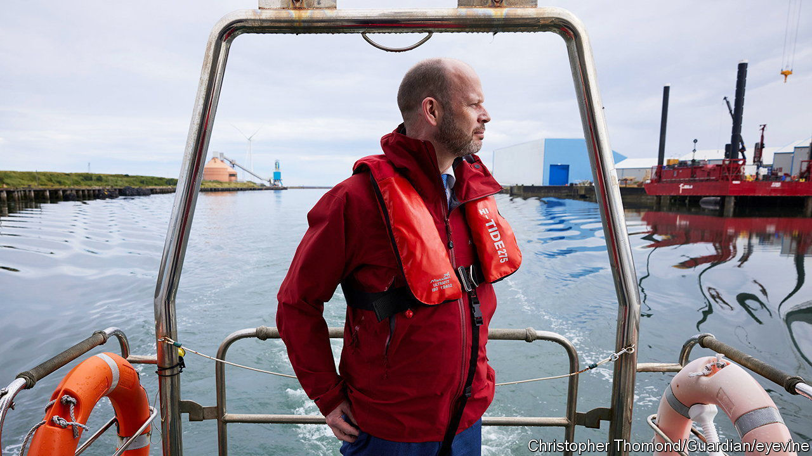

###### Look north

# A northern mayor’s left-wing challenge to Labour 

##### Can Jamie Driscoll emulate Ken Livingstone? 

 

> Feb 20th 2024 

JAMIE DRISCOLL’s pitch mixes the nostalgic, the technocratic and the red-blooded. “Who remembers Curly Wurlys?” he asks. The fate of Britain’s public services, he says, recalls the shrinkflation that has reduced the chocolate bar of his childhood memory to just 21 grams. “Every government we get lets the rich get richer, while we get the Curly Wurly treatment.” His speech ranges from anecdotes of haggling with Treasury ministers to research on integrated transport systems. Then he adds: “What’s the bloody point of politicians who can’t think their own thoughts?” 

Those seeking a left-wing challenge to Sir Keir Starmer’s Labour Party have tended to hunt in Islington, the north London redoubt of Jeremy Corbyn, the exiled ex-leader. Better to head 275 miles (443km) north, to a community hall in Jarrow, a former shipbuilding town still synonymous with interwar unemployment.

Mr Driscoll, mayor of the North of Tyne region, is campaigning to become mayor of a new “North East” region, of 2m souls, more than twice his current remit. A supporter of Mr Corbyn, he was elected in 2019 on a Labour ticket; after an acrimonious split, he is standing in May as an independent. How Mr Driscoll fares will help to gauge whether anger among left-wing activists at Sir Keir’s  ahead of a general election can translate into a serious threat at the ballot box. 

He faces a hard task. History is littered with failed left-wing bids to usurp Labour. The party is riding high in national polls. On February 16th it triumphed in . 

But challengers can succeed—Ken Livingstone became mayor of London in 2000 after a similar rift—and Mr Driscoll has some factors in his favour. He has raised £165,000 ($207,000), a chunky sum by British standards. He can present himself as both an outsider railing at the Labour establishment and an insider who has wrung a bumper devolution deal out of Whitehall (“We get more money than Manchester,” he boasts). And the north-east, though long Labour-leaning, has occasionally given the party high-ups a bloody nose: in 2004, 78% of voters rejected a regional assembly, Sir Tony Blair’s early attempt at devolution. 

Mr Driscoll levels two charges at Sir Keir. The first is resiling from the principles on which he became leader in 2020: by embracing private health-care providers, being too “weasel-worded” on the war in Gaza, shying away from extending child benefit and trimming a green industrial plan originally priced at £28bn a year.

The second concerns party democracy. Mr Driscoll was barred as a candidate ostensibly for sharing a stage with Ken Loach, a left-wing film-maker who is now persona non grata, having dismissed Labour’s crisis over antisemitism as a “witch-hunt”. Sir Keir’s circle have been proudly ruthless in intervening in bits of the party they regarded as falling short. The price, complain some on the left, has been ideological uniformity in a once broad church. 

Though the electoral odds are stacked against Mr Driscoll, his campaign points to a potential longer-term problem for Sir Keir. A 20-point poll lead and the allure of government have so far persuaded most of the party to swallow the compromises he insists are necessary for victory. Yet some MPs quietly warn that within a couple of years he will be at risk if he sticks to them. 

Mr Corbyn was popular with many Labour members not because they were ideologically rigid, but because he spoke to broad ideals, such as reducing inequality, that Sir Keir reflected in 2020: more Lennon than Lenin, as Tom Baldwin, Sir Keir’s biographer, puts it. In Jarrow, Mr Driscoll cites as the litmus tests for a Labour government whether it can reduce health-service waiting lists and ease the state of “destitution” that some locals are in.

A theme of the past decade in British politics has been the Conservative government’s battle to contain insurgent forces on its right. If Labour comes to office, Mr Driscoll’s tests may dictate whether his campaign is the Corbynistas’ last stand—or a foretaste of wider unrest on the left. ■


