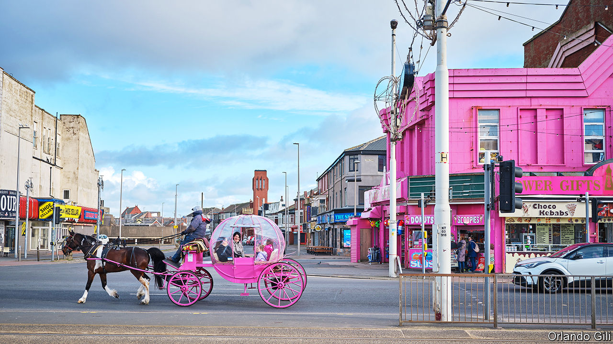
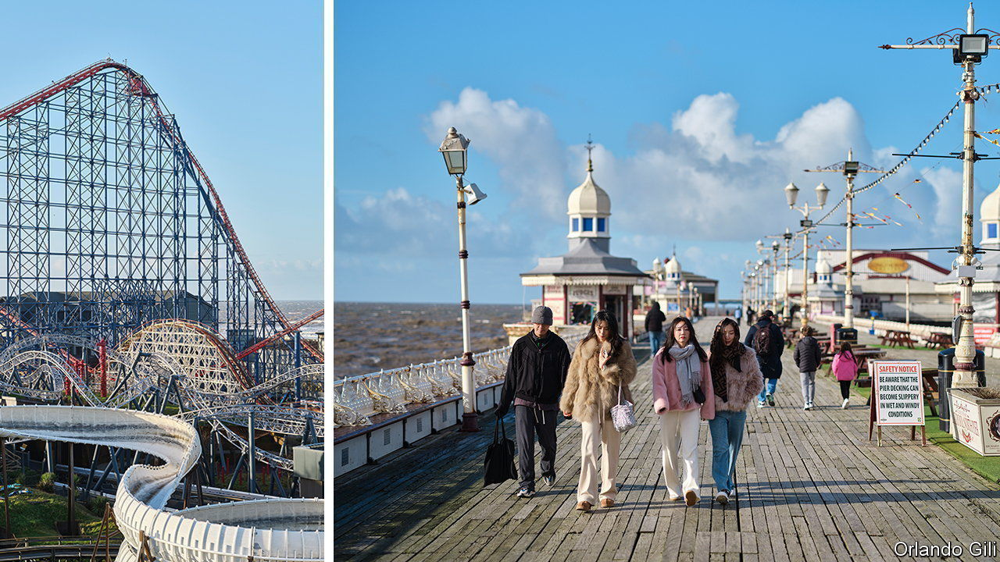

###### Lifting sands

# Can run-down Blackpool turn itself around? 

##### The plan to regenerate a struggling seaside favourite 

 

> Feb 22nd 2024 

TO SEE THE best and worst of Blackpool, take a ride on its Ferris wheel. On the way up, marvel at the miles of golden beaches; and at the horse-drawn carriages clip-clopping along the promenade, Blackpool Tower at one end, a giant rollercoaster (once the world’s tallest) at the other. Coming down, gaze at a brutalist haystack jutting out from the skyline—in fact an abandoned police station—and row after row of run-down terraced houses.

The seaside town in north-west England, home to around 140,000 people, has long been a place of contrasts. As Britain’s most popular coastal resort, Blackpool brings joy to millions. Yet it is also a repository of despair, at the bottom of national rankings on a host of measures. Blackpool contains eight of England’s ten most deprived wards. It has a lower healthy-life expectancy than Angola. The share of its children in local-authority care is the highest in the country. Its 16-year-olds’ exam results are among the worst in England.

Yet the tide may be turning. Pragmatic leadership has helped Blackpool’s Labour-run council convert a Conservative government’s rhetoric about “levelling up” neglected towns into capital and action. With the support of local businesses, the town is overseeing a £2bn ($2.5bn) regeneration scheme. The council and the government now hold up Blackpool as a place of promise. Might the town do the seemingly impossible, and turn itself around?

 


Like the Ferris wheel, Blackpool’s fortunes have risen and fallen over the years. In the 19th century railways transformed a fishing village into a holiday resort, drawing in first Lancashire millworkers, then many others beyond. By 1911 the central station was the busiest in the world. During the second world war, it escaped heavy bombing because Hitler dreamed of unfurling a swastika over its tower. But from the 1970s it would suffer another kind of continental assault. Cheap trips to warmer destinations such as Spain and Greece precipitated its decline. 

Today Blackpool still attracts around 14m visits a year, from 5.5m people. They are overwhelmingly British or Irish—fans of its air show (from 70-80 countries) and punk festival (a draw for Dutch and Germans) aside. Most come for day trips, or for boozy stag or hen nights. 

Blackpool’s problems are typical of many English coastal towns, which tend to be predominantly white and disaffected (Blackpool voted for Brexit by two to one). Seasonal work is often low-paid and low-skilled. Its precariousness creates transience, reflected in high turnover rates of pupils in local schools.

 


The town’s housing is terrible. Much of it is old, built as B&amp;Bs and guest houses. Many lie derelict. Just off the promenade, red paint is peeling off one in patches. “Decades of decay” is daubed on the boarded-up door. “It used to be a nice hotel, once,” says Stephen Cheatley (pictured above), who makes a living broadcasting tours of the town to his 55,000 subscribers on YouTube (a fan later stops him for a selfie). 

Others become poor-quality houses, crammed with occupants. Rents are typically pegged to housing benefit, claimed by four-fifths of private renters in the town centre. Some landlords advertise their rooms in prisons. Just as lack of opportunity pushes out the young and healthy to thriving cities, so Blackpool’s cheap housing pulls in the sick and unemployed. Blackpool has become “the last place left in the country for people to go”, says Professor Heather Brown of Lancaster University. 

The result is a poverty trap and a picture of poor health. Life expectancy is the lowest in England (and bar Glasgow, in Britain). One woman in five smokes while pregnant. Poor mental health is rife and the town lacks a sense of civic identity. 

Reversing decline is not easy when many upward paths are blocked. Densely populated, Blackpool lacks space for new factories (though chemical and aerospace firms are nearby). It has a similar number of drag queens to Brighton, but lacks the southern resort’s proximity to London to help its gay scene sparkle. A bid for a supercasino in the early 2000s was a busted flush. The town’s director of regeneration, Alan Cavill, visited Las Vegas and Atlantic City for inspiration, but Manchester held the winning hand.

So Blackpool has looked for other ways to revive itself. For almost a decade it has been following a plan agreed on by council, voluntary and business leaders combining private investment, central-government funding and council borrowing to invest in physical regeneration, housing, health and skills. 

The regeneration of the town centre is by far the costliest part. Plans include a building for 3,000 civil servants, Blackpool’s first museum (“Showtown”) and a £300m leisure complex, privately financed but unlocked by a levelling-up grant to move the law courts. Next to its busiest train station, the council has built and secured franchise rights for a Holiday Inn, with a Marco Pierre White restaurant, linked to the tramway skirting the promenade. The council hopes that Blackpool will again become a regular venue for political parties’ conferences.

 


Better housing is just as important. Five minutes’ walk from the Holiday Inn stands a scaffolded former guest house. Six months ago plants were growing out of its collapsed floor; now the finishing touches are being applied to a six-bedroom home. It is one of around 700 run-down properties acquired by My Blackpool Home, a company wholly owned by the council. The firm competes with landlords with the aims of providing better housing at similar rents and stabilising communities. Since 2016 it has bought around 10% of the town centre’s worst housing. The aim is to improve areas sufficiently to prompt private investors to do the rest. 

On health and skills, through Pride of Place, a partnership created in 2017, community, council and business leaders are working together. In one area of town, Claremont, one in ten residents had an unplanned hospital admission in 2022. Their average age was 42; the most common cause was asthma. Working with the health service, Pride of Place uses street-level data to pre-emptively knock on the doors of those most at risk. “It makes business sense,” says Kate Shane of Merlin Entertainments, which operates Blackpool Tower and employs 500 people locally, some of whom have health problems.

Blackpool has high youth unemployment rates and lacks a university. But £65m, some of it levelling-up money, is being invested in turning Fylde College, a further-education college which already offers degree-level apprenticeships, into a “multiversity”, a concept floated in 2018 by Andy Haldane, then chief economist at the Bank of England. In a world of artificial intelligence and automation, Mr Haldane argued, such institutions would be needed to spread technical skills, beyond the cognitive ones taught in lecture theatres.

Some locals ask if the money could be better spent, at a time when a cost-of-living crisis has made life even more difficult for Blackpool’s poorest. “They don’t even have time to draw breath,” says Conal Lane, of Citizens Advice, a charity.

Some plans sound a little optimistic. Mr Cavill reckons that the best model for Blackpool may be Rimini, an Italian working-class resort which has reinvented itself as a place for business tourism. But whereas Rimini has an airport and good rail links, Blackpool has slow trains to Liverpool and Manchester. Rather than looking out at the Adriatic, diners at the Holiday Inn will see The Flying Handbag, a gay bar, and moss-tinged terraces. 

And the partial funding of some of the biggest, shiniest projects from central-government grants has a whiff of the pork barrel. Such grants have mostly been doled out to “Red Wall” seats won from Labour in 2019. Blackpool elected two Conservative MPs (though one is suspended from the party and facing a ban from Parliament). 

For all that, there is firepower behind Blackpool’s plan. It already draws more visitors than Rimini, and it set its plan in motion years before ministers first harped on about levelling up. The scheme cannot be truly appraised for a generation. But since 2017 it has created or preserved nearly 6,000 jobs. Despite covid-19 cratering its tourism sector, Blackpool’s gross value added per person, a measure of output, grew faster than Britain’s in the decade to 2021. Productivity may be greater in big cities. But Blackpool is still a place people want to live in, work in and visit.

Return to the Ferris wheel and look again, this time at the people: at the tourists who regularly return; at the residents who may no longer have to leave. At least now there is hope again for Blackpool. The wheel may be turning.■

 


