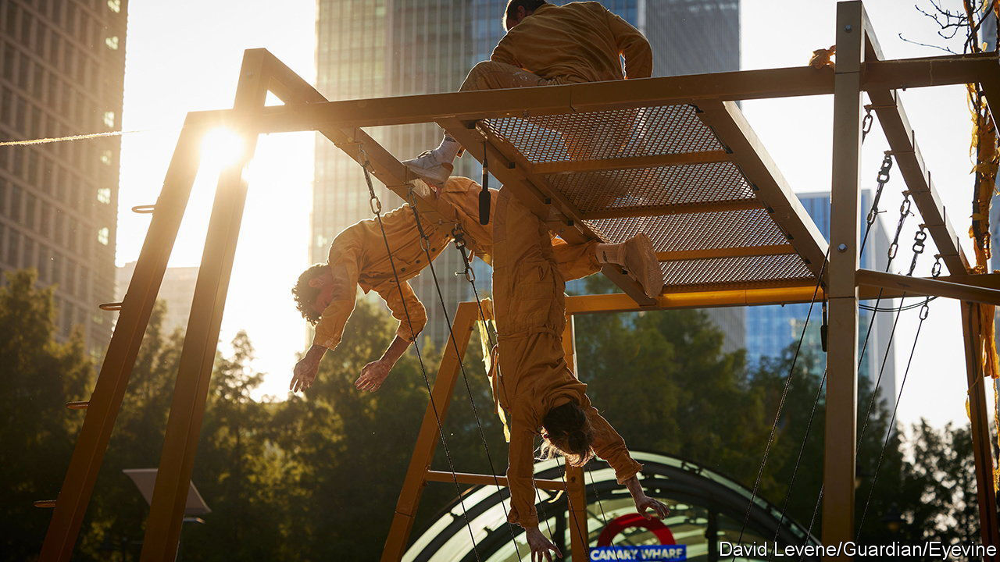

###### Refurbished

# How working from home is reshaping Canary Wharf 

##### London’s dockland district has more homes, more fun and fewer offices 

 

> Feb 22nd 2024 

Canary Wharf is reinventing itself. When it was London’s new financial hub in the 1990s, bankers and lawyers filled its glass towers. Now that Londoners are not commuting five days a week, the district is broadening its appeal, to accommodate those seeking somewhere to live or let loose. Will it succeed?

An effort to diversify has been in the works for years. But the exodus of workers during the pandemic, and the departure of corporate tenants such as HSBC, a big bank, and Clifford Chance, a law firm, have sharpened it. Across the capital 9.5% of office space is empty, above the five- and ten-year averages, cramping valuations. Rising interest rates have pushed up borrowing costs, just when landlords face extra bills to make buildings greener. 

Canary Wharf’s investors are unruffled. The district has known hard times before. It crashed into bankruptcy in the 1990s; in 2008 the fall of Lehman Brothers, an American investment bank, cleared over 76,000 square metres overnight. The estate’s joint owners—Brookfield, an asset-management firm, and the Qatar Investment Authority, the emirate’s sovereign-wealth fund—injected £400m ($485m) last year.

Housing plays a big part in Canary Wharf’s reinvention. Nearly all new building is earmarked for homes for rent. The plans mirror Brookfield’s playbook elsewhere, notably Manhattan West and Hudson Yards in New York, where offices, hotels, shops and housing sit side by side. Today more than 3,500 people live in Canary Wharf; the first residents moved in only in January 2020. 

To shed its image as a sterile office district, Canary Wharf has rolled out activities including go-karting and a padel club. In the summer it hosts outdoor sports screenings and concerts, and a beach volleyball tournament for firms on the estate. The water surrounding the former docks, mostly unused until recently, now affords swimming, boat rentals and 5km of boardwalks. Where there was once a largely vacant car park, there is now an indoor playground with a roller rink, ball pits and bumper cars. 

The drive to diversify is paying off. Around 6.3m people visited the estate in January, up by 8.2% year on year. At the end of 2022 midweek trips returned to pre-pandemic levels; visits between 4pm and 10pm were 50% higher. Fears that retailers and hospitality businesses would leave as offices emptied have not materialised. There are now 70 bars, cafés and restaurants, up from 40 or so before the pandemic. The Waitrose supermarket in Canary Wharf has long been the upmarket chain’s best performer by revenue. 

Offices are still at the core of Canary Wharf, but their importance has shrunk: from 95% of the portfolio’s value 20 years ago to 74% by 2022 (of that, big banks make up just over half, down from 70% in 2004). Plans are in hand for a swanky life-sciences campus. Canary Wharf is also attracting creative types. Last year it welcomed the Qube, which provides studios and production space for music producers, podcasters and social-media influencers.

The result is a mix that should be more resilient to fluctuations in demand for any single class of property. But the office workers still toiling in the sleek towers above the dog-walkers, pram-pushers and joggers lining the riverside paths have not been forgotten.

Citigroup is spending over £100m to refurbish its 42-storey skyscraper. Barclays has revamped its 32-storey tower, adding a trading floor with a café selling mocktails and . A coworking floor is filled with bean bags, board games and mirrors with supposedly motivational prompts (“You’ve got this”). And the view over east London’s old docklands is bright.■


