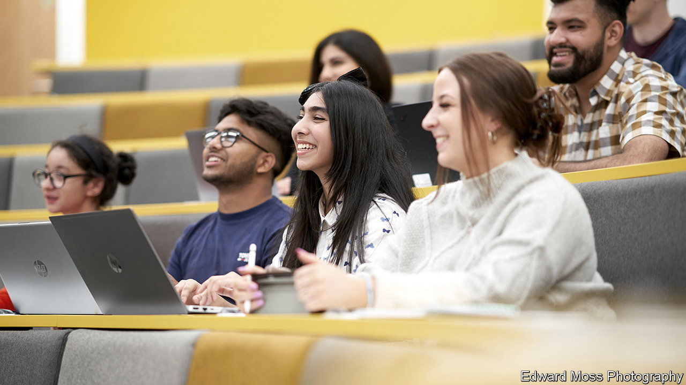

###### Higher education and race

# Some British universities have become remarkably racially diverse 

##### Good grades, high expectations and reluctance to travel explain why 

 

> Feb 22nd 2024 

Black and Asian undergraduates were rare in the mid-1980s, when researchers working on an official report on race and education turned up to interview them. The students told sorry stories of off-putting teachers and careers advisers. An Afro-Caribbean student remembered expressing a desire to train as a lawyer, only to be advised to take a job in Woolworths, a now-defunct retail chain. Another student was advised to work in agriculture because his father came from rural Pakistan. 

 


They could hardly have imagined what Britain’s universities would look like today. Far more people from all backgrounds go. But non-whites have rushed in faster, going from 23% to 35% of all Britons accepted as undergraduates over the past 12 years. Some universities, especially former technical colleges and polytechnics in big cities, have grown exceptionally diverse. Last year just 16% of the undergraduates admitted to Aston University in Birmingham were white (see top chart). 

One reason is simply that Britain has grown more ethnically diverse, cities like Birmingham much more so. The 2021 census showed that 32% of 17-year-olds in the city were white. Another reason is that black and Asian pupils do far better in exams than they did in the 1980s. In last year’s gcse exams (normally taken at 16) larger proportions of Asian, black and mixed-race pupils in England got at least a grade five in English and maths than of white pupils. Teenagers from some ethnic groups, such as Bangladeshis and black Africans, have pulled well ahead of the national average despite high poverty rates. 

Black and Asian Britons are unusually likely to go to university, even after accounting for their better grades. This is not because universities favour them, although some lower entry thresholds for people who grew up in poverty. It is mostly because non-white youngsters strive to go, perhaps anticipating that they will face discrimination in the job market. Among the poorest, academically least successful teenagers, ethnic differences in university-going are vast. The Institute of Fiscal Studies, a think-tank, calculates that 5% of white Britons who score in the bottom quartile at gcse and are entitled to free school meals because of their parents’ poverty end up at university. Among black Africans in the same position, 40% do. 

Non-white students, especially ethnic Bangladeshis and Pakistanis, tend to study close to home. Michael Donnelly of the University of Bath puts this down to a combination of parental conservatism, money worries and not-unjustified fears of standing out in more homogeneous parts of the country. The stickiness helps to explain the great diversity of institutions like Aston University. It also explains why a good university in a diverse city like Leicester has come to look quite different from a similarly good university on the edge of a mostly white city such as Brighton (see bottom chart).

Some black and Asian Britons are unhappy at university. They are less likely than white students to graduate with first-class or upper-second-class degrees, and are less likely to feel that their courses are worth it. Black students are more likely to drop out. For most, higher education is a good bet all the same. Research by the Sutton Trust, a charity, shows that technically oriented institutions like Aston University are extremely good at pushing young people from poor backgrounds into the middle class. Aston does more for social mobility than Cambridge or Oxford do, because those universities admit so few students from poor backgrounds. 

The British government rarely utters a positive word about universities, which it views as dens of wokeness. Last year Rishi Sunak, the prime minister, complained that they often sold a “false dream” and encouraged young people to do apprenticeships instead. Sensibly, black and Asian Britons seem to be ignoring him. The younger Mr Sunak would not have listened, either. He has a ba from Oxford and an mba from Stanford.■


