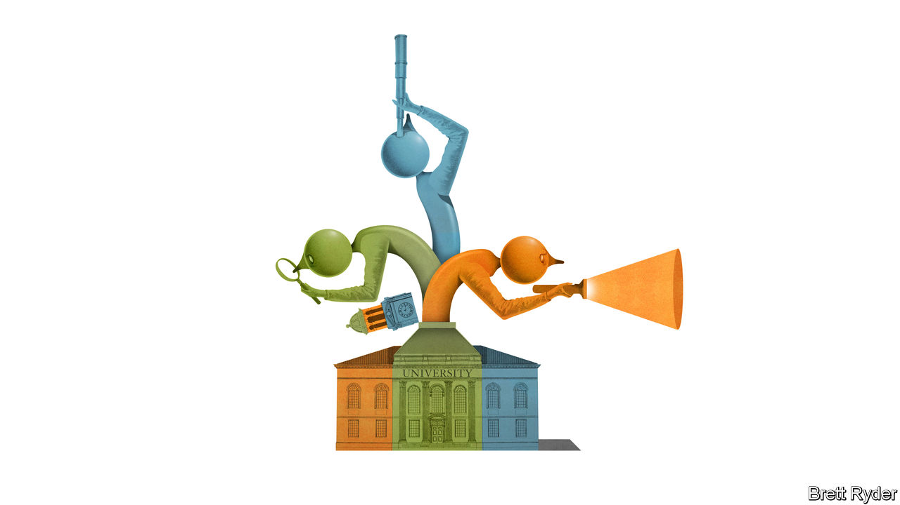

###### Schumpeter

# Is running a top university America’s hardest job? 

##### Balancing a motley crew of interested parties is becoming nearly impossible 

 

> Feb 20th 2024 

Wanted: presidents for America’s top universities. Applicants must possess an unimpeachable academic record. Marc Tessier-Lavigne resigned as president of Stanford University in July 2023 after a report found serious problems with the neuroscientist’s research. They must also be able diplomats in America’s culture wars. In December Liz Magill was chastised by lawmakers in a hearing on campus antisemitism, and  as president of the University of Pennsylvania days later. Claudine Gay, whose tenure as president of Harvard University , fell at both hurdles. She was seen as weak on antisemitism by donors and resigned on January 2nd after a plagiarism scandal erupted over her work. 

Changes at the helm of America’s universities are common. According to the American Council on Education, an industry association, the average tenure of a university president in 2022 was six years, indicating that hundreds of jobs change hands each year. Yet the number of vacancies at America’s most prestigious schools is striking. Yale’s president will also step down this summer after 11 years in the job; so will the chancellors of the publicly funded University of California, Los Angeles, and Berkeley. That leaves six of the top universities in the world searching for a new president. These institutions are responsible for shepherding some of the world’s biggest brains (Nobel prizewinners) and also some of its most impressionable (the coddled offspring of America’s elite). That’s to say nothing of their hospitals, thousands of administrative staff and $160bn of endowments.

The search is on. At private universities, the responsibility falls on the board of trustees. Many university boards look similar to those of America’s corporate giants, packed with financial luminaries. A broader committee, including faculty and students, is sometimes tasked with aiding the search. Specialist headhunters are often called. Fierce competition for candidates, who are usually found running big faculties or lesser universities, is not the only reason boards are daunted by the prospect. America’s universities, which are at the centre of toxic debates over free speech and diversity, are suffering from a crisis of legitimacy that has put the presidential office under a microscope, too.

The top job at a university has long had its frustrations. Beyond directing donors’ dollars and making a few big hiring decisions, university presidents wield surprisingly little formal power. Unlike the boss of a company, they find their most senior employees protected by tenure, which makes it almost impossible to remove experienced faculty members. “The glib answer is that they live in a very large house and beg for money,” says Richard Chait, a professor at Harvard. A 1949 editorial in  described the job as an exercise in “advertising, selling and hoarding”; Clark Kerr, a mid-century Berkeley chancellor, quipped that the role involved providing parking for the faculty, sex for the students and athletics for the alumni. 

Mr Kerr’s summation points to a deeper truth—that a university president’s job is mainly about keeping a motley crew of interested parties happy. Achieving that balance is becoming nearly impossible. A 2003 paper by Edward Glaeser, an economist, suggests that as non-profit institutions become wealthier, power shifts from their providers of capital (donors) to their workers (faculty). Although that may have been a reasonable description of the decline of donors’ power during the 20th century, the financial backers of America’s universities are now reasserting their influence with a vengeance. Some, displeased with how Ms Gay and Ms Magill handled antisemitism on campus, were instrumental in ousting them. Ken Griffin, a hedge-fund titan whose name adorns Harvard’s Graduate School of Arts and Sciences, recently said he had halted his financial contributions to the university. At the same time students, who are meant to be instructed by universities, are instead pushing them around. Few think these pressures will subside any time soon. 

One option is to rethink the duties of the president. That could involve limiting their ability to make political statements, or reinforcing their obligation to free speech and merit. Boards are, however, more likely to approach the problem through their choice of appointee than through constitutional change. A candidate’s ability to placate donors or appear on the congressional stage will be closely scrutinised. That trustees will undertake more thorough due diligence of prospects’ academic records is assured. Despite the challenges of the job, boards will not encounter a dearth of applicants from within academia for these distinguished posts. But might they look outside universities altogether?

Some may consider a business leader an attractive choice, particularly to deal with the administrative bloat that now afflicts many universities. After all, the operating budgets of America’s largest universities are now similar to those of a Fortune 500 company. Yet America’s businesses have not shown themselves to be any better at navigating the country’s culture wars. A former politician, another possibility, may know how to gladhand donors and schmooze with journalists, but would be a lightning rod for criticism from supporters of whichever party they did not represent. In both cases, the outsider would struggle to win the respect of the faculty through whom they must work.

Searching for meaning

The truth is that the background of applicants is not the problem. An identity crisis is engulfing America’s universities. They are torn between their responsibilities to learning and social justice—and that is a tension any president governing by consensus will find hard to resolve. This carries wider lessons for all organisations. Institutions unmoored from a clear purpose, whether that is knowledge-seeking or profit-seeking, are destined for crises. Even the cleverest captain would struggle to steer such a ship. ■


