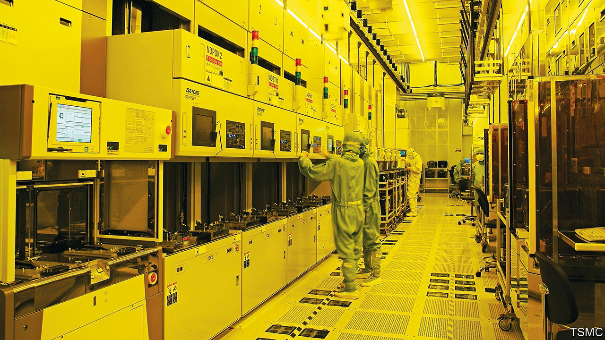

###### A tale of two chip factories

# TSMC is having more luck building in Japan than in America 

##### Truculent workers and red tape have slowed its efforts in Arizona 

 

> Feb 22nd 2024 

On the Japanese island of Kyushu, the fruits of the country’s industrial policy are about to go on show. On February 24th tsmc, the world’s most advanced chip producer, will open its first fabrication plant in the country. Earlier this month it announced plans for a second plant nearby.

Contrast that with the Taiwanese giant’s other big international expansion, in America. Last summer it pushed back the start of production at the first of two plants it is building in Arizona from 2024 to 2025. In January it announced that a second plant, previously scheduled to open in 2026, would not be operational until 2027 or 2028. The second was meant to produce three-nanometre (nm) chips, the most advanced currently on the market, but tsmc has raised the prospect that it may now be used for less cutting-edge production.

Both the Japanese and American governments are eager to expand domestic production of chips, and are seeking the help of foreign firms. So what explains the contrast between celebrations in Kumamoto and headaches in Arizona? The first point of divergence is in labour relations. A protracted spat with the Arizona Building and Construction Trades Council, an association of labour unions, over the use of Taiwanese workers to build the plants was finally resolved in December with a promise by tsmc to hire and train local workers. Union activism is comparatively rare in Japan: the country typically loses fewer than 10,000 days of workers’ labour each year to stoppages, compared with more than a million in America.

Helpful local partners are the second reason why TSMC’s experience in Japan has been smoother. Denso, a Japanese maker of car parts, and the chipmaking arm of Sony, an electronics giant, both took minority stakes in TSMC’s subsidiary in Japan. Earlier this month Toyota, a carmaker, invested in the venture, too. Those companies have plenty of experience pulling off big projects in their country. Helpfully, they are also the primary customers for the chips the plants will build, notes Lim Tai Wei, a researcher at the East Asian Institute of the National University of Singapore. In contrast, the Taiwanese firm is going it alone in Arizona, its first large project in America since the 1990s.

A final difference concerns subsidies. Both the Japanese and American governments have tempted global chipmakers with offers of grants. tsmc has already received money from Japan’s government, which agreed to stump up half the cost of its capital spending for the Kumamoto project. But it has yet to get any funds from America under the CHIPS Act passed in 2022. Disbursements of cash have been slowed by negotiations over conditions, including what profits America’s government will be entitled to, says Stephen Ezell of the Information Technology and Innovation Foundation, a think-tank based in Washington. In the meantime, the costs of building and equipping the sites have been going up. Mark Liu, tsmc’s outgoing chairman, said in January that the technology in its second Arizona plant would depend on the incentives on offer.

The delays could drag on. In October Gina Raimondo, America’s Commerce Secretary, warned that projects like tsmc’s could be held up for years by the environmental reviews required for federal funding unless they are exempted on national-security grounds. In a survey of around 200 semiconductor firms by the Bureau for Industry and Security, an American government agency, 64% named environmental rules as among their biggest regulatory problems, compared with 21% who included export controls and 18% who cited local permit and zoning laws.

There are plenty of lessons to be learned. Subsidies are effective only if they are paid, and environmental red tape in America has become excessive. Combative unions may put off foreign firms. Would-be customers should take a keener interest in the success of their suppliers. Foreign firms, for their part, must also learn to adapt to local market conditions, rather than trying to copy and paste approaches that worked at home, argues Chris Miller, a historian of the semiconductor industry at Tufts University.

Japan, meanwhile, should avoid being smug about its success. The TSMC plant opening in Kumamoto on February 24th will produce chips ranging in size from 12nm to 28nm, less advanced than those in the works in Arizona. For the whizziest chips, Japan is instead pinning its hopes on Rapidus, a company established in 2022 with the backing of eight of the country’s biggest firms, including the three that took a stake in TSMC’s subsidiary. Its goal is to mass-produce bleeding-edge 2nm chips by 2027. That more ambitious plan could still encounter plenty of stumbling blocks along the way. ■


