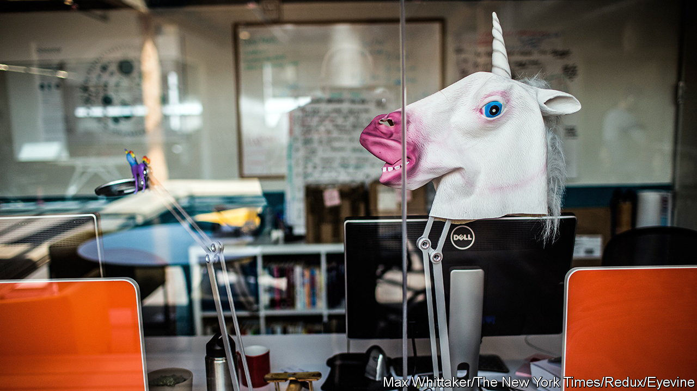
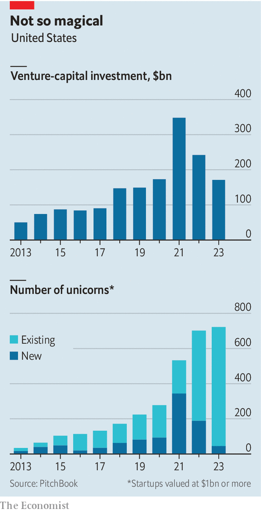
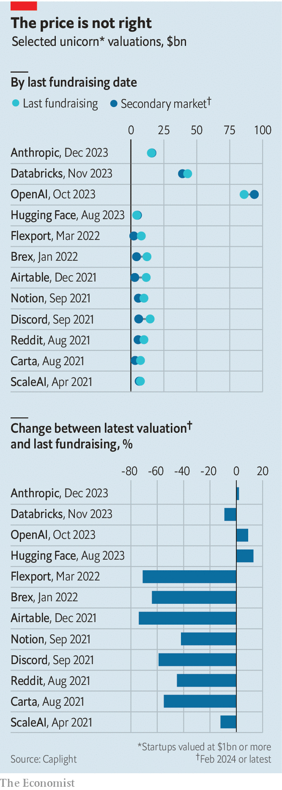

###### Silicon Valley sobriety

# The age of the unicorn is over 

##### Don’t expect AI to bring it back 

 

> Feb 22nd 2024 

Business has never been better for America’s tech giants. After slumping in 2022, the combined market value of Alphabet, Amazon, Apple, Meta and Microsoft has surged by 70%, to over $10trn, since the start of 2023 amid the hype over artificial intelligence (AI). The technology has also propelled others into the industry’s upper echelons. On February 21st Nvidia, an AI-chip champion, reported that its sales rocketed by 265%, year on year, in the quarter to January. Its market value has risen from around $500bn a year ago to $1.7trn, making it America’s fifth-most-valuable firm. OpenAI, the maker of ChatGPT, and other AI builders such as Anthropic have shot to fame, scooping up billions of dollars in funding.

 


Thousands of smaller AI firms have popped up, too. Enough that a small Caribbean island called Anguilla, whose internet domain suffix is “.ai”, now generates around a third of its government’s budget from licensing it out, according to , an online publication. In the latest sign of madness returning to Silicon Valley Adam Neumann, the ousted founder of WeWork, an office-sharing firm that declared bankruptcy in November after years of losses, made a bid on February 5th to retake the reins of the firm.

Yet it would be a mistake to think America’s startup scene is returning to its former exuberance. For one, the reception from WeWork’s management and creditors to Mr Neumann’s gambit has been lukewarm. Venture-capital (VC) firms invested only $170bn in the country last year, down by half from 2021, according to PitchBook, a research firm. Bar a few high-profile exceptions, such as OpenAI, investors have been especially wary of signing cheques at lofty valuations. Throughout the 2010s the number of unicorns—private companies with valuations above $1bn—soared in America. Fully 344 of them were minted in 2021. Last year’s figure was 45.

The end of the era of cheap money is largely to blame. In the go-go years, as investors raced to get a piece of the buzziest startups, tech firms had little need to tap public markets for capital. Crossover investors such as Tiger Global and Coatue, which operate in both public and private markets, flooded into Silicon Valley. Dharmesh Thakker of Battery Ventures, a VC firm, recalls that founders could “raise money on a Zoom call”. In 2021 crossover investors accounted for over half of startup funding. They have since retreated, last year contributing less than a third.

Now investors are mulling how to sell their stakes in the unicorns of yesteryear. Most VC funds operate on a ten-year clock, backing startups in the first five and cashing out in the second. With over 700 unicorns, at a combined valuation of $2.4trn, a sizeable amount of money is at stake.

The first way to exit is through an initial public offering (IPO). Yet the IPO market remains at a standstill, with 83 VC-backed listings in 2023, down from 309 in 2021. Many of those that listed last year, including Instacart, a grocery-delivery business, and Klaviyo, a software firm, are trading below their initial price. Arm, a chip designer whose share price has more than doubled since its listing in September, is a rare exception. Firms that are planning for an IPO this year are often doing so at a reduced valuation: Reddit, a meme-sharing website, plans to list at $5bn, down from a private valuation of $10bn in 2021. 

 


The second path to an exit—a sale to a corporate buyer—is also partly blocked. Only 698 VC-backed firms were purchased by companies last year, according to PitchBook, down from 1,311 in 2021. Trustbusters have kept big tech, once a serial acquirer, on the sidelines. Last month Amazon abandoned its bid to acquire iRobot, a maker of robo-vacuum-cleaners, following scrutiny from European regulators.

Selling to another private investor—the third option—is not too attractive, either. Private valuations in the so-called secondary market are below those at the latest fundraising round for more than four-fifths of unicorns, according to Caplight, a data provider. Discord, a chat service popular with gamers, was most recently valued in the secondary market at $6bn, down from a nearly $15bn valuation when it last raised funds in 2021.

Amid the drought, some unicorns have simply collapsed. Convoy, a logistics startup that last raised funds in 2022 at a nearly $4bn valuation, shut down in October. Veev, a unicorn dedicated to disrupting home-building, closed its doors in November and is liquidating its assets. Samir Kaji of Allocate, a firm that connects investors with VC funds, believes that many unicorns will “quietly get acquired for parts”.

Back to the garage

That is a sad fate for the founders, employees and investors of those once-promising firms. But others need not be overly worried. Tom Tunguz of Theory Ventures, another VC firm, reckons the drop in funding since 2021 is merely a return to a long-run trend that was thrown off course by the pandemic. And there is plenty to celebrate in the newfound sobriety of Silicon Valley. 

It is rare these days to find a startup that espouses growth at all costs. Founders have rediscovered the concept of frugality. Many are being cautious with their hiring, a striking contrast to the race for talent during the pandemic. It helps that the industry’s giants have flooded the market with thousands of techies following a bout of layoffs. Over the past two years Alphabet, Amazon, Meta and Microsoft have fired more than 75,000 staff between them.

What’s more, AI is providing American startups not just with new business ideas, but also ways to do more with less. Startups burn roughly half their cash on selling their products and a third on engineering. AI assistants for salesmen and coders are raising productivity by more than a third at some startups, lowering the amount of capital they need to raise. In time, the age of the unicorn may not be missed. ■


