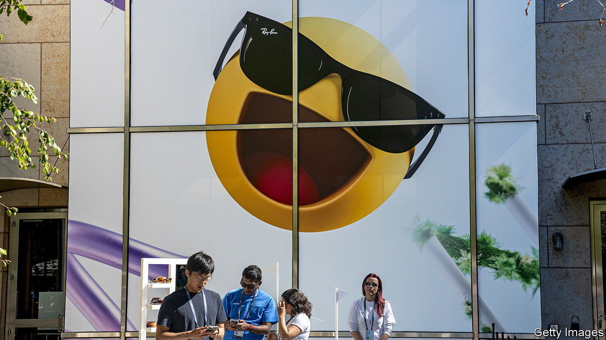

###### Through the looking glass

# The world’s biggest maker of spectacles wants to be a tech firm 

##### It is experimenting with smart glasses and built-in hearing aids 

 

> Feb 22nd 2024 

Over the course of six decades Leonardo Del Vecchio, an Italian entrepreneur who died in 2022, built Luxottica into the world’s largest maker of spectacles and sunglasses. In 2018 he merged his firm with Essilor, a French lens manufacturer, to create a Franco-Italian corporate giant that is today worth over $90bn and employs some 200,000 people. The group owns iconic eyewear labels from Ray-Ban to Oliver Peoples, and also produces glasses using the brands of European luxury houses such as Armani and Chanel. On February 14th the company reported that its sales grew by 7% last year, at constant exchange rates, faster than at many other luxury businesses.

Now Francesco Milleri, a close confidant of Mr Del Vecchio’s who was appointed chief executive of Luxottica in 2017 and of the combined group in 2020, is looking for the company’s next act. He has two big ideas. First is to become the leader in smart glasses. The ambition is not entirely new: the firm partnered with Google, a tech giant, on its Google Glass—an unambiguous flop thanks in part to its clunky interface and dorky design. The device was discontinued in 2015.

Yet there are plenty of optimists who think that the moment for smart spectacles has arrived. In 2021 Snap, a social-media firm, unveiled a pair of augmented-reality glasses. This month Apple began shipping its augmented-reality headset, the Vision Pro. It reportedly pre-sold 200,000 of the devices, despite a price tag of $3,499. “I believe we are at the dawn of a product revolution akin to what we saw in the early 90s in mobile phones,” reckons Luca Solca of Bernstein, a broker.

EssilorLuxottica’s latest foray into the technology is through Ray-Ban, in partnership with Meta, another tech giant. The first iteration it launched in 2021 had only modest success. It will be hoping that a new version it began selling in September, which has a snazzier camera and a longer battery life, will do better. The device can capture and relay what the wearer sees. An in-built virtual assistant can hear and respond to their requests.

Mr Milleri’s second idea is the one in which he seems most invested. “We have become a med-tech company,“ he declares. Central to that is the development of spectacles with built-in hearing aids, which it will launch in August, for those with moderate hearing loss. It reckons that is a group of some 1.25bn people worldwide, many of whom shy away from the perceived stigma and high price of conventional hearing aids. The company’s spectacles, by contrast, will look no different from other glasses and cost well below the price of a regular hearing aid, says Mr Milleri.

The thinking is not altogether original. The Beltone “Hear-N-See”, one such device, first debuted in 1956. Audiofon, a German maker of hearing aids, has also dabbled in spectacles. But the idea has never been adopted en masse. Mr Milleri is counting on better technology to change that. Last year his company acquired Nuance Hearing, an Israeli startup founded in 2015. Its technology uses an algorithm to detect where sounds are coming from based on when they are picked up by different microphones. The spectacles it has developed then isolate and process the voice of the person the wearer is speaking to and transmit it through tiny built-in speakers. Nothing goes in the wearer’s ear.

Mr Milleri’s enthusiasm for the concept is personal. Mr Del Vecchio, who was 87 when he died, suffered from hearing loss and often lamented that hearing aids were uncomfortable to wear with glasses. That inspired Mr Milleri and Leonardo Maria Del Vecchio, one of the founder’s sons, who is also the firm’s strategy chief, to pursue the idea. Whether they prove to be farsighted remains to be seen. ■


