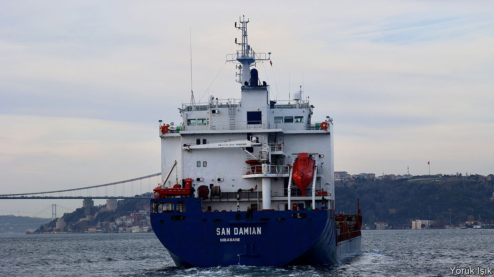

###### Flagging business

# Why does landlocked Eswatini have a ship registry? 

##### Countries like it may be helping to fuel the growth of a “dark fleet” 

 

> Feb 22nd 2024 

The website for the shipping registry of Eswatini (formerly Swaziland), established in October 2023, appears much like those of more established seafaring nations. A picture of vast cruise ships sits alongside promises of the “highest quality ship maritime services and ship registrations”. Delve deeper though and Eswatini’s nautical credentials start to unravel. For one thing, the African country is landlocked, calling into doubt the assertion that the port of Mbabane, Eswatini’s capital, is situated on the coast of South Africa. It is a “dry port”, 150km from the sea and 30km from a rail link to Maputo on Mozambique’s Indian Ocean coast. Its stated ability to handle “containers, bulk carriers and tankers” seems questionable.

The country is following in the wake of other smaller nations that offer their flag to shipowners. Seagoing vessels are obliged by maritime law to fly a flag of a country of registration and stateless vessels are not protected by international law. Yet the days when the stern of a ship would fly a national flag connected to the ownership of the vessel are long past. Liberia, Panama and the Marshall Islands now account for nearly half of the global fleet, by tonnage. Countries with loose ties to seafaring have been dubbed “flags of convenience” for levying low or no taxes and offering an escape from burdensome labour laws and other regulatory requirements. Often administered by private companies based elsewhere, these registries are a handy source of additional revenue for small and poor countries.

Registering a merchant vessel with a jurisdiction that is a mere speck on the map is not necessarily a cause for concern. Many take seriously their responsibility to oversee adherence to the rules and regulations of the high seas. Liberia’s, based near Washington, dc, has a good record of maintaining global standards across its fleet. Other registries merely give a “façade of legal oversight” says Richard Meade, editor of , a trade publication. A blacklist complied by Paris mou, an organisation that aims to “eliminate the operation of substandard ships”, puts the likes of Cameroon, Vanuatu and Comoros near the bottom.

Eswatini’s register provisionally comprised 13 cargo ships at the end of January. According to , three were placed under sanctions by America for supporting the Syrian regime and have been involved in exporting grain from Russian-occupied parts of Ukraine. A spokesperson for Eswatini’s registry says that all three were registered in December but then de-registered on January 18th for “not complying with the administration’s guidelines”. Yet at the start of February two of the vessels,  and , continued to signal that they were flagged by Eswatini. On February 8th  was spied passing through the Bosporus Strait flying an Eswatini flag. “Once a ship has been removed or rejected”, says the spokesperson, “we do not follow them further. If they still use [the flag] it is illegal and invalid.”

Less diligent registries are helping to fuel the growth of a “dark fleet”—some 1,400 vessels, according to the Atlantic Council, a think-tank—that operates with little regulatory oversight. They are mostly oil tankers that engage in subterfuge to hide where they are and the origin of their cargo in order to evade sanctions on Russian crude oil. Ownership is often opaque. Mr Meade estimates that 12% of the global tanker fleet is now dark. He notes that Gabon’s registry, now comprising 140 vessels, is the fastest-growing in the world thanks largely to the reflagging of Russian tankers. 

An expanding dark fleet poses a danger to itself and other vessels. Dark ships tend to be old and less well maintained, and some may be uninsured. Practices such as turning off or “spoofing” location devices are a danger to other ships. Swapping oil cargoes at sea to obscure their origins poses the danger of a spillage. Mr Meade foresees a worse calamity of a large “dark fleet” tanker sinking in an environmentally sensitive area, with no accountability.

Can anything be done? Diplomatic arm-twisting sometimes works. Moldova, another landlocked country on the blacklist, recently closed its registry after pressure from the eu, probably as a precondition of starting accession talks. Rumours suggest that the British government, with American backing, wants to implement un recommendations made in 1986 to tighten the link between ships and the flag they fly. In the meantime, the expanding dark fleet can be added to a growing list of dangers on the high seas. ■


