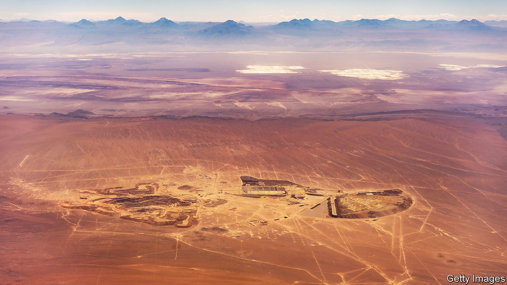

###### In a hole

# Why the world’s mining companies are so stingy 

##### The energy transition requires vast quantities of metals. But miners are reluctant to invest 

 

> Feb 18th 2024 

Mining companies have spent much of the past decade in investors’ bad books. Throughout the 2000s and early 2010s the industry, betting that the surge in commodity prices brought on by China’s economic rise would persist, splurged on investments and racked up hefty debts in the process. At the height of the frenzy in 2013 the combined capital expenditure of the world’s 40 largest mining firms by market value reached $130bn, according to pwc, an advisory firm, nearly four-fifths of their earnings before interest, tax, depreciation and amortisation (EBITDA). That spending spree left mining bosses red-faced as economic growth in China slowed, causing commodity prices—and the industry’s profits—to plummet.

Miners spent the years that followed cleaning up the mess. In 2015 more than $50bn-worth of assets were written down. BHP, the world’s most valuable mining firm, spun off its least-loved sites to raise money and simplify its business. Others followed suit. Cash was used to pay off debts instead of financing new projects.

 


Since then, profits in the industry have recovered. But investment has not. In 2022 the 40 largest miners together invested $75bn, equivalent to a mere quarter of EBITDA (see chart 1). BHP, which on February 20th reported its results for the second half of 2023, invested $8.8bn last year—less than half as much as it spent in 2013. Other big miners remain tight-fisted, too.

That is a problem. Decarbonising the global economy will require 6.5bn tonnes of metal between now and 2050, according to the Energy Transitions Commission, a think-tank. Although much attention has been paid to the lithium and nickel needed for batteries, they are only one part of the picture. Fully 170m tonnes a year of steel, made mostly of iron ore, will be needed for everything from wind turbines to electric vehicles—more than ten times current global production. Vast amounts of copper will be required to expand and upgrade electricity grids. Demand for aluminium, cobalt, graphite and platinum will rise substantially, too. That will require a lot of blasting and drilling, which must begin now. Why isn’t it happening?

One reason miners are reluctant to loosen the purse-strings is that they are still trying to win back the confidence of investors. The value of the MSCI world metals and mining index, which tracks share prices in the industry, has risen by about 10% in the past decade, compared with a doubling in the world’s stockmarkets as a whole (see chart 2). Returns on new projects in the industry are currently around 7%. That is hard to sell to investors when the yield on investment-grade corporate bonds in America is above 5%.

 


Wary of risky new developments, miners are prioritising expanding or selectively acquiring existing sites. Last year BHP bought OZ Minerals, an Australian miner of copper, gold and nickel, for $6.4bn. Mining firms are also handing more cash back to shareholders through dividends and buybacks than at any time since 2007, according to S&amp;P Global, a data provider.

Yet miners and their cautious investors are also responding rationally to changes in the industry. Commodity prices can be volatile. Mike Henry, chief executive of BHP, notes that doing business has become more difficult and expensive in recent years, too. Rising costs for labour and equipment have squeezed returns, says Jonathan Price, boss of Teck Resources, a Canadian miner. The nearly $9bn price tag to develop its Quebrada Blanca 2 copper mine in Chile, which opened last year, was almost double what it estimated in 2019.

The scope of what miners are expected to do to minimise the environmental impact of sites has also widened considerably, says James Whiteside of Wood Mackenzie, a research firm. Companies can no longer simply rely on diesel generators to power sites. They are increasingly being told either to connect to the grid or to install renewable-energy sources such as solar panels. Governments worried about water use have compelled miners to build desalination plants. All that has further raised their costs.

Miners, nervous of disappointing investors, have become more prone to pausing or cancelling projects when costs go up or prices come down. “You really have to have the stomach to think long-term,” says Jakob Stausholm, the boss of Rio Tinto, the world’s second-most-valuable miner. That is not always easy. On February 15th BHP said that it would write down the value of its Western Australian nickel business by $2.5bn in response to higher costs and a slump in the price of the metal thanks to an expansion of Indonesian supply. 

Stuck in the mud

Another reason for miners’ lack of investment is woefully lengthy permit processes, which delay projects and add uncertainty. In America obtaining permits often takes between seven and ten years, with companies required to consult a variety of government agencies and other interested parties. In some countries environmental concerns have led to approvals being withdrawn. The Serbian government revoked the licence of Rio Tinto, another mining behemoth, for a $2.4bn lithium mine after environmental protests broke out in the country in 2022. 

One thorny issue is access to the ancestral lands of indigenous populations. In America the majority of resources—97% of nickel, 89% of copper and 79% of lithium—are either on Native American reservations or within 35 miles (56km) of them. One example is the Resolution Copper project near Phoenix, Arizona. The site, jointly owned by BHP and Rio Tinto, could meet a quarter of America’s current copper needs, but has encountered stiff resistance from the Native American community. In 2020 the former chief executive of Rio Tinto was forced to step down after the company blew up two ancient Aboriginal rock shelters in Australia, sparking public outrage. The chairman also resigned the next year. 

Few bosses want to tempt a similar fate; others are also put off by spending in far-flung jurisdictions where governance is poor, for fear of irking sustainability-minded investors. 

As Western miners have retreated, others have piled in. Cash-rich Gulf entities are taking an interest. International Resource Holdings, an Emirati mining firm, is buying a 51% stake in Mopani, a Zambian copper miner, for $1.1bn. The government of the United Arab Emirates has agreed to invest $1.9bn to develop at least four mines in the Democratic Republic of Congo. Manara Minerals, a Saudi Arabian mining fund, is hunting for more investments after buying a stake in the base-metals unit of Vale, a Brazilian miner, for $3bn last year. The kingdom is also scouring its own deserts for resources and has opened itself up to foreign miners. It is making it easier for miners to operate by supporting the development of railways and desalination plants, says Bandar Alkhorayef, the minister for mining and industry.

The bigger threat to Western miners, however, comes from China. In the first half of 2023 its firms invested $10bn abroad in mining, 130% more than in the first six months of 2022. Nine of the world’s 40 most valuable listed mining companies today are Chinese. Firms such as CMOC, Minmetals and Zijin Mining have snapped up assets from Bolivia and Botswana to Serbia and Suriname. Many of these firms are backed by state-owned banks or investment funds. Compared with the Western majors, they face less pressure from shareholders to rein in spending. 

Western governments, alarmed by China’s growing control over the commodities needed for the energy transition, have turned to diplomacy. In 2022 America established the Minerals Security Partnership (MSP) with various allies in order to channel investment into the extraction and processing of critical metals. This month Japan, under the auspices of the MSP, signed an agreement with the Democratic Republic of Congo to expand “business opportunities”. America is also said to be in discussions with the eu to team up with resource-rich countries and facilitate projects. Yet for as long as investors are timid, costs stay high and the permit process is glacial, all this will do little to get miners to dig in. ■


