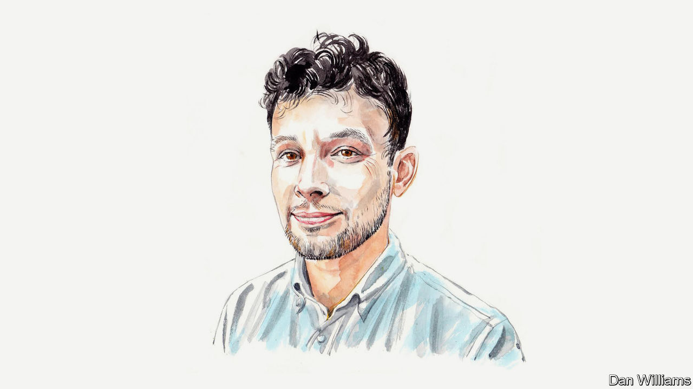

###### Artificial intelligence and copyright

# Don’t give AI free access to work denied to humans, argues a legal scholar 

##### Ben Sobel thinks lawsuits from rights-holders could reshape copyright law for the better 

 

> Feb 16th 2024 

MORE THAN six years ago I published an analysis arguing that training generative AI on copyrighted works could break American law. Since then many others have suggested the same. The issue has already boiled over in Britain, where this month talks between the AI industry and creative organisations over a new code of practice broke down. Now, lawsuits by artists, writers and the    are testing our theory against defendants such as OpenAI, Meta and Stability AI. 

The AI industry’s defence rests on “fair use”, a doctrine that permits the use of copyrighted material without its owner’s permission in certain circumstances. If this argument prevails, the industry will receive to exploit copyrighted works without compensating authors—all while the law continues to stifle humans’ access to those works. AI will “learn” from pirated textbooks free of charge, while students pay extravagant prices. How perverse.

The purpose of copyright is to stimulate creativity and thereby encourage the creation of more expressive works for the public good, not just to promote a particular technology. Yet, curiously, many “free culture” activists support the AI companies. These activists’ worldview crystallised around the early 2000s, when copyright protections expanded and record labels pursued exorbitant judgments against people who shared music online. In response to this grab by major rights-holders, the copyright decelerationists, as I call them, vowed to halt copyright’s expansion.

I believe that the decelerationists’ premise remains as correct today as it was then: ever-stronger copyright protection has withheld incalculable amounts of culture from the public domain. But we won’t repair that damage with exceptions tailor-made to benefit the giants of AI. A better strategy is to enforce copyright just as harshly on AI learners as we enforce it on humans. This may seem paradoxical, but I believe it will highlight the law’s disregard for learning and could ultimately lead to copyright regulation being relaxed for humans. Thus, we should become copyright accelerationists.

Accelerationism can be used as a tactic to destabilise: Karl Marx delivered an accelerationist call-to-arms when he endorsed free trade, believing it would heighten capitalism’s contradictions and hasten the social revolution. In the context of copyright, accelerationism aims to upend the legal rules that hinder ordinary people from engaging with creative works. For example, there are millions of in-copyright works with no identifiable owner. But because using these “orphan works” remains legally risky, libraries, archives and people who want to use them for their own creative ends hesitate to touch them. 

This cultural tragedy is the result of a dramatic expansion of copyright’s reach over the past 50 years. Copyright’s term was lengthened, keeping creative works out of the public domain long after their creators had earned a fair return and stifling new generations. “Steamboat Willie”, Mickey Mouse’s 1928 debut, did not enter the public domain until January 1st this year because rights-holders had successfully lobbied for a 20-year copyright extension without any rational economic justification. America’s Congress abolished “formalities”—requirements that authors register and renew their copyrights and place notices in published works, or risk forfeiting those copyrights. Courts chipped away at the required level of creativity for copyright to be established.

These changes had predictable consequences: innumerable works were withheld from the public and a small group of rights-holders was enriched. But technological changes triggered unanticipated consequences. Each of us now accumulates dozens of copyrights every day. Thanks to rock-bottom originality requirements and the elimination of formalities, all but our most mindless emails, text messages and photos automatically count as intellectual property until 70 years after we die. Nearly all valuable AI training data is owned by someone and will be for decades. These legal rules, long the enemy of free culture, are now the enemy of powerful technology companies, too.

The AI industry claims training AI on copyrighted works is excused by the fair-use doctrine because rights-holders cannot prevent others from copying their works to learn from them. But that argument would fail if made by a human. Could you imagine a file-sharing defendant arguing that downloading a Beatles album was fair use because she wanted to learn the Lennon-McCartney songwriting style? She would be laughed out of court, even if she wrote nothing that resembled a Beatles tune.

The decelerationists and I agree that copyright’s routine thwarting of human learning and creativity is tragic. But carrying the AI industry’s water won’t repair that tragedy. Decelerationists must realise that even if the industry wins, all the cases denying fair use for activities like artistic pastiche, fan fiction and the publication of personal letters in a biography will remain binding precedents (for humans, that is).

So don’t decelerate copyright. Do the opposite in order to heighten copyright’s contradictions. Show the powerful just how harmful it is when the law stymies learning. Give AI firms a choice: support reforms that eliminate the copyright doctrines that inhibit human and machine learning alike, or watch investments in AI crumble under the same copyright liability that human learners face.

Copyright accelerationism is not anti-AI. If it appears so, that’s because today’s copyright law is anti-human. What copyright accelerationism abhors are laws that preserve all of copyright’s anti-human provisions while exempting the AI industry from those same strictures. There’s no inherent tension between the interests of people who create and consume media in traditional modes and people who use generative AI. Their interests appear in conflict now only because decades of anti-learning copyright policy have blinkered us.

Sam Altman, the boss of OpenAI, calls the AI revolution “unstoppable.” But copyright law presents a profound threat to generative AI—and AI presents an unprecedented opportunity to reshape copyright for the better. So come, accelerationists. Pit AI’s “unstoppable” force against an object long thought immovable: inhumane copyright law. ■


