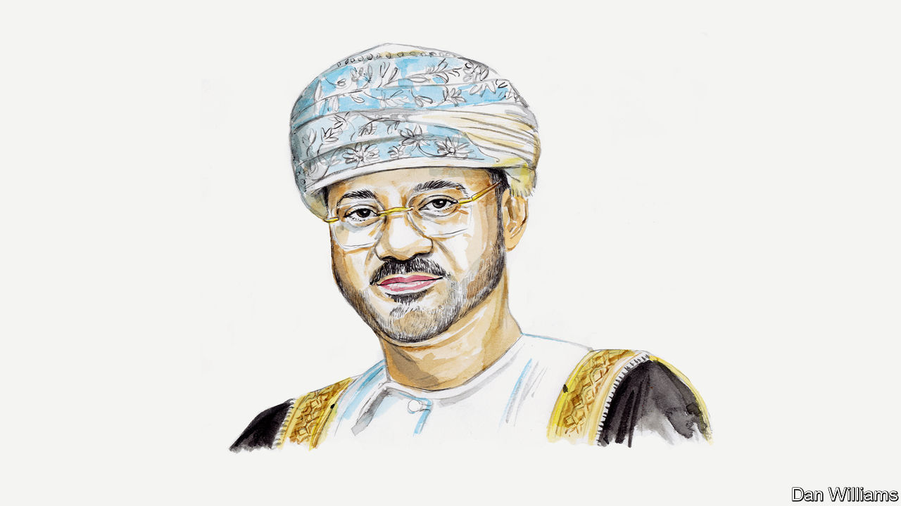

###### The Middle East

# Oman’s foreign minister calls for an emergency peace conference 

##### Hamas, Hizbullah and the Houthis are too deeply rooted in their communities to be excluded, argues Badr Albusaidi 

 

> Feb 21st 2024 

OMAN IS CALLING for an emergency international conference on Palestine, an initiative to match that of President George H.W. Bush when he convened the Madrid Peace Conference in 1991. Madrid set off a series of multilateral negotiations aimed at ending the Arab-Israeli conflict, which made substantial progress but were then, tragically, interrupted. We must try again. 

Like all its neighbours Oman is suffering the consequences of the deepening crisis in Gaza. The prospect of further escalation threatens the entire region. So a ceasefire is a humanitarian necessity, and a strategic necessity too. The step from ceasefire to emergency conference must come swiftly and decisively.

Without a Palestinian state, the whole region is condemned to a constant cycle of violence, and the Palestinians will continue to live with the threat of annihilation.

Hamas cannot be eradicated. Movements of national liberation like Hamas are too deeply rooted in their communities. Their cause will be kept alive however many militants die. So, if there is ever to be peace, the peacemakers have to find a way to talk to them. And to listen. 

There is an assumption that the people of the Middle East are so imprisoned by sectarian logic that they are incapable of making the kind of sophisticated judgments that the people of the liberal and democratic West are used to making. This is deeply condescending. It is also factually wrong.

Pluralism is not the privilege of a Western elite; it is a vital part of the history and present reality of the Arab world. The people of the region have minds of their own and make political judgments rather than just adhering to sectarian affiliation.

In Lebanon today, for example, it is Hizbullah which has mobilised its forces and taken military action against Israel. Hizbullah, we are told, is a Shia party and it functions as a proxy for Iran. And that is supposed to explain what is happening.

But it stops short of an actual explanation. In reality, Hizbullah enjoys significant popular and political support within Lebanon. That support comes from across the religious spectrum, and includes not just Shia Muslims but also Sunni Muslims and Christians. This support is a matter of political choice, not sectarian fidelity. 

I am not saying that the people represented in Western media as the bad guys are really the good guys; that’s just binary thinking. What I am saying is that bad and good aren’t helpful categories when trying to make sense of a complex and dynamic situation and act responsibly within it.

Talking to, listening to and ultimately working with all kinds of players, with different interests and perspectives, has to be the basis on which we halt the catastrophe in Palestine. The world has deferred the question of Palestinian statehood for far too long. Too many of those who speak in favour of a two-state solution regard this as an objective to be achieved in some distant future—as though in that future the fundamental realities will have magically changed to make possible then what is somehow impossible now. 

So, no more deferral. We have to deal with the reality we inhabit now. And that reality includes Hamas.

Those who follow the affairs of the region sometimes praise the Omanis as mediators. It is true we have supported peace initiatives from Camp David in 1978 to the Madrid process in 1991 and the Oslo Accords in 1993, as well as the JCPOA multilateral nuclear accord with Iran, talks aimed at ending war in Yemen, and various hostage releases. But we are just facilitators, not mediators, for some infer that mediators sit in judgment. That is not the Omani way.

The conference Oman is calling for must include everyone. Because everyone has a stake in achieving agreement. Iran will need to make difficult compromises to be part of such a process. But I am confident, having dealt with Iranian officials for more than 30 years, that the country’s leaders are capable of making such compromises. 

We must also believe that there exists an Israeli leadership that can be persuaded to engage in good faith. The people of Israel deserve better than to live in a world shaped by the assassination of Prime Minister Yitzhak Rabin in 1995—a murder, perpetrated by a young Israeli extremist, that helped derail the peace process.

We will all have to engage with non-state actors, and that includes not only Hamas and Hizbullah but the Houthis, too. The Houthis, and before them other Zaydi Shias, have been a big factor in Yemeni politics for centuries, and like all Yemenis they are Oman’s immediate neighbours. Today, they rule most of Yemen. This makes them the de facto government. Again, we must inhabit the reality we find ourselves in. (And, if I may offer an aside on the Red Sea, I am as certain as I can be that calm will prevail there if a ceasefire is agreed in Gaza. After all, the West is arguing there is no linkage, and a ceasefire would give the Houthis the opportunity to demonstrate precisely that there is.)

Where will a conference be held? Wherever people feel comfortable. It might be in Switzerland or Norway, for example. When? As soon as possible. And what for? To agree a plan to admit Palestine to the United Nations, and for many more states to join those which I hope will be recognising Palestine in the coming weeks. This could serve as a platform for the urgent negotiation of a comprehensive two-state solution and all that is required to guarantee it.■


