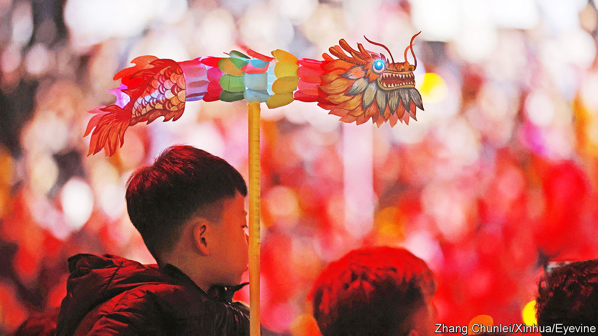

###### Enter the loong

# A nationalist effort to rebrand the Chinese dragon 

##### Officials in Beijing want a more friendly symbol for their country 

 

> Feb 22nd 2024 

The year of the dragon, one of the 12 creatures in the Chinese zodiac, began on February 10th. But some Chinese state media have been calling it the year of the  in their English reports.  (pronounced like the English word “long”) sounds like the Mandarin term for dragon. It is more appropriate, says the state-run , because Western dragons are evil monsters, whereas Chinese ones are noble and benevolent. The latter are said to bring good luck. 

Dragons have a special place in Chinese culture. They were once the symbol of the emperor. Some Chinese people—including the country’s supreme leader, Xi Jinping—call themselves “descendants of the dragon”. But in both China and other countries, dragons come in all shapes and sizes. There are good dragons in Western mythology and culture. One is on the Welsh flag, for instance. Another called Puff, made famous by the musical group Peter, Paul and Mary, seems nice enough. Meanwhile, there are Chinese tales of  who eat children and conjure up devastating floods. 

So the word dragon would seem a decent translation for . But China’s state media have another reason to prefer the Mandarin term. They hope it will make the country look more friendly. China’s association with fearsome dragons has contributed to Western perceptions that it is a threat, writes Ding Gang, an editor at the , the Communist Party’s mouthpiece. If Westerners instead saw China as a friendly , they would not fear its rise, Mr Ding argues. Never mind China’s efforts to upend the liberal world order.

China often tweaks language to make political points. In recent years English editions of state media have increasingly replaced the word Tibet with Xizang, the Mandarin word for the region, to downplay its history of independence from the rest of China. Government officials have also started to use Mandarin words to refer to disputed territories that China claims in the South China Sea. Ren’ai Reef, for example, which is also claimed by the Philippines, is now usually called Ren’ai Jiao on the English version of the Chinese foreign-ministry website ( is Mandarin for reef). 

More than a few netizens have mocked the effort to rebrand the Chinese dragon as a friendly fire-breather. Should China be known internationally as Zhongguo, the transliteration of its name in Mandarin, asked some. But the word  could yet catch on, at least among English-speaking Chinese people. About two-thirds of respondents to a poll on Weibo, a Chinese social-media platform, said they prefer it to the word “dragon”. “Change the definitions of words,” wrote one commenter, “and the world will slowly change.” ■


