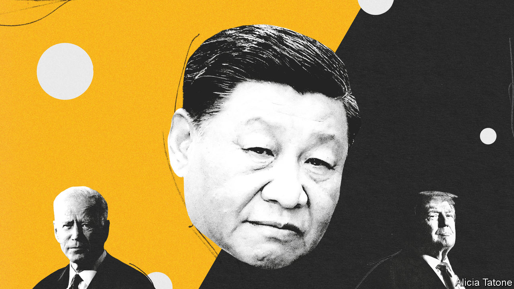
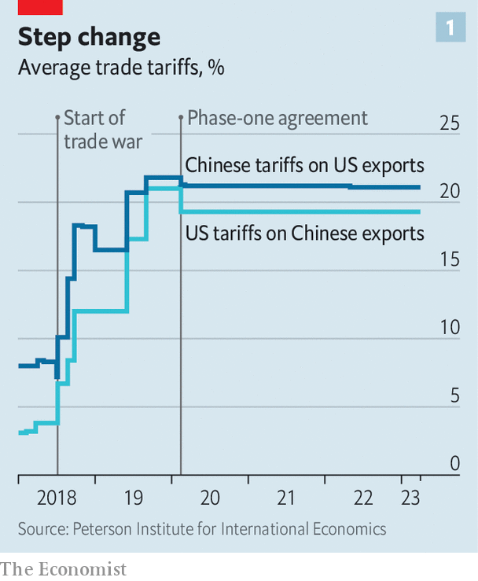
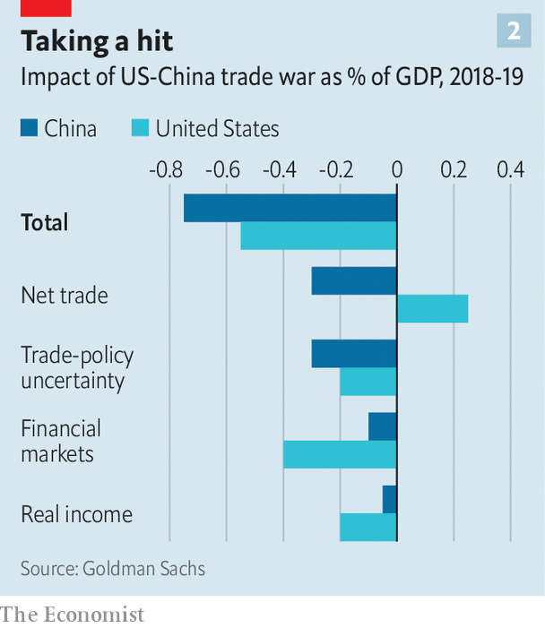
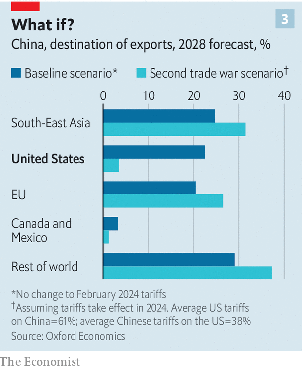

###### America’s election, viewed from Beijing

# How scared is China of Donald Trump’s return? 

##### 60% tariffs are a danger, yet some Chinese nationalists are cheering him on 

 

> Feb 20th 2024 

IF YOU WANT to get a sense of how China feels about the prospect of Donald Trump winning America’s presidential election, Chinese social media offers some revealing signals. In the past few weeks it has begun to boil over with fury and mockery. The prospect of  of over 60% on Chinese imports? “Add even more,” rages one online commentator in the mainland. “I’d be curious to see how ordinary Americans would live.” Others think Mr Trump would increase the . The world will “never be at peace” with him around, reckons another netizen. “This old madman is too vicious,” says a third. “He must be annihilated.”

It is not just online: the prospect of a Trump victory is the subject of debate among China’s elite, too. They fear his return to the White House would lead to an even hotter trade war, with potentially vast economic costs. But they also believe his contempt for alliances (witness the latest outburst against NATO) could yield huge propaganda gains and undermine the American-led security system in Asia, freeing China to act as it pleases on Taiwan and more. Some Chinese nationalists are cheering his successes and call him Comrade Chuan Jianguo: Chuan being a common rendering of Mr Trump’s surname, and Jianguo meaning “build the country”. It is a way of suggesting that Mr Trump’s excesses make China stronger.

For Xi Jinping, China’s leader, the unpredictable trade-offs that a Trump presidency would involve are especially difficult to weigh, even if the two men’s relationship is reasonable enough after multiple encounters from banquets in Beijing to steak dinners at Mar-a-Lago, Mr Trump’s lair in Florida. “I like President Xi a lot,” Mr Trump recently told Fox News. “He was a very good friend of mine during my term.” On the one hand Mr Trump’s presidency from 2017 to 2021 saw a profound shift in America’s policy. His administration deployed tariffs in an attempt to reduce America’s trade deficit and protect jobs. It redefined the domestic debate in America, with China portrayed as a political, technological and military adversary. 

On the other hand Mr Biden’s more systematic approach to governing has posed a different kind of threat to China than that of Mr Trump’s first term. America has kept the Trump tariffs in place, but on top of that also built a comprehensive system for restricting Western technology flows to China. And by investing in America’s security partnerships and alliances, from Australia and India to the Philippines and South Korea, it has rejuvenated an Asian security system to deter and contain China. Mr Biden may be known as Shui Wang, or Sleepy King, in China. But while more restrained than Mr Trump, he has in some ways been a more formidable opponent.

 


A big part of Mr Xi’s calculus now is working out what Mr Trump could do on China in a second term. You might imagine that after four years in office, the MAGA appetite to confront China would be sated. Yet the available signals suggest that opposition to China in Mr Trump’s inner circle may have intensified. Take the views of Robert Lighthizer, Mr Trump’s influential trade representative, who could get a top job again in the White House. In the period from 2017 to 2021 he launched an investigation into Chinese theft of intellectual property and invoked Section 301 of America’s trade law, which allows the president to punish trade partners that do not play fair, in order to raise tariffs. The average tariff faced by Chinese firms rose from 3% in 2018 to 21% by the end of 2019, when the two countries struck a truce (see chart 1).

Mr Lighthizer’s position remains intensely hostile to China, whose totalitarian instincts, he argues, pose an ever greater danger. In a book published last year, “No Trade is Free”, he argues China is “the greatest threat that the American nation and its system of Western liberal democratic government has faced since the American revolution”. The book contains several tough proposals, including screening of Chinese investments not just on security grounds but also for “long-term economic harm”; the prohibition of any Chinese company from operating in America unless there is reciprocal access for American firms in China; and the banning of TikTok, a Chinese-owned short-video app.

Crucially, Mr Lighthizer recommends another huge increase in tariffs. The goal, he argues, should be “balanced trade”—that is, presumably, no goods-trade deficit at all. Last year China still enjoyed a surplus with America of nearly $280bn, down from a record $419bn in 2018, but not far off the $347bn before Mr Trump took office. To correct this Mr Lighthizer calls for the undoing of “one of the worst mistakes” in America’s history: its decision to enter into “permanent normal trade relations” (PNTR) with China in 2000. This allowed China to pay the same low tariffs America charges most of its trading partners, rather than an alternative, steeper set of levies that appear in “column 2” of America’s tariff schedule and apply to only a handful of countries such as Cuba and North Korea, and now Russia and Belarus.

Ending PNTR with China would raise tariffs on Chinese goods to 61% on average, according to Oxford Economics, a consultancy, assuming the Section 301 tariffs remain in place. For Chinese mobile phones, tariffs would jump from 0% to 35%; for Chinese toys from 0% to 70%. Instead of settling for the existing column 2 tariffs, America might write a new tariff schedule just for China. That could be even stricter on some goods (such as cars) but less restrictive on other products dear to American consumers, such as Apple iPhones. 

 


Mr Xi will be busy asking his advisers to estimate how high the economic fallout might be. One guide is the past. At its height, the trade war knocked as much as 0.8% off China’s quarterly GDP, according to Goldman Sachs, a bank, equivalent to roughly $40bn in today’s dollars. Overall, the net trade effect was negative for China and positive for America. But the conflict eroded the incomes of both Chinese and Americans by raising prices, disrupted financial markets in each country and led to policy uncertainty that inhibited business spending (see chart 2). During negotiations with China, Mr Trump liked to be both the arsonist and the firefighter, as one observer put it, starting conflagrations with angry tweets and then dousing them with diplomatic dinners. These zigzags spooked global markets. 

Another guide to the potential cost is modelling. Repeal of PNTR would shrink America’s expected share of China’s exports from about a fifth under existing policies to about 3%, according to Oxford Economics (see chart 3). There are many moving parts to such simulations. One consideration is whether firms believe that new Trump tariffs would be maintained after he left office, as was the case last time (see Finance &amp; economics section). Another is that some Chinese components would still find their way into America’s market embedded in goods assembled by other countries. China’s economy and financial markets are in dismal shape compared with 2017. And it is not clear how China would retaliate: doing so during the first Trump presidency did not force America to back down. Oxford Economics assumes that China would raise its tariffs by about 17 percentage points on average. All in all, the once-intimate economic relationship between the superpowers could be reduced to an air-kiss.

 


Either way, the kind of decoupling that Mr Trump’s advisers envisage would inflict profound damage on China’s economy. Studies by JaeBin Ahn and other economists at the IMF show what would happen if the world splits into rival economic spheres with limited flows of foreign-direct investment between them. If such flows were to fall by half, it could eventually reduce China’s GDP by about 2%, relative to a baseline in which investment flows more freely. Another study by Carlos Góes of the University of California, San Diego, and Eddy Bekers of the World Trade Organisation argues that tariff increases of around 30% could lower China’s income by over 5% by 2040. 

Four more years?

Judged on trade and tariffs, it is likely that Mr Xi favours a Biden victory. A Biden administration would probably extend import curbs on Chinese electric vehicles and further impede the flow of American cutting-edge technology to China in realms including semiconductors, artificial intelligence and quantum computing. But it is far less likely than a Trump administration to trigger a destabilising trade shock.

Yet the America-China relationship encompasses far more than economics, and it is here that the calculus for Mr Xi may lean the other way. He resents the Western-led world order and wants to establish China as an alternative centre of power. Mr Trump’s tempestuous relationship with America’s allies in Europe and Asia may undermine cohesion with them on China policy if he is elected again. His contemptuous remarks about NATO, including his recent suggestion that he would not offer American protection to allies who fail to spend enough on defence, are music to China’s ears. It sees NATO as a cold-war relic that the West uses to preserve its dominance. For the same reason, it relishes any tension in America’s relationships with Japan and South Korea, such as Mr Trump caused by threatening the withdrawal of American troops from those countries if their governments would not agree to big increases in their contributions to the cost of maintaining the bases. 

A Trump administration might unwind the work Mr Biden has done to nurture Asian partnerships. To China’s chagrin, he created a new grouping, known as AUKUS, aimed at strengthening co-operation with Australia and Britain in responding to the security challenge posed by China’s navy in the Indian Ocean and Pacific. China, inaccurately, calls it “NATO-like”. Still, AUKUS involves exactly the kind of long-term, rather than transactional, relationship that Mr Trump dislikes. 

Similarly on Taiwan, Mr Trump may be preferable for China. Mr Biden has sometimes gone beyond the conventional, ambivalent, language about America’s commitments to the island. He has said repeatedly that American troops would defend Taiwan if China invaded, only for his aides to walk back his comments after Chinese outrage. Mr Trump is probably far less enthusiastic about protecting the island. In his memoir, John Bolton, who served as Mr Trump’s national security adviser in 2018 and 2019 before a bitter parting of ways, wrote of Mr Trump’s “grousing” about weapons sales to Taiwan. Mr Trump was “dyspeptic” about Taiwan, Mr Bolton said, suggesting his boss lacked commitment to a “democratic ally”. 

Above all else, Mr Xi wants stability. The views of Chinese scholars probably echo official thinking. In an interview in state media in January, Yan Xuetong of Tsinghua University in Beijing said that the candidates would compete to show “who is more anti-China” than the other: “If we want to prevent confrontation between the two sides from getting out of control and escalating into a conflict, our country needs to take some proactive measures.” Mr Biden’s approach to China is likely to be more predictable but better organised and enforced, and perhaps a bigger threat in the long run. Mr Trump’s potential for chaos and excesses could create opportunities for China to outmanoeuvre America but also bring the instability China dreads. 

Could there be a way out of superpower confrontation? Wu Xinbo of Fudan University in Shanghai suggests that Mr Biden offers hope for Sino-American ties. In an online article he describes Mr Trump as a “unilateralist”, having little need for China’s help. “But Biden still hopes to maintain America’s dominant position in the world,” writes Mr Wu. “As long as the United States wants to deal with many global problems, it cannot do without co-operation with China.” Yet amid a military build-up and fraying trade ties such optimism is rare. Mr Xi will be watching the vote counts in November closely: the two likely candidates present China with very different challenges. But even as he waits for a result, he will know that however divided American politics may be, hostility towards China is now a bipartisan matter, and deeply entrenched. For him and for America the election cycle is part of a longer-term struggle. ■


