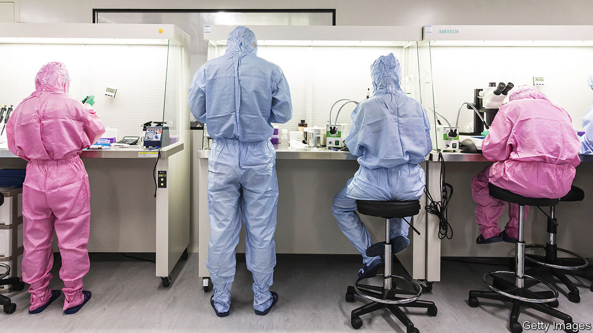
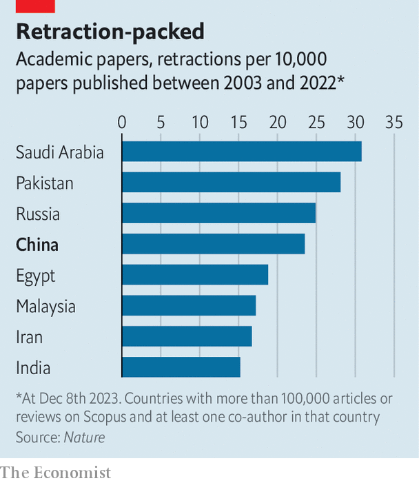

###### Science fiction

# Why fake research is rampant in China 

##### Eleven students aim to set a better example 

 

> Feb 22nd 2024 

HUANG FEIRUO was once a respected scientist who studied ways to make pigs gain weight more quickly. He ran government-funded research projects at Huazhong Agricultural University in the central city of Wuhan. But last month 11 of his graduate students accused him of plagiarising the work of other academics and fabricating data. He had also, they said, put pressure on them to fake their own research. On February 6th the university announced that it had fired Mr Huang and retracted some of his work.

Scientific fraud is all too common in China. Bad incentives are a big part of the problem. Chinese universities typically reward researchers with promotions and funding based on the quantity of papers they publish, not the quality. That has got results. In 2017, for the first time, China published more scientific papers than any other country. It has kept the top spot ever since. But while some of the research has been cutting-edge, much has been dodgy.

 


The scale of the problem is hard to measure, as fraudulent work often goes unnoticed. But it is useful to look at retractions, or when a scientific journal withdraws a study, usually due to suspicions of research misconduct. Papers from China have the fourth-highest retraction rate in the world, according to , a journal (see chart). In a database of some 50,000 retracted studies compiled by Crossref, an American non-profit, and Retraction Watch, a blog, about 46% are from China.

Many of the fishy papers are probably written, for a fee, by “paper mills”. These outfits often plagiarise real research, changing a few details. Some fakes are obvious, says Elisabeth Bik, a microbiologist who specialises in rooting them out. She found a Chinese paper on prostate cancer, for instance, which claimed that more than half of the patients studied were women. Only men have prostate glands. Other fakes look more convincing and might pollute a field of research. So some scientists simply refuse to peer review work from China, says Ms Bik.

The government, which hopes to turn China into a scientific superpower, is trying to crack down on fake research. In recent years it has fined hundreds of misbehaving scientists and barred them from public funding. In January the Ministry of Education launched a fresh campaign, demanding that universities investigate every retracted paper written by their faculty. Many authors welcome such toughness. Authorities should use harsh penalties to “purify” the pursuit of science, says a researcher at a hospital in Beijing. 

But punishment alone will not fix the problem, says Shu Fei of Hangzhou Dianzi University. He believes universities should stop rewarding researchers just for publishing lots of papers. In 2020 the government released guidelines to this effect. Still, little has changed, says Mr Shu. Part of the problem, he suspects, is that university leaders are government officials (rather than academics). So they are good at chasing numerical targets, but bad at fostering good science, which is hard to quantify.

The example set by Mr Huang’s graduate students is encouraging, at least. On social media many Chinese people have applauded them for taking a stand, at the risk of damaging their own academic careers. But there is much work still to be done. In an online survey published last year, over a quarter of Chinese graduate medical students considered it acceptable to fabricate some data or results. ■


