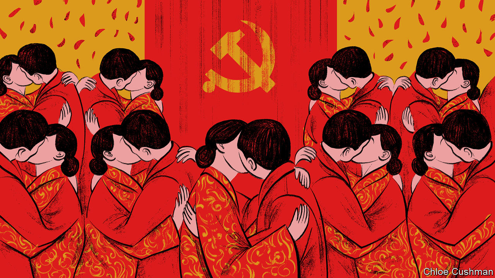

###### Chaguan

# Xi Jinping plays social engineer 

##### Inside the Communist Party’s campaign to spread civilised habits 

 

> Feb 22nd 2024 

AS A SHOW of a political party’s social power, a mass wedding is hard to beat. There was a strut in the step of the propaganda chief of Ningdu county, in the orange-growing hills of Jiangxi province, as he welcomed 66 couples to a collective marriage ceremony on February 17th. Though the men and women were all dressed in traditional red wedding robes, this was a Communist Party gathering. It began with expressions of respect for Xi Jinping, the supreme leader. Standing in Ningdu’s main square, watched by their families and a throng of curious locals, the couples read a wedding oath from a large video screen. They pledged to love one another, to care for their respective parents, to educate their children and to heed the call of the party and government to build a contented, civilised China. The term civilised is a clue. The couples were not just enjoying a free party. They were now recruits in a nationwide ideological campaign, intended to stamp out “unhealthy” traditions and carry “socialist spiritual civilisation” into every home, especially those in rural areas.

Bad habits targeted by the campaign vary from place to place, but its stated goal is the same everywhere: to solve real-life problems so that “the masses personally feel that the Communist Party is good”. A banner on stage spelled out the mission of Ningdu’s collective wedding. It read: “No to bride prices, yes to happiness”.

Ningdu is not rich. Like many counties in Jiangxi, it is notorious for high bride prices, or . Before they can marry off a son, many rural families have to find, or borrow, as much as 200,000 yuan ($27,800) to give to the bride’s parents. This is a heavy burden for some villagers and yet another barrier to marriage for rural males, in a country where men now outnumber women by almost 35m after decades of selective abortions. Jiangxi leaders have duly added high bride prices, along with costly village weddings (and funerals) to their list of outdated habits that must change.

In Mr Xi’s China, once an ideological campaign is set in motion, little is left to chance. Ningdu’s mass wedding addressed local concerns. But when a bridegroom was called to the stage to express gratitude to the party, and urge young people to embrace “a new culture of civilisation”, those were national slogans. Flying video cameras buzzed overhead, for Chinese propaganda outlets love drone footage filmed from above. 

From his vantage point near the stage, Chaguan watched the drones and imagined them pulling back for a long shot. Fly high enough over Ningdu’s main square and the next node of this campaign would come into view: the town’s New Era Civilisation Practice Centre. A party-run ideological training hub, it is attached to a memorial hall that honours Red Army fighters from the 1930s. China’s first such centres opened in 2018 as a pilot. The campaign was expanded to the whole country in 2021. Following a hierarchy repeated nationwide, Ningdu’s civilisation-practice network has one full-scale centre, supported by 25 offices and 338 stations at neighbourhood level, covering a county with 700,000 residents.

Should the drone swoop down on a neighbourhood station, it would find it manned by a few propaganda officials and squads of volunteers. A party directive from 2019 suggested that 13% of all residents should volunteer at civilisation-practice bases. Some activities are benign: water-safety lessons for children, fan-dance classes for pensioners. Volunteers deliver shopping to the old. Other activities are bossier. Villages nationwide have established “Red and White Committees” to promote frugal weddings and funerals, sometimes held in communal canteens. The , the party’s mouthpiece, praised a village in Hubei province that evaluates households annually as “honest” or “dishonest”, with honest families given credits to exchange for goods in a “points supermarket”. It cited a man who accepted village mediation of a dispute with neighbours to avoid losing points. That said, the “points supermarket” seen by your columnist in a Jiangxi civilisation-practice station was underwhelming: a glass-fronted cupboard holding packets of soap, laundry powder and toothpaste.

If the drone flies higher, it would see how local campaigns reflect the ambitions of party chiefs. Mr Xi has drawn connections between large problems, such as falling marriage and birth rates, and grassroots work to “strengthen guidance on young people’s views of marriage, childbirth and family”. Civilised-practice grids have appeared, as that campaign joins another: the Xi-era grid management scheme for monitoring individual neighbourhoods.

A problem-solving, all-knowing party

Clearly, the party is serious about its mission to be felt and seen in every home. Yet return to the ground in Ningdu and the picture becomes blurrier. For one thing, that mass wedding looks very different in close-up. A clue came when a young child ran to a supposedly newlywed couple. “Mama,” he laughed, and hid under her robes. When asked, other couples admitted to being married for years. A red-robed groom said that he married a decade ago and was taking part “to help the propaganda department”.

Another bridegroom turned out to be newly married, at least. Then he confessed to having hosted a wedding banquet for “200 or 300 people”, undermining the day’s emphasis on frugality. High bride prices “really are bad”, the young man continued, especially if a bride’s parents keep the money and do not pass it to the new couple. But he ascribed China’s falling marriage rates to larger problems. Men who move to cities encounter “fierce competition” and unaffordable housing. But if they stay in rural areas, “there are basically no girls of marriageable age”. He endorsed the civilisation campaign, though he suspects that changing deep-rooted customs may take a generation. “Since I am a party member, I must take part in this kind of activity,” he revealed, unbidden.

Mr Xi has increased his party’s reach into everyday lives, tackling practical problems as a way to strengthen social controls. But changing hearts and minds is hard. Some shows are just a show. ■


