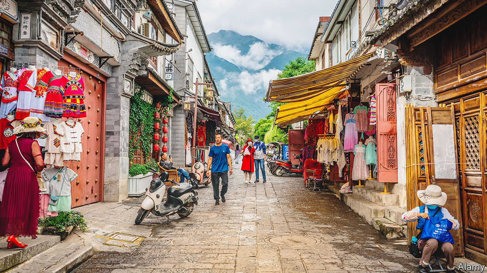

###### Escape to “Dalifornia”

# Growing numbers of Chinese are escaping urban life for rural peace 

##### “The Mountains Are High” examines what is driving people out of Chinese cities to the mountains 

 

> Feb 22nd 2024 

By Alec Ash. 

IN January 2020 Alec Ash, an English writer living in Beijing, arrived in the small mountain town of Dali in southwestern China. He and his fiancée had split up just two months before their wedding, and he wanted to escape. So he chose a mountain refuge to which a growing number of Chinese were fleeing, seeking a different kind of Chinese dream. The ancient town became known as “Dalifornia”. 

Some of the new arrivals were writers and political dissidents, but many were refugees from modernity. The reason most of them left cities, writes Mr Ash, “is not communist control so much as capitalist excess”.  has improved people’s lives. But now some citizens are stepping back from the “gospel of development” and asking, “What was it all for? I’m richer, but am I happy?”

The numbers are still small, but the trickle represents a rejection of what upwardly mobile Chinese held dear for four decades: “It had taken just two generations for a Chinese family to pass from pre-industrial agrarianism to post-material urban malaise.” For years  and tried to shift their (household registration) to get better health care and education. Now urbanites are doing the reverse.

Some are hippies. Others are Chinese yuppies fed up with the social expectations of earning more and pushing their children to achieve, part of a trend known as (a return to old ways). All are taking advantage of Dali’s remoteness. The book’s title invokes an old saying, “The mountains are high and the emperor far away.” 

The author sets out to reinvent himself, too. What could have been a laboured tale of a foreigner in rural China is mercifully kept as a sideshow. Mr Ash (who used to be a emerges from the year a changed man. China, less so. “The paradox of Dali was that we were trying to find freedom in an unfree state,” he writes. The parties continue, but so does the Communist Party. Those who can get from Dalifornia to California still do.■


