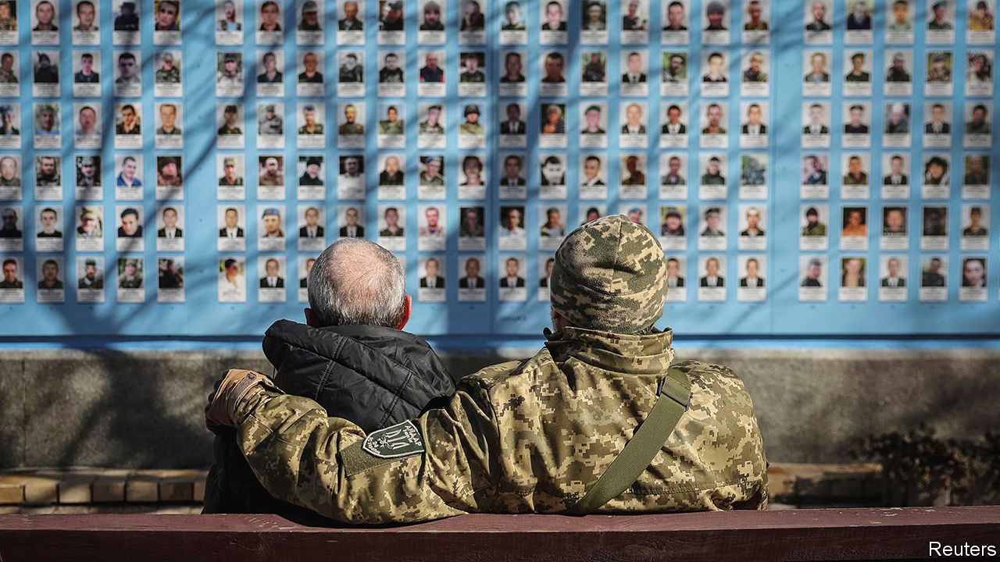

###### The war score

# How Ukraine’s fortunes have ebbed 

##### Two new books chronicle Ukrainians’ miraculous early resistance. Today’s reality is more sombre 

 

> Feb 22nd 2024 

 By Yaroslav Trofimov. 

By Simon Shuster. 

WHAT HAS gone wrong? Two years ago, as Russian tanks crossed the border, Ukrainian men and women flew back to defend their homeland. Now the country is struggling to . America used to give Ukraine money and weapons. Today, despite the obvious peril,  in the House of Representatives are blocking the supplies it needs. On February 17th Ukrainian forces handed Russia its biggest victory in months by abandoning the eastern town of , where Russia was able to fire ten shells for every Ukrainian round. 

Two new books shed light on Ukraine’s dark turn. One is a brilliant and stirring account of the early months after the invasion, the other a probing biography of President . Although both were written while the war was running in Ukraine’s favour, to read them today is to understand what has changed. 


Yaroslav Trofimov, who has covered the war for the , is Ukrainian by birth. By layering detail upon telling detail from his notebooks, he builds up a vivid picture of how the men and women of Ukraine repulsed the Russian blitzkrieg with cleverness and courage. Helicopter pilots fly daredevil missions to supply the Azov brigades holed up in Mariupol in the south. When their missile-loading crane breaks, crews improvise by hauling 620-pound Uragan rockets using only their leather belts. Three Ukrainian soldiers deceive Russian military intelligence by talking non-stop on their radios, as if they are part of a much larger force. 

Simon Shuster, who has covered the war for  is Russian by birthHis theme is how a comic actor with an eye to stardom became a wartime president of iron resolve. Nothing would have been easier than to write a hagiography. Instead, Mr Shuster describes how Mr Zelensky’s journey from burlesque to bunker has taken a toll on the man and his family. He worries that, having amassed extraordinary powers under martial law, Ukraine’s president may not want to give them up whenever—and however—the war finally ends.

Both these books live in their reporting, and a message emerges about why the war has unfolded as it has. Ukraine survived Russia’s first assault two years ago because it was underestimated. The Kremlin’s battle plan was to storm Kyiv, the capital, and capture and kill Mr Zelensky or push him to flee abroad. In his place, , Russia’s president, planned to install his crony, Viktor Medvedchuk, at the head of a puppet government.

In his hubris Mr Putin had not reckoned with the bravery and initiative of countless Ukrainians. Although some, especially in the south, embraced the Russian promise of safety and money, many more joined the resistance. Teams of volunteers and special forces rushed to Hostomel airport, where Russia was flying in thousands of elite troops tasked with storming Kyiv. Had these units landed, Kyiv could well have fallen. Quarry-owners in Voznesensk brought granite to form roadblocks against advancing Russian armour. In Okhtyrka, outside Kharkiv, volunteers ambushed a column of tanks. They were so unpractised that before they could fire their rocket-propelled grenades they first had to read the instruction manuals.

Another reason Ukraine survived is that it thrives on self-organising networks of local people, rather than being centralised in the Russian style. The ambush in Okhtyrka took place because the mayor decided to resist. Across the Donbas, veterans of the conflict that began in 2014 sorted into armed units. Ukrainian tank crews were adopted by local people, who brought them food and helped with repairs.

The division of labour reached right to the top. At the start of the war Mr Zelensky focused on communication. Contrary to Russian propaganda, he did not flee and was not killed. Instead, he rallied his people. He also devoted himself to winning the backing of leaders in the West; many had expected Kyiv to fall.

Mr Zelensky was content to leave the fighting to the commander-in-chief of Ukraine’s armed forces, . Unlike his president, the general had expected a massive Russian assault. He understood that Kyiv must be defended at all costs and that Ukrainians needed to spill Russian blood in the rest of the country even if it meant losing territory. He was so worried about Russian spies that he did not share the details of his plans with the presidential administration.

By some miracle Ukraine’s defence worked. Because Russia had too few men to take the country town by town, the decapitation of Mr Zelensky had to be fast. But Ukrainian forces bogged down Russian armour in the spring mud. An inspired Western public rallied to Ukraine’s cause, dragging their leaders behind them.

Today Ukraine’s problems stem from the fact that the dynamic behind its early success has gone into reverse. Ukraine is still underestimated, but by parts of the West rather than Russia. This is about more than fatigue. Some argue that Ukraine cannot win and should sue for peace; Donald Trump, the  for president, boasts he can broker it within 24 hours. Others say that the West has too small a stake in Ukraine’s fight to waste money on it. That is wrong-headed. If Mr Putin is not stopped in Ukraine he will threaten the rest of Europe. Ukraine’s fight is the West’s fight, too.

Ukraine’s brilliant self-organising networks no longer count for as much as they did. The battlefield is static, ranged along front lines fortified by trenches and minefields. Fixed warfare suits the side with more men and munitions. Given the West’s lack of urgency, Russia has the advantage. And Mr Zelensky has gradually asserted control over the war strategy. His team started to see the wildly popular General Zaluzhny as a dangerous political rival. Earlier this month, he sacked him. As politics returns, Ukraine risks becoming prey to all the old infighting and divisions.

This is a troubling picture. However, as these two books make clear, it is not hopeless. By invading, Mr Putin destroyed Ukrainians’ lingering sense that their country might belong with Russia. When so many brave Ukrainians chose to stand up and resist him, Mr Putin lost his war immediately. Mr Trofimov quotes Kharkiv’s defenders explaining that in 2014 many Ukrainians would have greeted Russian troops with flags and flowers. “That mindset has reversed completely,” says Ihor Terekhov, Kharkiv’s mayor. “The attitude to Russia is very negative now. There will probably be several generations before that changes.” Across the country it is the same.

That should give Mr Putin pause. Ukraine defines itself against Russia. So long as it remains hostile to Mr Putin’s imperial project, he cannot control it without deploying millions of men as an occupying force. Even then, Russia would struggle to cope with a guerrilla war. That leaves him in the position of being able to degrade Ukraine without being able to conquer it.

The question for the world is what sort of country will emerge. Will Ukraine be broken, or will it fulfil its dream of becoming a thriving Western democracy? Two years into this war, the answer is as elusive as peace itself. ■


