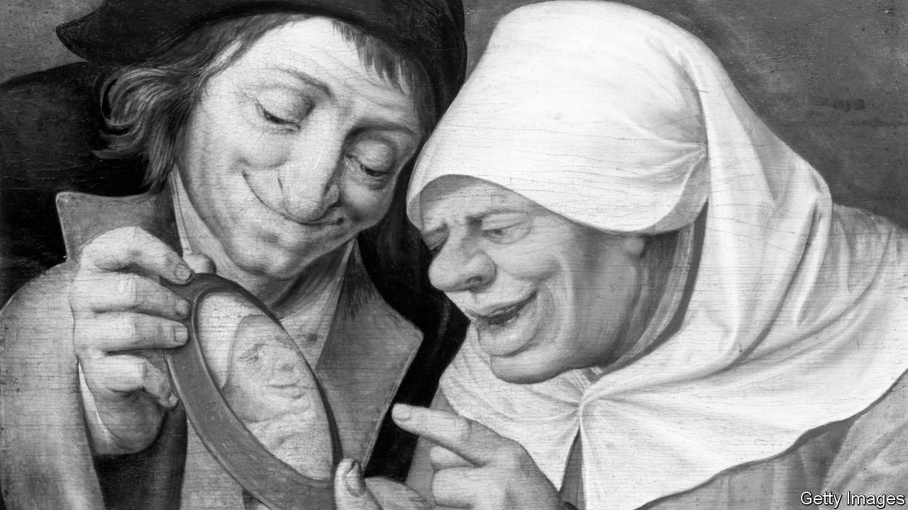

###### The lives of others

# Is everything you assumed about the Middle Ages wrong? 

##### There was more to the period than violence, superstition and ignorance, argues a new book 

 

> Feb 21st 2024 

 By Ian Mortimer. 

“In public, your bottom should emit no secret winds past your thighs. It disgraces you if other people notice any of your smelly filth.” This useful bit of advice for young courtiers in the early 13th century appears in “The Book of the Civilised Man”, a poem by Daniel of Beccles. It is the first English guide to manners.

Ian Mortimer, a historian, argues that this and other popular works of advice that began appearing around the same time represent something important: a growing sense of social self-awareness, self-evaluation and self-control. Why then? Probably because of the revival of in the 12th century, which had disappeared from Europe after the fall of Rome. The mirror made it possible for men and women to see themselves as others did. It confirmed their individuality and inspired a greater sense of autonomy and potential. By 1500 mirrors were cheap, and their impact had spread through society.

Mr Mortimer sets out to show that the , from 1000 to 1600, is profoundly misunderstood. It was not a backward and unchanging time marked by violence, ignorance and superstition. Instead, huge steps in social and economic progress were made, and the foundations of the modern world were laid.

The misapprehension came about because people’s notion of progress is so bound up with scientific and technological developments that came later, particularly with the  and digital revolutions. The author recounts one claim he has heard: that a contemporary schoolchild (armed with her iPhone) knows more about the world than did the greatest scientist of the 16th century.

Never mind that astronomers such as  and Galileo knew much more about the stars than most children do today. Could a modern architect (without his computer) build a stone spire like Lincoln Cathedral’s, which is 160 metres (525 feet) tall and was completed by 1311? Between 1000 and 1300 the height of the London skyline quintupled, whereas between 1300 and the completion of the 72-storey Shard in 2010, it only doubled. Inventions, including gunpowder, the magnetic compass and the printing press, all found their way from China to transform war, navigation and literacy. 

This led to many “expanding horizons” for Europeans. Travel was one. In the 11th century no European had any idea what lay to the east of Jerusalem or south of the Sahara. By 1600 there had been several circumnavigations of the globe. 

Law and order was another frontier. Thanks to the arrival of paper from China in the 12th century and the advent of the  in the 1430s, document-creation and record-keeping, which are fundamental to administration, surged. Between 1000 and 1600 the number of words written and printed in England went from about 1m a year to around 100bn. In England, a centralised legal and criminal-justice system evolved rapidly from the 12th century. Violent deaths declined from around 23 per 100,000 in the 1300s to seven per 100,000 in the late 16th century. 

Another “horizon” was speed and the sense of urgency that went with it. By 1600 a letter bearing important news could be carried 200 miles in a single day, thanks to people starting to use relays of horses at staging posts. Over the course of the 14th century mechanical clocks were developed, allowing time to be standardised and appointments to be kept.

The period was also marked by growing personal freedom, with the banning of slavery within England by the English church in 1102 and the rapid decline of serfdom after the  of 1348-49, when nearly half the labour force died. Political power expanded to include a growing land and property-owning yeoman class. Whoever thinks the Middle Ages were all darkness has a middling understanding of history’s truths. ■


