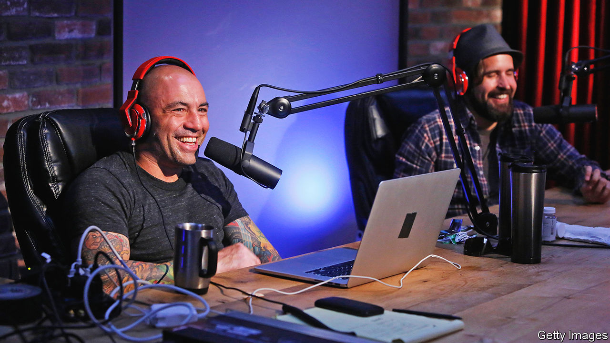

###### Aural history

# Podcasts got their name 20 years ago this month 

##### A once-fringe medium has gone mainstream, but many wonder what the future holds 

 

> Feb 22nd 2024 

In February 2004 Ben Hammersley, a British journalist, noticed a new kind of digital media: “downloadable radio” produced by geeky amateurs or public broadcasters. Mr Hammersley suggested a few names for it. Fortunately “audioblogging” and “GuerillaMedia” did not catch on. But a third did: podcasting, a portmanteau of  and “broadcasting”.

At a tech conference the next year, Steve Jobs, Apple’s boss, asked how many people in the audience had heard of podcasting, which he described as “‘Wayne’s World’ for radio”. Not a single person raised their hand. But today, 20 years after they got their name, podcasts are mainstream. Around 43% of American internet users and 30% of Britons listen to at least one a month (including ). You can open Apple, Spotify and, increasingly, YouTube to find some 4m shows by everyone from ex-convicts to duchesses. Podcasting has turned anyone with a microphone into a talking head who can talk straight into people’s earbuds.

Like butt-dialling and doom-scrolling, the podcasting boom was facilitated by the smartphone. The iPhone was released in 2007; the first standalone podcast apps came out between 2010 and 2012. In 2014 , a binge-worthy investigation into the botched murder trial of a teenager in Maryland, arrived; it was the first show to gain attention in mainstream American culture. (The first season has been downloaded more than 300m times.) The number of monthly podcast listeners in America doubled in the five years after 2014.

Since “Serial”, podcasting has been in a “hyper-charged, hyper-capitalist, hyper-speculative period”, says Nicholas Quah, a podcast critic. Tech companies swooped in, such as Spotify, which was hungry for new customers and  it could have royalty-free. (Spotify has invested $1bn in podcasting since 2018.)

But last year—cue the “record scratch” sound effect—the music stopped. Economic headwinds were one factor. But advertisers and investors also realised that they know relatively little about how many people actually listen to podcasts: “downloads”, the standard industry metric for engagement, do not always equate to listening. Spotify eliminated 200 podcasting jobs; others followed suit. Many well-regarded shows were cancelled, including “Stolen”, which won the Pulitzer prize for audio journalism in 2023. Podcasters learned that “excellence won’t save you”, says Neil Verma, a media-studies scholar. 

Although producers are struggling to turn a profit, podcasting is in the ascendant. Advertising spending and listening time are predicted to rise. But the medium “is growing in a direction that is hard for a lot of the podcast originalists to accept”, says Ariel Shapiro, who writes , an industry newsletter.

What does the future hold? Some think the future of podcasting lies in video. Many podcasts, including a talk show hosted by (pictured), the most popular podcast globally, now employ video to increase their audience. “We will be watching podcasts, we will be skipping chapters of podcasts, and you will be commenting on them at the end,” predicts Will Page, Spotify’s former chief economist.

Betting that some people want visual entertainment while listening, Spotify started supporting video podcasts in 2020. Already the black microphone icon has become omnipresent on YouTube and TikTok, functioning as a visual signal for podcast-like straight talk. Video will help podcasts’ further spread; rarely does audio alone go viral. 

Whatever , its impact on audio storytelling will endure. Podcasts offer something traditional formats often work hard to leave out, but which, as trust in media has fallen, audiences crave: transparency. Instead of formal interviews, listeners get sprawling conversations. Instead of radio features measured in minutes, listeners are led through whole investigations over hours. “In exposing the vulnerabilities of the reportorial process, the news product becomes more credible and trustworthy,” writes David Dowling in “Podcast Journalism”, a forthcoming book. Podcasts often set out to explain things—and they always end up explaining themselves. ■


