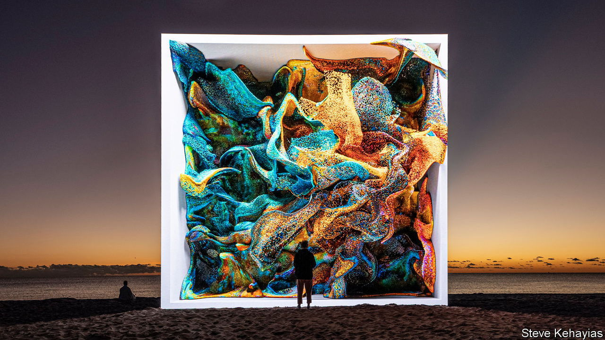

###### Good optics

# Refik Anadol’s use of AI has made him the artist of the moment 

##### His work seems to be everywhere, blurring the boundaries between art and engineering 

 

> Feb 20th 2024 

HE is in high demand. Last year Refik Anadol projected luminous images of coral on to a wall at the World Economic Forum in Davos and covered the exterior screen of , a new concert venue in Las Vegas, with animated, tumbling blue blocks. In October the Museum of Modern Art (MoMA) in New York acquired “Unsupervised—Machine Hallucinations”, in which a machine-learning model generates artworks based on those in the museum’s collection. On February 16th “Echoes of the Earth”, his largest-ever show in Britain, opened at the Serpentine North Gallery in London.

Mr Anadol, a 38-year-old Turk who lives in Los Angeles, is riding widespread public interest in  to become the most visible digital artist of his generation. His work reflects the innovation and anxieties of the current moment. As Mr Anadol sees it, AI is a powerful . In a world where so much of life happens in a digital realm, he argues, data has become a new “pigment”. 

He is steeped in both art and science, having completed several arts degrees and a residency at Google focused on machine learning. Mr Anadol trains AI models on massive troves of data, often publicly available, to create raucously colourful animations that he calls “dreams” or “hallucinations”. They swirl on superbright screens (creating what he calls “data paintings”) and wiggle on walls (“data sculptures”); sometimes the pieces illuminate buildings, as at the Sphere. 

One artwork, displayed at the Venice Architecture Biennale, drew on 70 terabytes of brain scans, allowing AI models to imagine the organ’s development. Another piece used an archive of the Los Angeles Philharmonic’s performances to imitate dreaming. A third assimilated more than 138,000 images and pieces of metadata from MoMA’s collection (pertaining to provenance, for instance), along with local weather and data about noise levels. The results are churning clouds and waves, as well as abstractions evocative of Mark Rothko, a celebrated painter.

To undertake work on this scale Mr Anadol employs around 30 people, including architects, designers and engineers, half of whom work in his studio in Los Angeles. Public projects with institutions and companies have boosted his profile, but some private collectors have bought pieces, too. Mr Anadol also mints , digital artefacts that sometimes come with physical works.

The animations have proved popular: around 2.4m people came to see an exhibition of his work at MoMA in 2022. Mr Anadol’s style is accessible and often beguiling.  works may help you fathom the process behind the “data paintings”, but it is not essential. (In some installations, a control panel pops up to explain the model, giving the illusion of glancing under the bonnet but mostly evoking the futurism of “The Matrix”.) You can be swept along by the crashing tides of colour, or watch a rose turn into a lily, without wondering whether you are “getting it”. 

Naturally Mr Anadol has critics as well as admirers. Some compare his animations to glorified screensavers and lava lamps, more spectacular than substantial. (Some do look as if they belong at a hotel in Las Vegas or at Burning Man.) Like anything generated by an AI model, Mr Anadol’s animations raise questions about originality and whether such creations simply recycle the work of others. 

Some worry that he glorifies AI while ignoring its risks, by presenting a rosy (or deep purple or yellow) view of the tech’s potential. Casey Reas, one of Mr Anadol’s former teachers, says many in the art world are prejudiced against digital art, as they once were against photography, but concedes that “sometimes Refik’s work can appear to have a utopian view of technology”. The artist has appeared twice at TED and is fluent in the breathless  of “breakthroughs” and “inclusivity”.

 


Wearing all black, in an all-black room in his studio, illuminated only by high-definition screens, Mr Anadol acknowledges that AI is changing everything—and not always for the better. But he is indeed excited about what the technology can do in the right hands. “I don’t see the problem there,” he says. “I see possibilities.”

His latest project, on display at the Serpentine, is “Living Archive: Large Nature Model”, which trained AI models on photographs, sounds and other kinds of scientific information collected at 16 rainforests across the globe. In addition to his usual sponsors, Google and Nvidia, institutions including the Natural History Museum in London and the Smithsonian have also furnished Mr Anadol with images and data.

Photo synthesis

Mr Anadol prompts the model to create his trademark abstractions, as well as hyper-realistic creatures. Eagles morph into owls, which turn into toucans; the overarching point is the connectivity of the natural world. AI offers “a new brush, a thinking brush”, he says.

He hopes that his work will educate people and help them “discover new worlds”. A viewer might prompt a model with the name of a plant, and it will generate a new one right in front of them. The artist’s ultimate goal is a place called Dataland: a fully  experience, including sounds and smells. 

Hans Ulrich Obrist, the Serpentine’s artistic director, says that Mr Anadol “makes the invisible visible”; he captures the power of technology as he turns AI from an abstraction in the cloud into art before the eyes. Whether that art looks like a dream or a beautiful banality is up to viewers. But like it or not, people will be seeing a lot more of Mr Anadol’s work. ■


