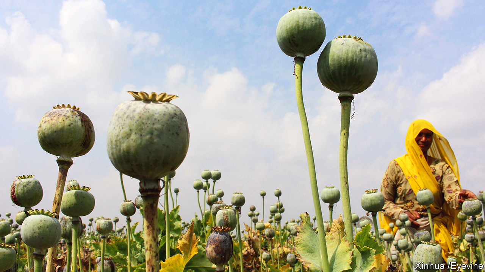

###### Flower power

# The history of the opium trade helps explain the modern world 

##### “Smoke and Ashes” is a gripping, true tale of profits, power and powerlessness wrought by drugs 

 

> Feb 22nd 2024 

 By Amitav Ghosh. 

The opium poppy looks delicate and innocuous. But for Amitav Ghosh, an Indian writer, it is “one of the most powerful beings that humans have encountered in their time on Earth”. Mr Ghosh’s elegant history of the plant’s influence is both a tribute to what he calls “the historical agency of botanical matter” and a reckoning with the imperial past. 

The book’s origins lie in his trilogy of “Ibis” novels, set in the thick of the opium trade in the 1830s. The research Mr Ghosh carried out while writing them prompted him to probe how the drug trade shaped free-market capitalism and globalisation.

Opium has been prized as a sedative for 5,000 years. Mr Ghosh’s account begins with Catherine of Braganza marrying King Charles II in 1662. Her dowry included a casket of Chinese tea and some small islands off India’s west coast. The fashion for tea simmered quickly in Britain, with the East India Company (EIC) controlling its import. The EIC funnelled goods to China from India. An appetite for one of these, cotton, was already strong. But the EIC began coercing Indian farmers to grow a different crop that, used recreationally, would turn countless people into addicts. 

Europeans did not invent the opium trade. Rather, they expanded modest local practices into a rapacious global enterprise. Mr Ghosh argues that the Dutch created the first “imperial narco-state” in the 17th century. The model was “perfected by the British”, who promoted the convenient myth that “non-white people were by nature prone to addiction and depravity”. When China banned the import of opium in 1729, the British turned to smugglers who called themselves “private traders”. 

Most of the characters he depicts are venal. One exception is Lin Zexu, a Chinese civil servant. In 1839 he complained in an undelivered letter to Queen Victoria that opium traders were “perfectly careless about the injuries they inflict” in their “inordinate thirst after gain”. 

Americans felt that thirst, too. “Send ships immediately to China,” John Adams urged Congress in 1783, as “this trade is as open to us as to any nation.” Soon families in New England grew rich from it, pouring some of their gains into philanthropy—which enriched many institutions, including Ivy League universities. The largesse resembles that of the Sackler family, whose company, Purdue Pharma, has done much to fuel the present century’s epidemic of opioids (a class of painkillers that can be derived from or simulate opium). 

The trade’s legacy endures in other ways. “Cities that are now pillars of the modern globalised economy—Mumbai, Singapore, Hong Kong and Shanghai—were initially sustained by opium,” writes Mr Ghosh. Colonial policies continue to shape regional disparities in India. In what is now Bihar, the EIC ruthlessly exploited peasant farmers, whereas in Malwa, another opium-producing area, it was unable to exert as much power. The regions’ health, education and crime statistics reflect their historical differences. 

As Mr Ghosh marvels at opium’s ability “to spin off new and more potent versions of itself”, including its synthetic analogue, fentanyl, his emphasis on the drug’s degree of agency can feel exaggerated. (He also has a weakness for the phrase “and so on”.) But he tells his intricate story with verve. Anger bubbles up, as he points the finger at multinational companies whose success is tied to the opium trade. 

The author sees a “ray of hope” in how anti-opium activists built an international alliance in the early 20th century. Today activists and courts are taking opioid merchants to task, demanding tens of billions of dollars in damages. But the darker message of “Smoke and Ashes” is that when a drug epidemic abates, forgetfulness follows. Addiction often returns. ■


