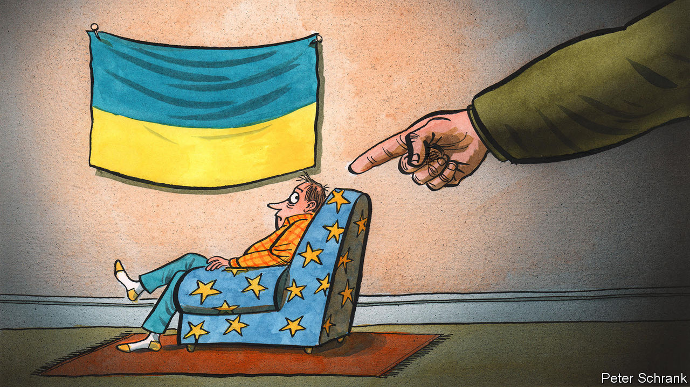

###### Charlemagne

# Europe’s generosity towards Ukrainian refugees is not so welcome…in Ukraine 

##### Ending the “temporary” protection offered to those fleeing war will be tricky 

 

> Feb 22nd 2024 

It takes two buses, a sturdy bottom and 43 hours to travel from downtown Brussels to Uman, a city right in the centre of Ukraine. Can’t afford the €90 ($97) fare? No matter: the Belgian authorities will pay the fare for any Ukrainians up for the trip, and throw in €50 pocket money to make the journey more palatable. Better yet, anyone who later changes their mind about having returned to their oblast even has the right to come back to Belgium, should they fancy another two-day bus ride. But the most compelling argument for those who had once fled war to voluntarily return is the call from home to fulfil their patriotic duty. Ukraine needs soldiers and workers, consumers and taxpayers. Its president, Volodymyr Zelensky, thinks too many of them may be lingering overseas. “Ukrainians are stronger together, so it is time to be together!” he said recently.

Around a fifth of Ukraine’s 37m citizens left the country in the wake of Russia’s invasion two years ago this weekend. Over half of those, or 4m, have been granted refugee-like protection in EU countries. Extending hospitality has been a point of pride from Spain to Estonia. But the arrangement was always meant to be temporary, an emergency measure as bombs rained on Kyiv. As the war has dragged on and life away from the front lines has largely returned to normal—bar the odd air-raid siren—questions have arisen as to why anyone still needs to stay away. Mr Zelensky has spoken of “citizens” at home in contrast to “refugees” who left, and praises the 1m or more who have returned. In a war of endurance, the domestic economy will sustain the effort all the better if citizens currently abroad come home. Such talk is discomfiting to EU countries that proudly laid out the welcome mat to Ukrainians in 2022. Is their abiding generosity to those once fleeing war in fact undermining the future of the country they are trying to help?

The Ukrainian authorities may be right to worry. It is rare for refugees to return to poor countries having settled down in rich ones (the average wage in Germany is nearly ten times that in Ukraine). Ukraine’s demography was woeful even before the war: emigration and a low birth rate meant it had lost around one-sixth of its population in the previous two decades, not including territorial losses in 2014. Worse, those departing in 2022 were among the country’s best educated, with two-thirds holding university degrees. At first, the vast majority were women and their children (men of fighting age are mostly prohibited from leaving the country). But over the past 18 months, more and more men in their prime have also found a way to the EU. 

With every month that passes, Ukrainians overseas are putting down roots: they have found jobs, children have settled in schools and learned a new language. Perhaps as a result, a rising number of them seem to indicate they might not return even once the war ends. Migration experts guess a quarter definitely will go back, a quarter will not, and the other half are up for grabs. Wait long enough and what started off as a temporarily displaced population will morph into a more permanently exiled diaspora, says Lukas Gehrke of the International Centre for Migration Policy Development in Vienna. But not if the Ukrainian authorities can prevent it. Rich countries with ageing populations develop migration policies to attract foreign nurses or careworkers from overseas to fill gaps in their labour markets. Ukraine is taking a similar approach—to lure its own people back. Those returning can apply for startup grants and subsidised mortgages to rebuild homes. Dual nationality, once forbidden, may soon be possible. 

The trouble is, Ukraine’s migrants are currently filling gaps in the EU’s labour markets, too. Even as providing them with social assistance such as housing has been a short-term cost, many exchequers see the long-term benefits of welcoming a young and educated Ukrainian workforce. Germany, the Czech Republic and Poland, which between them have taken in over half the Ukrainians in the EU, have unemployment rates of around 3%, the bloc’s lowest. In some countries populists have railed against Ukrainians. This week Geert Wilders, whose hard-right party has most seats in the Dutch parliament, accused Ukrainians of coming to his country not to flee war but to get free housing and jobs. In time, if Ukraine does indeed join the EU (it has opened negotiations to do so), its people will have the right to settle anywhere in the bloc. But that is years away.

Oblast from the past

In theory, Ukrainians in neighbouring countries may have no choice but to return. By March 2025 the three-year protection originally afforded them by EU rules will expire. Some countries in Europe have in the past shown that “temporary” means just that. As late as the early 2000s Germany kicked out a quarter of a million Bosnians who had been given refuge there in the 1990s; children were plucked out of school and sent to a country many had never known. In practice nobody wants to force Ukrainians back into a place still at war. Running out of time under the temporary programme would push many to apply for permanent refugee status, a cumbersome process that would overwhelm the bureaucracies of the countries in which they make the demand. So an extension of the temporary status beyond March 2025 seems likely. But then what happens?

What is clear is that a little steeliness in how EU countries deal with Ukrainian refugees—for example a cut in benefits they are entitled to, and an encouragement to return worth more than just a bus fare—would actually be welcomed by their home government. But it may not be so simple. One host country trimming benefits to Ukrainians may prompt the refugees to move home, but could just as easily encourage them to move to another EU country, which they can do under the current rules. Offering temporary protection two years ago was an easy decision, driven by the heart. The hard bit will be bringing the scheme to an end. ■


