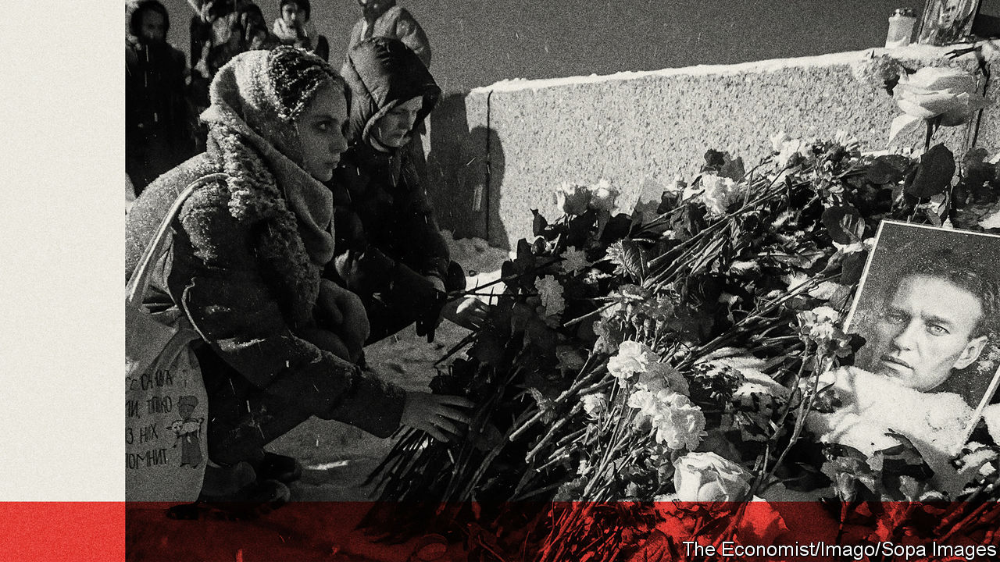
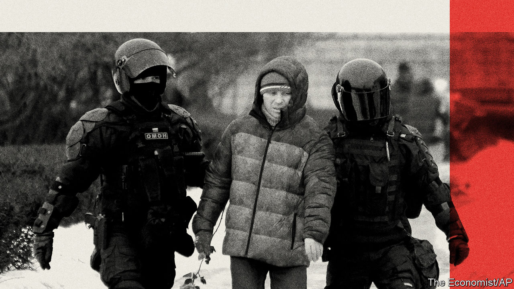

###### Two years on

# Vladimir Putin has been fighting not just Ukraine, but his own people 

##### He will not stop 

 

> Feb 19th 2024 

TWO YEARS after he launched his invasion of Ukraine on February 24th 2022, things are going Vladimir Putin’s way. Ukraine’s summer counter-offensive failed, and Russian troops are slowly creeping forward. On February 17th they took , a small town, now a smoking ruin, next to the Russian-held city of Donetsk. It is the first Russian achievement since May. But though it is of limited significance considering the cost in blood, it is a sign of Mr Putin’s determination to carry on his war. Russia’s military-industrial complex is now churning out five times as many shells as it did at the start of the war. Western aid to Ukraine is ebbing.

Russia’s president is also advancing on the home front. On February 16th he finally got rid of , a brave opposition leader who died in jail in the Arctic where Mr Putin had placed him. Mr Navalny’s mother was told that the reason for his death was “a syndrome of sudden death”; many other enemies of Mr Putin have succumbed to similar medically opaque causes. The two fronts are connected; Mr Putin’s war in Ukraine has always been about securing his position at home by changing conditions abroad.


Stephen Covington, a veteran Russia expert who has been advising NATO’s supreme allied commanders in Europe for the past 30 years, calls this a kind of revolution—an attempt to change the conditions on which the social and political order is built. He traces its roots to 2007, when Mr Putin concluded that change inside Russia would undermine his own power. Unwilling to integrate with the West and unable to compete with it economically, since that would require a change of political system, Mr Putin instead set his country on a path of confrontation. “Putin’s choice reflects a view that Russia can only address its non-competitiveness by changing the world around Russia, and most critically, by changing the European security system,” Mr Covington wrote in 2015.

It was not NATO’s military power Mr Putin feared, but the principles it was set up to defend in 1949: “freedom, common heritage and civilisation of their peoples, founded on the principles of democracy, individual liberty and the rule of law”. They posed an existential threat to him. “We see that the doctrine of human rights is used to destroy the sovereignty of states, to justify Western political, financial, economic and ideological dominance,” Mr Putin said in December 2022. The war he is fighting is not really about territory in Ukraine, but about an entire system of political control inside Russia and beyond it.

Inside Russia, it is suffered not just as drone strikes or the shelling of the Russian city of Belgorod by Ukrainian forces, but in Mr Putin’s direct attacks on his own people. The killing of Mr Navalny, a man who fearlessly asserted the power of human agency, is in fact a blow struck at the hearts and minds of the country. Cowed compliance is no longer enough for the president who, like any paranoid dictator, sees danger everywhere; the number of treason cases each year has gone up tenfold since the start of the war. With its opponents rotting in jail, dead or exiled, the regime is now turning against even those friendly to it. 

In December an “almost naked” party of Russian socialites in a nightclub drew Mr Putin’s outrage. The host of the party was forced to apologise on camera. A rapper who turned up wearing only a sock over his groin was locked up for two weeks. Fillip Kirkorov, Russia’s highest-paid pop star, long loyal to the Kremlin, was banned from state television and was sent to redeem his sins by performing in a military hospital in Russian-occupied eastern Ukraine. “The true elite,” Mr Putin said, “should be formed from participants in the special military operation [his term for the war], not freaks who display their genitals.”

 


This internal war is waged against the young and cosmopolitan in Russia’s great cities. Any mention or display of LGBT attributes has been criminalised. Access to abortion has been restricted. Priests who preach peace instead of victory have been expelled from the church. Children as young as four are being dressed in military fatigues to play “patriotic games”. Schools have been prescribed textbooks declaring that Russia has always been at war with the West. Halloween and Valentine’s Day have been demoted as alien holidays, while the Chinese new year has been elevated almost to the level of a state holiday, with lanterns and dragons decorating the centre of Moscow. China, after all, is seen as Russia’s ally in its war against the West.

Private property has also been violated. Dozens of private firms have been nationalised without compensation. First it was foreign assets that Mr Putin was after. Now it is Russian businessmen who have been told to return assets that they legally bought in the 1990s. On February 14th Mr Putin signed a law that allows the confiscation of property and assets from people convicted of discrediting the Russian army or spreading “fakes”, calling for sanctions or helping international organisations that Russia does not take part in. 

All this is causing resentment. Public protests are brutally suppressed, but discontent bursts out in different forms and places. On learning of Mr Navalny’s murder thousands of people took to the streets, and covered memorials for previous victims of political repression in flowers before police moved in to arrest them and clear away the tributes. From outside Russia, Mr Navalny’s widow, Yulia Navalnaya, has vowed to continue his campaign.

An anti-war movement called (The Way Home) led by wives, sisters and mothers of mobilised men has also become more audible. Every weekend they turn up in white headscarves to lay flowers at the tombs of unknown soldiers in cities across Russia. The Kremlin has been careful not to trigger wider protest by arresting or assaulting them, so has instead harassed journalists who report on them. Opinion polls show that people’s will to make sacrifices for the war is at its lowest since the start of Mr Putin’s “special military operation”. None of this means that a protest movement is building up, but polling data do suggest that support for the war is slowly eroding. 

There is another reason why the majority remain silent even if they don’t support the war, argues Kirill Rogov, a political analyst. It is an inability to fathom how Russia might withdraw its troops without its entire social order crashing down. What people crave is a return to normalcy, not a revolution. This craving explains the sudden popularity of , a veteran liberal-leaning politician who was allowed to collect the 100,000 signatures he needed to register as a presidential candidate in next month’s election. His message for Russia to be free and peaceful resonated. He did not call the “special military operation” a crime or even a tragedy. He called it a mistake, something that could be corrected. He tried to comfort his countrymen and give them hope.

Hundreds of thousands of people queued up to sign. Barely known outside Moscow at the start of the campaign, his rating shot up to reach about 10% by the time he submitted his signatures. To be sure, the Kremlin swiftly barred Mr Nadezhdin from standing. But removing him does not remove the demand that he revealed. Whether this pressure might in time grow strong enough to bring a change or whether it can be handled by the Kremlin depends partly on the state of the economy, and partly on unpredictable events.

For now, the cost of compliance is low and the risks of speaking against it are far higher. This could change. Mr Putin’s ability to militarise the Russian economy while maintaining living standards is limited. Alexandra Prokopenko of the Carnegie Russia Eurasia Centre, a Berlin-based think-tank, argued recently in  that Mr Putin faces “an impossible trilemma”: funding the war, maintaining living standards and taming inflation. The first two goals require higher spending, which fuels inflation and undermines economic stability. The damage caused to the economy, Ms Prokopenko argues, cannot be repaired without ending the war and seeing Western sanctions lifted. 

Yet Mr Putin cannot do this, because his regime can now only exist in a state of war. It is safer for him to double down, imposing greater repression on his people, than to stop, which would prompt questions about the costs and causes of the war. He is not the first ruler to find himself in this situation. It is what the German high command concluded in the spring of 1918 as it adopted an “all or nothing” attitude to victory and prepared for a decisive offensive. 

The gap between Mr Putin’s militarism and people’s wish for life to get back to normal will only grow. This mood is already affecting those stuck in the trenches. As Alexander Shpilevoi, a 27-year-old front-line soldier, says in a video posted on a Telegram channel called Road Home, run by wives and sisters of mobilised Russian men: “Everybody wants to go home. Very much so.” His appeal landed him in a punishment pit in Russian-occupied Luhansk. 

Seated under the medieval vaults of his Kremlin fortress, Mr Putin sees the world differently. To him the high cost of this war justifies the scale of his endeavour. As his recent  with the ex-Fox News presenter Tucker Carlson vividly demonstrated, he dwells among Russia’s ancient princes and tsars, measures his efforts in centuries and sees it as a historic mission not only to restore their lost empire but to overthrow the social order that emerged after the second world war in the West and that spread eastwards after the fall of the Berlin wall. He wants to defeat the very sense of individual will that Mr Navalny embodied. And he will not stop. ■


