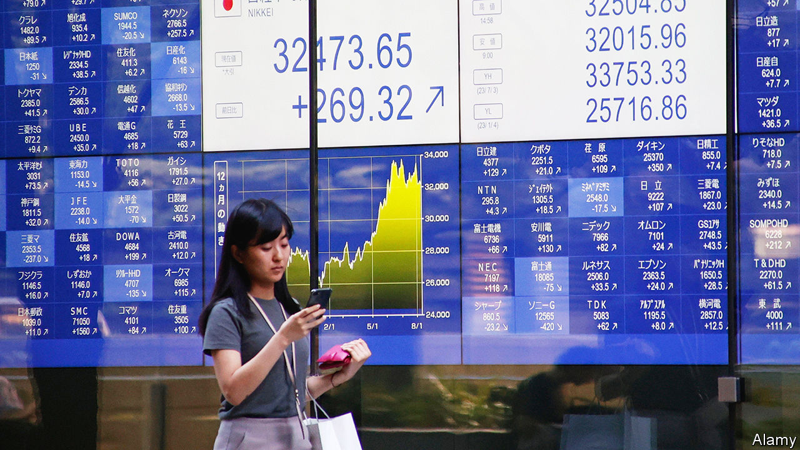
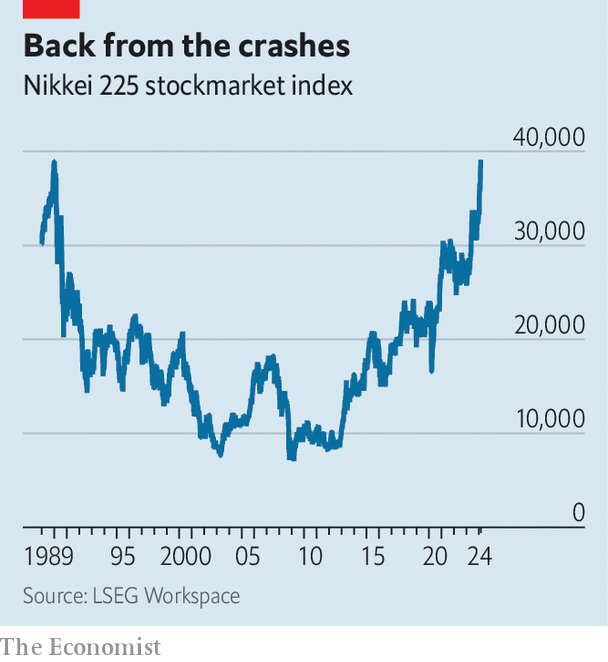

###### In the nick of time

# As the Nikkei 225 hits record highs, Japan’s young start investing 

##### Will more now favour domestic stocks? 

 

> Feb 22nd 2024 

Saito Mari, a 28-year-old nurse, was frustrated. Her pay, at just ¥160,000 ($1,100) a month, was meagre; after bills, rent, shopping and a few holidays, she had little left over. So in 2020 she decided to buy some stocks. “I used to think it was too risky,” says Ms Saito, who learned about investing via books and YouTube. “But it was amazing to see my assets grow.” 

Although Ms Saito’s story would be unremarkable anywhere else, it is part of a sea change in . According to surveys by the Investment Trusts Association, 23% of people in  invested in mutual funds last year, up from 6% in 2016. So did 29% of people in their thirties, up from 10%—a bigger rise than in any other age group. Those with exposure to the Nikkei 225, which on February 22nd passed a record high set in 1989, are reaping the rewards.

 


Japan’s officials, who want to boost , have long desired such a shift. The public’s previous aversion to retail investing dates back to the early 1990s, when a stockmarket bubble burst. In the ensuing decades, with inflation minimal or non-existent, low-risk saving came to be seen as virtuous. Some 54% of Japanese household assets are in cash or deposits, against 31% in Britain and 13% in America. 

, Japan’s prime minister, outlined an “Asset Income Doubling Plan” in 2022. This aims to create a virtuous cycle: companies will grow by making use of funds from retail investors; individuals will enjoy the benefits of their growth. As part of the initiative, in January the government improved the terms of its NISA programme, modelled on Britain’s ISA, which exempts retail investors from capital-gains taxes. The same month 900,000 new NISA accounts were opened with the country’s five biggest investment platforms. 

Mr Kishida’s push has been given extra oomph by economic developments. Under Japan’s zero-interest-rate policy, hoarding cash in a bank brings almost no return. This has been true for a while, but inflation now stands at around 3%—a three-decade high—meaning the value of cash not put to work is being eroded. Young generations, who do not share the trauma of the burst bubble, are more inclined to act.

The number of students at ABCash, a financial school in Tokyo targeting millennials, has doubled since 2022, reaching 40,000. Shinjo Sayaka joined after seeing an influencer mention it on Instagram. “It’s hard to talk about money with my family,” she reports. One problem for Mr Kishida is that many youngsters favour international markets over domestic ones. For instance, Ms Saito’s investments include Apple (an American tech giant), the s&amp;p 500 (an index of big American firms) and BioNTech (a German vaccine-maker). Yet perhaps she and others will change their approach if the Nikkei continues to soar. ■


