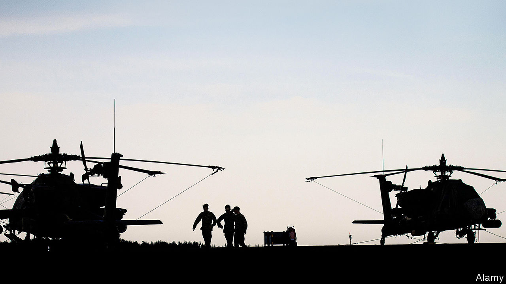
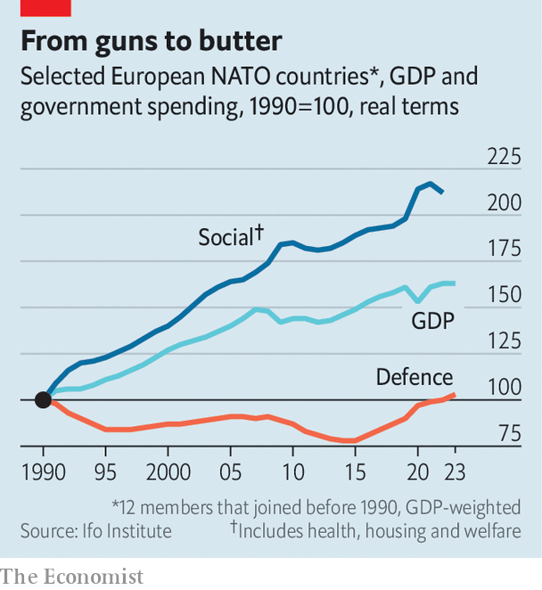

###### Pick your poison

# Europe faces a painful adjustment to higher defence spending 

##### The choices: taxes, cuts elsewhere, more borrowing 

 

> Feb 22nd 2024 

With vladimir putin issuing threats and Donald Trump musing about withdrawing support, everyone agrees that Europe needs to spend more on its armed forces. What is less widely recognised is how wrenching the shift will be for a continent that has grown used to outsourcing its defence to America. Over the past three decades, politicians have enthusiastically spent the peace dividend on everything bar pilots, sailors and soldiers (see chart). 

Some European leaders are already making commitments. Germany has created a fund of €100bn ($108bn) to bolster its armed forces and aims to meet the nato target of spending at least 2% of gdp on defence immediately. In France Emmanuel Macron has promised to reach the target this year. Compared with their pre-pandemic average, the continent’s NATO members (and Canada) have already increased defence spending by about 0.26 percentage points of GDP, together hitting a new average of 1.7% of gdp last year.

 


Yet in most cases even 2% will not be enough. Decades of miserliness take a toll: many armed forces across Europe are in a sorry state. According to calculations by Marcel Schlepper and colleagues at the Ifo Institute, a think-tank, the EU’s NATO countries have accumulated underinvestment in equipment of about €550bn (or 4% of the bloc’s GDP) since 1991. Boris Pistorius, Germany’s defence minister, has said that his country’s spending might need to reach 3.5% of gdp in order for its armed forces to rebuild their fighting capabilities. 

Spending requirements would be lower were it not for fragmentation among the eu’s 27 armed forces, which all favour different kit, and different ways of buying it. Manufacturers will struggle to leap to attention. As Christian Mölling of the German Council on Foreign Relations, another think-tank, notes: “Europe‘s bonsai armies have nurtured bonsai industries.” 

How will countries meet their more ambitious commitments? Those currently failing to reach NATO’s 2% target, which include Belgium and Spain, as well as France and Germany, tend already to have higher taxes. Therefore they will have to reprioritise, moving spending from, say, health and welfare into defence. According to the Ifo Institute’s calculations, in order to spend 3% of GDP on defence, spending on everything else will have to fall by 3% in Germany and Italy, and 2% in Britain and France. Voters may object to having their pensions cut to buy more tanks.

Another option is to borrow. Although few economists would normally support funding armed forces via debt, since it is just the sort of regular spending for which taxes are designed, the current shock may warrant bigger deficits. The euro zone’s fiscal rulebook might even make a modest allowance for them. In theory, borrowing would not be a problem in low-debt countries such as Germany and Netherlands. But there are obstacles: Dutch coalition talks have just collapsed over spending differences; German reformers run up against a constitutional debt brake. And additional borrowing would not be wise in much of southern Europe, including Italy and Spain, which last year both spent more on interest payments than their armed forces. 

That leaves a final option if spending is to rise: EU funding. Kaja Kallas, Estonia’s prime minister, is arguing that the bloc should establish a debt-funded defence budget along the lines of its covid-19 recovery fund. The logic that underpinned the fund—of common EU spending in return for mutually beneficial reforms—would seemingly also apply now, perhaps with reforms this time concerning defence procurement. Yet there is a problem. For the moment, finance ministers in Europe’s north and south remain to be convinced by a fund that would mostly benefit the east. The sad truth is that another shock might be required to prompt them into action. ■


