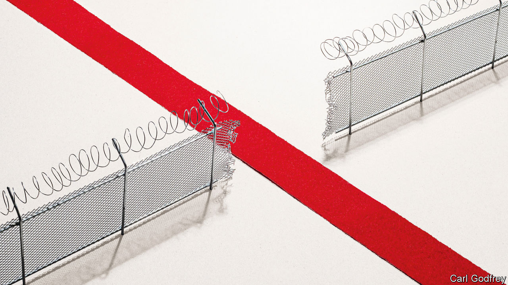
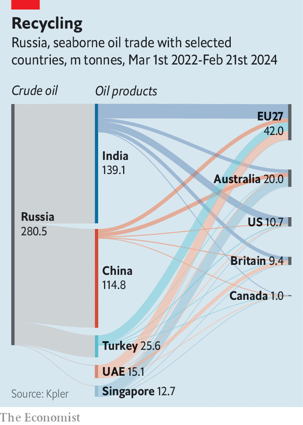
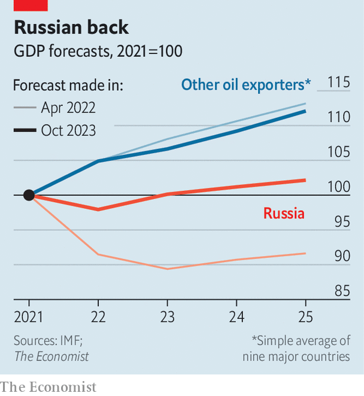

###### Gaps in the fence

# Russia outsmarts Western sanctions—and China is paying attention 

##### How the rise of middle powers helps America’s enemies 

 

> Feb 21st 2024 

Nazem Ahmad, an art collector and financier, who owns work by Andy Warhol and Pablo Picasso, has been under American sanctions since 2019. That may sound like a problem, but it has not stopped him from smuggling half a billion or so dollars for Hizbullah, a Lebanese militant group, according to America’s Treasury. He moves art, cash and gems across borders via galleries in the Ivory Coast, family offices in the UAE and portfolio firms in Hong Kong. His financial tapestry is underpinned by bank accounts in America. 

All of this displeases Western policymakers, who are trying to make sanctions more stringent. Mr Ahmad is one of several magnates on whom sanctions have been adjusted. The EU’s 13th wave of measures against Russia, agreed on February 21st, will punish some Chinese firms for supplying Vladimir Putin with weaponry and other banned goods. President Joe Biden has announced that foreign banks settling payments for such goods could be next, and is planning more sanctions on Russia after the death of Alexei Navalny, an opposition politician, on February 16th. In recent years measures have been applied to everyone from Houthis holding up Red Sea traffic to Israeli settlers building illegally in the West Bank and companies helping strengthen China’s armed forces.

Thus the world is witnessing an unprecedented surge in financial warfare. But just as the West ratchets up sanctions, ways to circumvent them are becoming more sophisticated. Visit any country that courts the West’s business without buying into its principles, and you will find companies and people—hailing from China, Russia and the Middle East—under sanction and getting things done. Since the West first retaliated against Russia’s invasion of Ukraine, it is in places such as India, Indonesia and the UAE, which have access to the dollar, that America’s and Europe’s aims are being thwarted. 

Any enemy of the West faces a mixture of measures. Most common are trade embargoes, under which Iran and Russia labour. American companies are banned from exporting anything that could be repurposed by Russia’s army, which ranges from drones to ball-bearings. Import restrictions on commodities, such as the $60-a-barrel price cap imposed on Russian oil by America and Europe, are meant to weaken hostile powers. Bans on doing business with governments, as also apply to Iran’s and Russia’s, are supposed to further cripple their ability to fight.

On top of these are financial sanctions. Western officials keep blacklists, which apply varying restrictions on how their citizens may deal with designated firms and people. Ships that carry Iranian oil are on America’s list, as are Hamas’s leaders and financiers for Latin American drug empires. Sometimes individuals’ assets are frozen; sometimes entire banks are banned. Russia’s central-bank reserves in Europe (half its total) have been frozen, 80% of its banks are subject to sanctions and seven are locked out of SWIFT, a messaging service used to make transactions. 

Yet all these measures must contend with the growing prosperity and financial sophistication of “third countries”—ones that neither impose American and European sanctions, nor are under sanctions themselves. The 120 members of the “non-aligned movement”, which include Brazil and India, produced 38% of global GDP in 2022, up from 15% in 1990. They are home to five of the world’s 20 most important financial hubs, measured by the number and variety of banks, and churn out lots that a modern army might need. Whereas financial crises in the 1980s and 1990s drove entire continents to borrow from the IMF, today these countries have robust financial systems. With international firms trying to avoid tensions between America and China, sitting on the fence is not only possible, but often profitable.

Brazil, India and Mexico all declined to participate in the West’s economic war soon after Russia invaded Ukraine. Indonesia’s foreign-affairs spokesman explained that his country would “not blindly follow the steps taken by another country”. Yet neutrality is a delicate game. Although, for instance, America can do little about Russia importing more tech from China, it can make life difficult for some financial institutions that might help the trade. Among third countries, hostility to America’s actions combines with reliance on the superpower’s financial system to produce a strange patchwork: in places sanctions are insurmountable; in others they may as well be non-existent. 

Commodity-import bans are the measure most obviously ignored by non-aligned countries. Although the purchase of Iran’s oil is restricted by America, its exports are at an all-time high. Countries that are not party to the West’s price cap on Russian oil—together home to half the world’s population—are willing to pay more than $60 a barrel. Brazil, China and India have all bought more of the stuff since the war in Ukraine began. Many of the country’s biggest customers, including the UAE and Turkey, import its cheap fuel for domestic use at the same time as exporting their own more expensive non-embargoed oil. In 2022 China, India, Singapore, Turkey and the UAE together imported $50bn more oil from Russia than in 2021. Meanwhile, the value of the EU’s oil imports from these countries increased by $20bn.

 


Legitimate trade helps hide goods that end up furnishing a bomb or tank. As a result, half the military equipment gathered by Russia last year contained some Western tech. Indeed, Russia imported more than $1bn-worth of chips designed in the West—all of which should have been beyond its reach. European exports to Central Asia more than doubled from 2021 to 2023. The region’s fastest-growing industry is logistics, which expanded by 20% in 2023. It is not difficult to guess the final destination of many of these goods.

America’s recent tougher stance has made dodging trade sanctions harder. It helps that earlier rules are also starting to bite. Half the ships that belong to Western firms and once ferried Russia’s oil have turned to new work. And Mr Biden has now given officials authority to put “secondary sanctions”—which apply to outfits outside America and its adversary—on banks that help smuggle military tech to Russia. According to Bloomberg, a news service, two state-owned Chinese financial institutions have since stopped taking Russian payment for forbidden items.

Ghost ships

Yet lots of business has simply moved beyond the West’s reach. When America and Europe banned firms from insuring ships that carry Russian oil if it sells above their price limit, India and Russia established their own insurers. Russia’s shadow fleet now carries 75% of its oil shipments. At the same time, trade between Russia and the West via places such as Central Asia and Thailand is only growing as companies have more time to set up shop. 

 


When it comes to financial measures, third countries facilitate sanctions-dodging in two ways. The first is by expanding the options open to the West’s enemies. Institutions in America and Europe are banned from handling transactions that involve anything on blacklists, on pain of incurring sanctions themselves. Yet, in most cases, once cash leaves the West, blacklists carry no threat. Dubai’s financial industry has grown faster than any other over the past decade, with the exception of Shenzhen, and its expansion has been fuelled by grey money. Other important hubs include Hong Kong and São Paulo.

Many third countries participate in rouble- and yuan-based payment systems—efforts by Russia and China to build dollar alternatives. The UAE and Russia have teamed up to work on a rouble-based payment system that will be regulated from Dubai. And Indonesia is participating in trials for China’s international digital currency. Although these efforts sound fearsome, the reality is less bad. Just as many of the world’s transactions are settled in dollars and euros as on the eve Russia’s invasion of Ukraine. This is often seen as a victory for the West: the dollar, and therefore surely the West’s arsenal of financial weaponry, remains dominant. 

Yet there is a second, increasingly important way in which third countries thwart the West: they facilitate evasion while still using the dollar. Some foreign banks are much more relaxed about scrutiny than their American and European peers, and more of their business is now done without touching American shores. Whereas they used to rely on American branches for dollar funding, now they have $13trn—equivalent to more than half of the dollar liabilities of America’s banking system—borrowed from offshore sources. 

Without co-operation from these institutions, it is difficult for Western banks to work out when something is off, meaning that sanctions fail to make use of the West’s financial sprawl. Rules often contain carve-outs: funds are allowed to reach Iran for humanitarian aid, for instance, and Russia for agricultural transactions. Several people under sanction report that it is common practice to mislabel money. America has accused Kuveyt Turk—among the biggest banks in Turkey—of similar tricks, which it has denied. The EU reckons that Varengold Bank, a German institution, allowed millions of dollars to pass to Iran’s Islamic Revolutionary Guard Corps through third countries, on the grounds it was food aid. Varengold denies wrongdoing and says that the cash was desperately needed to alleviate suffering. 

Botched identification checks also help. More than 1,000 Russian firms have set up shop in Turkey since 2022, as well as 500 in the UAE, many of which Western officials think are fronts for others under sanctions. As lots are registered in “free zones”, meant to tempt business with a lack of red tape, it is hard to know for sure. Two years ago, a Singapore-based network of firms was punished for ferrying billions of dollars of payments for Iranian oil. It re-emerged in Dubai, using a mixture of Turkish, Singaporean and UAE-based firms to open American bank accounts. 

Many third-country governments have a laissez-faire attitude to sanctions-breaking, or even tacitly approve of it. Indonesia and the UAE are on the greylist of the Financial Action Task Force, an international regulator, in part because they are accused of knowing about the bad behaviour of local banks. When asked whether the UAE thinks that some of its 500 new firms could be evading sanctions, a European official shrugs: “They know, they just don’t care.”

The increasing commercial importance of these countries has both raised the costs and lowered the benefits of Western sanctions. American and European capital can now take advantage of investment opportunities abroad. Companies and individuals under sanction now have more places in which they can do business. What, then, can the West do? 

Western leaders have so far shied away from the most drastic measures. Mr Biden has said that he will eject foreign banks from America’s financial system if they help provide Russia with weaponry. But he has declined to issue the same threat over anything else, and the willingness of his officials to enforce it remains to be seen. Similar moves in the past have targeted tiny banks and been enforced in conjunction with local authorities. Doing the same with big banks over which America has no legal power would mean lots of guesswork. European officials say that it often takes 30 steps along a financial chain to trace the owner of a foreign bank account—ten times more than a decade ago. And if America made greater use of such measures it would risk brutal fights with allies such as Turkey and Indonesia. 

More American action might reduce evasion in places that use the dollar, but at the cost of encouraging countries to shift away from the currency. During, say, the 1990s, countries relied on America’s financial system because it reached everywhere in the world, imposed relatively few costs and there was no alternative. All three reasons become less convincing as financial warfare becomes more intense. They would become still less convincing should American officials begin to intervene more often beyond their jurisdiction. Not all that much capital needs to flee to alternative financial systems built by rival countries, such as China, for sanctions, which already target a tiny portion of the world’s transactions, to lose even more power. The West’s campaign to reassert its dominance over the global financial system could see it lose control, once and for all. ■


