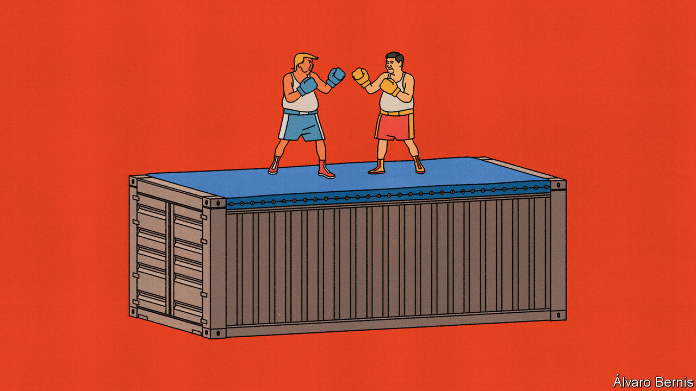

###### Free exchange

# Trump wants to whack Chinese firms. How badly could he hurt them? 

##### History provides a guide 

 

> Feb 22nd 2024 

A few months before America’s presidential election in 1980, George H.W. Bush paid a visit to Beijing. He got a frosty reception. Days earlier, Bush’s running mate, Ronald Reagan, had angered China by saying that he wanted an official relationship with Taiwan, which China claims as its territory. America should stay out of China’s “internal affairs”, said its foreign minister—just as China would not meddle in America’s presidential race. 

The prospect of a Reagan victory worried not only China’s leaders but also its exporters. Under President Jimmy Carter, Reagan’s opponent, America had done them the favour of establishing “normal” trading relations, meaning that they faced the same low tariffs America charged most other trading partners. There was, however, a catch. Normal relations had to be approved each year by the president and Congress. Would Reagan revoke them?

Chinese exporters, as well as the American companies that buy from them and invest in them, now face a similar threat from another loquacious and charismatic presidential contender: Donald Trump. If he wins in November, he has threatened to escalate the trade war he started in 2018 by imposing tariffs of 60% or more on Chinese goods. His allies have also advocated repealing normal trading relations with China, which became “permanent” in 2000. A new paper by George Alessandria of the University of Rochester and four co-authors suggests that the way exporters responded to the Reagan threat may hold lessons for new trade wars.

Entering a foreign market is costly for any firm. It must first establish a “beachhead”, as Richard Baldwin of IMD Business School in Lausanne has written, building distribution channels, advertising itself to potential buyers and bringing products into conformity with local regulations. Many of these upfront costs are fixed (they must be paid even if sales are small) and sunk (they cannot be recovered if the firm packs up and leaves). 

This has two consequences. Exporting, even in an era of globalisation, is surprisingly rare. A study of French manufacturers in 1985 found that only 15% sold to foreign markets. The figure in a study of Colombian factories was 26%. Even in China in the mid-2000s, a time of hyper-globalisation, the prevalence of exporting varied from 59% (in furniture-making) to 12% (in paper and printing), according to Mr Alessandria and his colleagues. Another consequence is that exporting is persistent. Once a company has established a beachhead, it rarely evacuates from a country. 

Firms must believe that the rewards will be large enough and last for long enough to justify upfront costs. The prospect of tariff hikes and trade wars makes such calculations harder. Even after Mr Carter lowered tariffs on China, the country’s exporters had to weigh the chances that they would go back up. The fear was acute in industries like toys where the pre-1980 tariffs were much higher than the “normal” tariffs that applied thereafter. Likewise, even after Mr Trump raised tariffs on China in 2018, exporters had to weigh the chances that they would go back down. 

Exporting from China to America was and remains, in effect, a bet on American trade policy. The pattern of bets reflects firms’ beliefs about the tariffs they will face. Although economists cannot directly observe these beliefs, they can observe the export decisions that reflect them. By examining how trade between America and China has evolved over time and differed from product to product, Mr Alessandria and his co-authors can therefore infer what firms must have believed about future American tariff policy.

They find that the tariff cuts in 1980 took time to become credible. For several years, exporters from China acted as if the chances of their reversal were 70% or more. The risks ebbed later in the decade after Reagan made his own visit to Beijing, Shanghai and Xi’an in 1984. (It was a “breathtaking experience”, he said, although it took him two stabs to snare a quail’s egg with his chopsticks.) By the time China joined the World Trade Organisation in 2001, the probability had fallen to about 5%.

The dynamics of the trade war in 2018 look similar “but in reverse”, write Mr Alessandria and his co-authors. Despite Mr Trump’s fiery rhetoric, Chinese exporters did not act in anticipation of his tariffs. When the war arrived, they expected it to culminate quickly. Judging by their actions in 2019 and 2020, they perceived that the probability the war would soon end was over 90%. When Mr Trump left office and the tariffs did not go with him, their hopes evaporated. The probability of an end to the war fell to 46% in 2021 and to 24% by 2024. The results have a paradoxical implication: entrenchment of tariffs under President Joe Biden did more harm to trade than their imposition under Mr Trump.

Bigger and worse

Would a second trade war be as damaging? The sheer recklessness of Mr Trump’s latest threat is double-edged. On the one hand, a sweeping 60% tariff would be far more disruptive than the targeted 25% tariffs he imposed in 2018. But their vertiginous height may make them harder to sustain. If they annoy too many consumers, hurt too many American firms or exact too big a toll on the stockmarket, they may prove relatively short-lived. Chinese exporters did not take Mr Trump’s trade threats seriously before 2018. Although they will not want to make the same mistake again, the most damaging of Mr Trump’s policies are ones that outlive his time in office, becoming a permanent feature. And not everything Mr Trump says in his presidential campaigns comes to pass. 

The same was true of Reagan. He never followed through on his desire to restore official relations with Taiwan. In Beijing, Bush tried hard to quell the anger his remarks had caused. “I certainly respect your views on wanting to stay out of the American election,” he said in response to China’s foreign minister. “I’d like to stay out of it myself sometimes, because it gets pretty hot in the cross-fire.” For China’s exporters and the American firms that buy from them, this year’s election will be just as uncomfortable. ■


