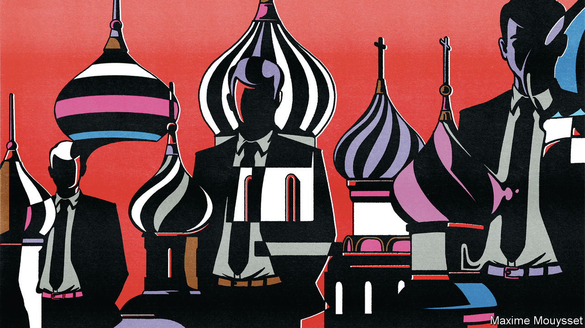
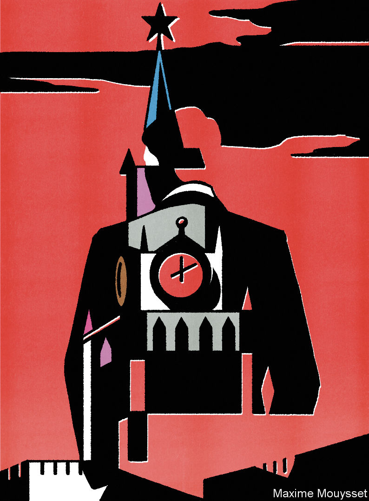

###### From Russia without love

# Russian spies are back—and more dangerous than ever 

##### The Kremlin’s intelligence agencies have learned from their mistakes in recent years 

 

> Feb 20th 2024 

IT IS UNUSUAL for spymasters to taunt their rivals openly. But last month Bill Burns, the director of the CIA, could not resist observing that the war in Ukraine had been a boon for his agency. The remark might well have touched a nerve in Russia’s “special services”, as the country describes its intelligence agencies. Russian spies bungled preparations for the war and were then expelled from Europe en masse. But new evidence gathered by the Royal United Services Institute (RUSI), a think-tank in London, shows that they are learning from their errors, adjusting their tradecraft and embarking on a new phase of political warfare against the West.

The past few years were awful for Russian spies. In 2020 operatives from the FSB, Russia’s security service, botched the poisoning of , the most vocal opposition activist. He mocked them for spreading Novichok on his underwear. Then the FSB gave the Kremlin a rosy view of how the war would go, exaggerating Ukraine’s internal weaknesses. It failed to prevent Western agencies from stealing and publicising Russia’s plans to invade Ukraine. And it was unwilling or unable to halt a brief mutiny by Yevgeny Prigozhin, the leader of the Wagner mercenary group, last year. The SVR, Russia’s foreign intelligence agency, saw its presence in Europe eviscerated, with some 600 officers expelled from embassies across the continent. Disastrously, at least eight “illegals”—intelligence officers operating without diplomatic cover, often posing as non-Russians—were exposed.

The study by RUSI, written by Jack Watling and Nick Reynolds, a pair of the organisation’s analysts, and Oleksandr Danylyuk, a former adviser to both Ukraine’s defence minister and foreign intelligence chief, draws on documents “obtained from the Russian special services” and on interviews with “relevant official bodies”—presumably intelligence agencies—in Ukraine and Europe. In late 2022 Russia realised that it needed more honest reporting from its agencies. It put Sergei Kiriyenko, the Kremlin’s deputy chief of staff, in charge of “committees of special influence”. These co-ordinate operations against the West and then evaluate them.

That personnel change appears to have produced more coherent propaganda campaigns. In Moldova, for instance, a once-scattershot disinformation effort against the country’s bid for European Union membership grew more consistent and focused last year. It tied the accession bid to the president personally, all the while blaming her for Moldova’s economic woes. Campaigns aimed at undermining European support for Ukraine have also picked up. In January German experts published details of bots spreading hundreds of thousands of German-language posts a day from a network of 50,000 accounts over a single month on X (Twitter as was). On February 12th France exposed a large network of Russian sites spreading disinformation in France, Germany and Poland. 

Despicable them

Meanwhile, the GRU, Russia’s military intelligence agency, has also been re-evaluating its tradecraft. In recent years its Unit 29155—which had attempted to assassinate Sergei Skripal, a former GRU officer, in Salisbury, Britain in 2018—saw many of its personnel, activities and facilities exposed by Bellingcat. The investigative group draws on public information and leaked Russian databases for its exposés. 

The GRU concluded that its personnel were leaving too many digital breadcrumbs, in particular by carrying their mobile phones to and from sensitive sites associated with Russian intelligence. It also realised that the expulsion of Russian intelligence officers in Europe had made it harder to mount operations and control agents abroad—one reason why the invasion of Ukraine went awry.

The result was wholesale reform, which began in 2020 but speeded up after the war began. General Andrei Averyanov, the head of Unit 29155, was, despite his litany of cock-ups, promoted to deputy head of the GRU and established a new “Service for Special Activities”. Unit 29155’s personnel—once exemplified by Alexander Mishkin and Anatoly Chepiga, Mr Skripal’s hapless poisoners, who insisted that they had travelled to Salisbury to see its cathedral’s famous spire—no longer carry their personal or work phones to its facility, using landlines instead. Training is done in a variety of safe houses rather than on site. Whereas half of personnel once came from the , Russia’s special forces, most new recruits no longer have military experience, making it harder for Western security services to identify them through old photographs or leaked databases. 

A separate branch of the Service for Special Activities, Unit 54654, is designed to build a network of illegals operating under what Russia calls “full legalisation”—the ability to pass muster even under close scrutiny from a foreign spy agency. It recruits contractors through front companies, keeping their names and details out of government records, and embeds its officers in ministries unrelated to defence or in private companies. The GRU has also targeted foreign students studying at Russian universities, paying stipends to students from the Balkans, Africa and elsewhere in the developing world.

For another example of how Russian spies have turned disaster into opportunity, consider the case of the Wagner Group, a series of front companies overseen by Mr Prigozhin. Wagner initially served as a deniable arm of Russian influence, providing muscle and firepower to local autocrats in Syria, Libya and other African countries. In June 2023 Mr Prigozhin, angered by the mismanagement of the war by Russia’s defence minister and army chief, marched on Moscow. The mutiny was halted; two months later Mr Prigozhin was killed when his plane exploded in midair. 

Russia’s special services quickly divided Mr Prigozhin’s sprawling military-criminal enterprise among themselves. The FSB would keep domestic businesses and the SVR the media arms, such as the troll farms which interfered in America’s presidential election in 2016. The GRU got the foreign military bits, split into a Volunteer Corps for Ukraine and an Expeditionary Corps, managed by General Averyanov, for the rest of the world. The latter missed its target of recruiting 20,000 troops by the end of last year, says RUSI, though its strength is “steadily rising”. There have been hiccups: Mr Prigozhin’s son, who mystifyingly remains alive and at liberty, offered Wagner troops to the , Russia’s national guard. That prompted a bidding war between the guard and the GRU, according to the RUSI authors.

The net result of this consolidation is a revitalised Russian threat in Africa. Shortly after Mr Prigozhin’s death, General Averyanov visited various African capitals to offer what RUSI describes as a “regime survival package”. In theory the proposals involve the GRU providing local elites with military muscle and propaganda against local rivals. In return Russia would get economic concessions, such as lithium mines and gold refineries, and thus gain leverage over enemies, perhaps including the ability to sever France from uranium mines in Niger (France needs uranium for its nuclear power stations). Mr Prigozhin is dead; his malevolent influence lives on.

 


Russian intelligence, though bruised, is firmly back on its feet after its recent humiliations. In recent weeks the Insider, a Riga-based investigative website, has published a series of stories documenting Russian espionage and influence across Europe. They include details of how a GRU officer in Brussels continues to provide European equipment to Russian arms-makers, and the revelation that a top aide in the Bundestag and a Latvian member of the European Parliament were both Russian agents, the latter for perhaps more than 20 years. 

“It’s not as bad for them as we think it is,” says Andrei Soldatov, an investigative journalist, who reckons that the Russian services are “back with a vengeance” and increasingly inventive. Vladimir Putin, Russia’s president, and once a (mediocre) KGB officer, is “trying to restore the glory of Stalin’s formidable secret service”, explains Mr Soldatov. He points to a case in April 2023 when Artem Uss, a Russian businessman arrested in Milan on suspicion of smuggling American military technology to Russia, was spirited back to Russia with the help of a Serbian criminal gang—a common intermediary for the Russian services.

In the past, says Mr Soldatov, the FSB, SVR and GRU had a clearer division of labour. No longer. All three agencies have been particularly active in recruiting among the flood of exiles who left Russia after the war. It is easy to hide agents in a large group and simple to threaten those with family still in Russia. 

Mission possible

Moreover, Russian cyber-activity goes from strength to strength. In December America and Britain issued public warnings over “Star Blizzard”, an elite FSB hacking group which has been targeting NATO countries for years. The next month Microsoft said that “Cosy Bear”, a group linked to the SVR, had penetrated email accounts belonging to some of the company’s most senior executives. That came on top of a sophisticated GRU cyber-attack against Ukraine’s power grid, causing a blackout apparently co-ordinated with Russian missile strikes in the same city.

The renewal of Russia’s intelligence apparatus comes at a crucial moment in east-west competition. An annual report by Norway’s intelligence service, published on February 12th, warned that, in Ukraine, Russia was “seizing the initiative and gaining the upper hand militarily”. Estonia’s equivalent report, which was released just a day later, said that the Kremlin was “anticipating a possible conflict with NATO within the next decade”. 

The priority for Russian spies is to prepare for that conflict not just by stealing secrets, but by widening cracks within NATO, undermining support for Ukraine in America and Europe, and eroding Western influence in the global south. By contrast, there has been precious little Russian sabotage against Ukraine-bound supplies in Europe. One reason for that is the Kremlin’s fear of escalation. Another is that the Russians cannot do everything, everywhere all at once. 

In the meantime, spies will continue to battle against their peers. In their report, Estonia’s foreign intelligence services published the identities of Russians working on behalf of the country’s intelligence services. “For those who prefer not to find their names and images alongside those of FSB or other Russian intelligence officers in our publications, potentially affecting their associations with the West, we extend an invitation to get in touch,” noted the Estonian spooks. “We are confident that mutually advantageous arrangements can be negotiated!” ■

