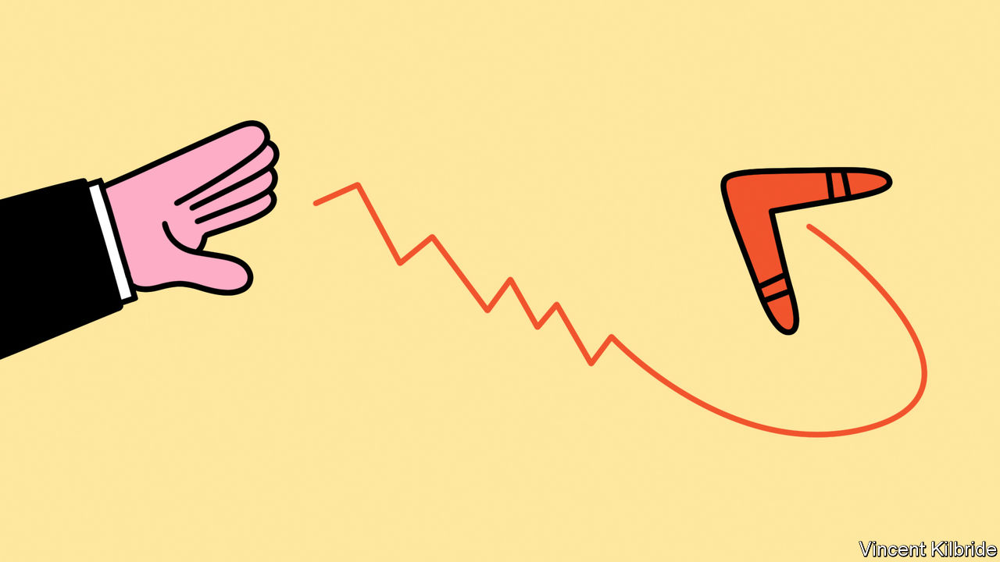
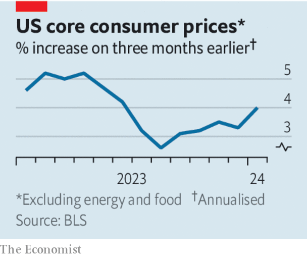

###### Held in suspense

# Do not expect America’s interest rates to fall just yet 

##### The risk of a second wave of inflation remains too great 

 

> Feb 22nd 2024 

Has inflation been vanquished, or is it bouncing back? The  grips bond markets and governs the world’s economic prospects. At the turn of the year, after the Federal Reserve all but declared victory over America’s excessive price rises, bond yields collapsed in expectation of several interest-rate cuts. Today that bet looks premature. Over the past three months core consumer prices, which exclude food and energy, have risen at an annual rate of 4%, up from 2.6% in the three months to August. Producer prices have risen more than expected and consumers’ expectations of inflation over the next year have gone up, too. Inflation is much lower than at its peak, but . As a result, Treasury yields are roughly back to where they were before the Fed’s doveish turn. Yields on long-dated bonds are higher still.

Inflation is also proving stickier elsewhere. The euro zone recorded large price rises in January, Swedish inflation rose in January and the Reserve Bank of Australia recently warned that inflation will take time to become “sustainably low and stable”. Everywhere, and especially in America, a resurgence of inflation threatens to delay cuts to interest rates. 

 


To understand what is going on, look at the pattern of demand. The covid-19 pandemic led to lockdowns and generous handouts, which fuelled the demand for goods and overwhelmed supply chains. In 2021 in America the price of a washing machine rose by 12%. After Russia invaded Ukraine, energy and food prices soared. Today, by contrast, global goods prices are falling, despite being buffeted by disruptions to shipping in the Red Sea. Food and energy prices are moderate. The source of today’s problem is rises in the price of global services.

Inflation in services is tightly linked to local conditions. If haircuts are in short supply, you cannot import them. It is, therefore, no surprise that the cost of services is rising in America. Over the past three months its booming jobs market has created an average of 289,000 jobs a month, more than double estimates of the sustainable rate. Wages are growing at an annual pace of more than 4.5%. GDP rose by an annualised 4.1% in the second half of 2023 and real-time indicators suggest that the expansion remains healthy. Such is the economy’s strength that, even if there had been no inflation in the past two years, forecasters would be expecting it to break out. 

Elsewhere, the situation is more finely balanced. In Europe unemployment is low but growth less strong. Britain fell into recession at the end of 2023. Business surveys in the euro zone are gloomy. Inflation fears are limited by sharply lower natural-gas prices. That will reduce inflation and raise the rate of sustainable, non-inflationary economic growth. The Chinese economy is in a funk and prices are falling. In Japan interest rates are still below zero. It would be considered a victory if inflationary pressures stayed strong enough to let the central bank raise rates. 

If a disruptive second wave of inflation is likely to strike anywhere it is in America. That means monetary policy is likely to diverge, with the Fed keeping interest rates high even as the rest of the rich world cuts them to revive growth. Such a pattern would boost the value of the dollar, which is already climbing. When America’s money markets offer high returns for little risk, the many poorer countries struggling to borrow in dollars suffer most. 

If interest rates do not fall there could be nasty surprises on Wall Street, too. The stockmarket appears to have barely noticed the danger that  will stay tight this year. By contrast, rising rate expectations in 2022 and 2023 often caused sell-offs as investors adjusted the discounted value of future profits. Neither is there much sign that America’s small and midsize banks have resolved the threats that high rates pose to their balance-sheets. The inflation problem is not what it was a year ago, but the world is not yet clear of the danger. ■

