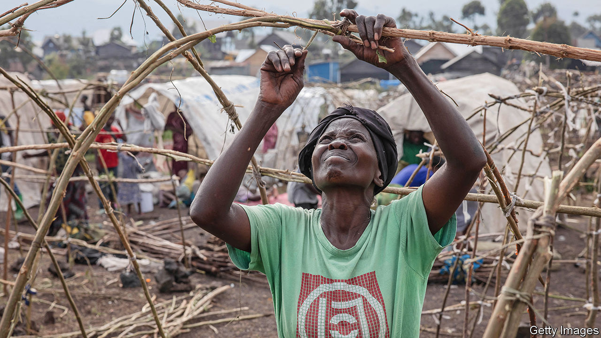

###### Stop the war

# How to prevent another catastrophic regional war in Congo 

##### The world needs to press Rwanda to pull back its forces 

 

> Feb 22nd 2024 

Few parts of the world have suffered such prolonged misery as, a place that has been meddled in and fought over by its neighbours for decades. Since the 1990s it has been the  in two major wars that sucked in troops from across the region. The deadliest of these, the second Congo war, led to the loss of 1m-5m lives, mostly from conflict-related disease and starvation. Now, with much of the world focused on crises elsewhere, there is the risk of a catastrophic third regional war being sparked in Congo—one that could possibly be averted but for the inattention of the West. 

Rwanda-backed rebels have surrounded Goma, the biggest city in the east and home to perhaps 2m people. In recent weeks  or their proxies have fired an anti-aircraft missile at a UN drone and bombed Goma airport. They are almost certainly responsible for firing on a UN helicopter, killing a peacekeeper, and for the death of two South African soldiers in a mortar attack. 

The conflict in eastern Congo has deep and tangled roots. The region’s rich mineral wealth has made it a prize worth fighting over. A weak central government in Kinshasa, Congo’s capital, has allowed the emergence of around 120 armed groups that fight one another and the army for control of mines, people and land. A national army too ineffectual to provide security for the region’s people or to control the country’s borders has been an open invitation to meddling by neighbours. In the centre of this thicket is Rwanda, a tiny country of 14m people that has played an outsize role in destabilising Congo, a country almost ten-times its size. 

The first Congo war broke out in 1996, just two years after the genocide in Rwanda. The genocide was halted only when the army and allied Hutu militias responsible for the killing were defeated by rebels led by Paul Kagame, now Rwanda’s president. The militias and army leaders found sanctuary in Congo, then named Zaire, and used its territory to strike back at Rwanda. In response, local Rwandan-backed rebels marched on Kinshasa and toppled Mobutu Sese Seko, Zaire’s dictator.

The second Congo war started when Rwanda invaded again, in 1998, after Laurent Kabila, the figurehead leader of Congo, turned on his erstwhile patrons and began supporting the Hutu militias. The resulting conflict involved troops from eight countries and lasted until 2003. It ended only after all sides were exhausted and donors pressed participants to withdraw. 

A third Congo war was narrowly averted in 2012, thanks to the stance taken by Western donors and the UN when Rwanda-backed M23 rebels marched into Goma. America, Britain and other European donors withheld more than $240m of aid to Rwanda and blocked disbursements by multilateral institutions. The UN formed the Intervention Brigade, its first-ever unit authorised to use offensive force, to attack the M23 and other armed groups. The pressure worked. Rwanda scaled back support for the M23, which was largely defeated by UN and Congolese forces. 

Yet now few in the outside world are paying much attention to the unfolding crisis. Only America has been using its diplomatic heft, to try to get Rwanda to withdraw its troops and Congo’s government to tone down its inflammatory rhetoric and stop co-operating with a militia linked to leaders of the genocide who had fled Rwanda. Others are being craven out of self-interest. Britain, which wants to deport asylum-seekers to Rwanda, gave it more than £120m ($150m) in aid in 2022. France, which is grateful for Rwanda’s help in fighting jihadists who threaten a large gas project French companies are developing in Mozambique, has provided €504m ($545m) in development aid since 2021. The UN, which wants to pull its peacekeepers out of Congo, has failed even to name Rwanda as being behind attacks on its blue helmets. 

There are many problems in a country as large and as poorly governed as Congo. Most of them cannot be solved easily or soon. But, as recent history has shown, the threat posed by Rwandan forces and their proxies can be lowered by outside pressure. It is not the means that are lacking, but the will. ■

