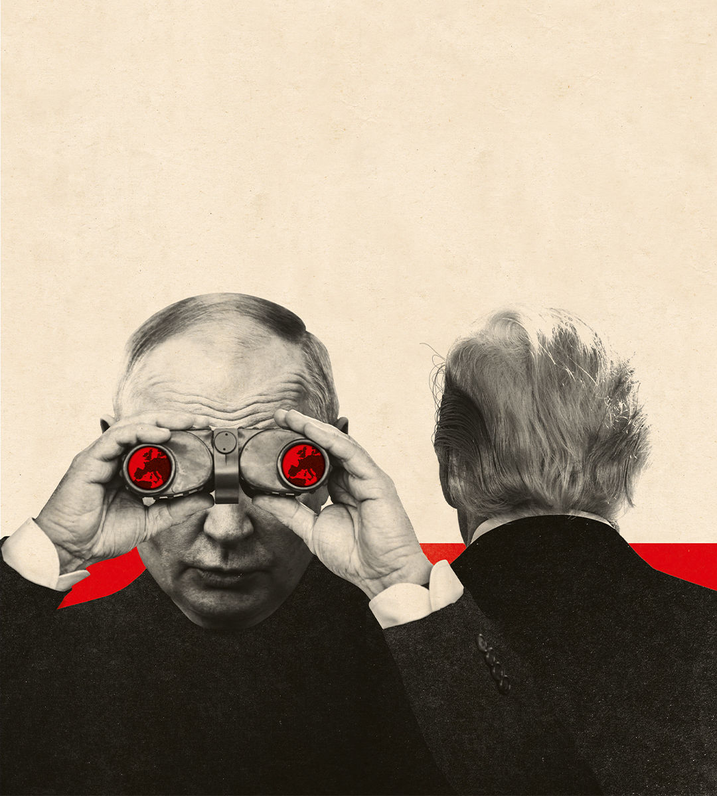

###### NATO

# Is Europe ready to defend itself? 

##### Russian aggression and American wavering reveal just how ill-equipped the continent is 

 

> Feb 22nd 2024 

RUSSIA iS BECOMING more dangerous, America is less reliable and Europe remains unprepared. The problem is simply put, but the scale of its solution is hard to comprehend. The security arrangements based on NATO that emerged from the second world war—and have prevented a third—are so much part of Europe’s fabric that remaking them will be an immense task. European leaders urgently need to jettison their post-Soviet complacency. That means raising  to a level not seen in decades, restoring Europe’s neglected military traditions, restructuring its arms industries and preparing for a possible war. The work has barely begun.

The murder of Alexei Navalny, Russia’s main opposition leader, in a penal colony on February 16th ought to have shattered any remaining illusions about the ruthlessness and violence of Vladimir Putin. As the fighting enters its third year, Russia is winning in Ukraine. Having put the , Russia’s president is spending 7.1% of GDP on defence. Within three to five years, Denmark’s defence minister has said, Mr Putin could be ready to take on NATO, perhaps by launching hybrid operations against one of the Baltic states. His aim would be to wreck NATO’s pledge that if one country is attacked, the others will be ready to come to its aid. 

Even as the Russian threat is growing, Western deterrence is weakening. That is partly because of wavering American support for Ukraine. But it is also because Donald Trump, who may very well be the next American president, has  on whether he would rally to Europe’s side following a Russian attack. The Republican Party and parts of the security establishment are becoming less committed to Europe.  is increasingly focused on the Pacific. Even if President Joe Biden is re-elected, he may be America’s last instinctively Atlanticist president.

The implications are grim. Europe depends utterly on NATO’s dominant military force. One American general recently complained that many of its armies would struggle to deploy even one full-strength brigade of a few thousand troops. In 2015-23 Britain lost five of its combat battalions. Many countries lack capabilities, such as transport aircraft, command and control, and satellites. Poland can field the excellent HIMARS rocket artillery system, but depends on America to find its long-range targets. Rapid Russian and Ukrainian advances in drone warfare, tested daily on the battlefield, risk leaving NATO behind the times.

Given the long cycles in military planning, Europe needs to start putting this right today. The priority is boosting its own ability to fight. That begins with a massive programme of recruitment and procurement. Conscription is expensive and ineffective, but Europe could learn from Nordic countries like Finland and Sweden, which maintain large reserves. European armies try to pool their orders for equipment, but those with defence industries often bicker over whether their companies have a fair share of the business. France is angry with European countries purchasing an air-defence system that uses American and Israeli launchers. In the trade-off between rapidly improving their soldiers’ fighting power and slowly , they should place more emphasis on speed.

That will not be cheap. This year European NATO will spend about $380bn on defence. Adjusted for purchasing power, that is roughly the same as Russia, but Europe gets less bazooka for its buck. Fragmentation is one reason. Another is a bad habit of scrimping on equipment. NATO expects its members to spend 20% of their budgets on weapons. The shortfall EU NATO countries (plus Norway) have accumulated since 1991 is €557bn ($600bn).

Filling that gap will be tough. In 2022, after eight years of increases following Russia’s annexation of Crimea, the European members of NATO spent in total no more than they had in 1990 in real terms. Social spending had more than doubled. Arguments about NATO budgets often boil down to whether a country allocates 2% of GDP to defence. How the money is spent matters, too. Yet even with efficiencies, 2% will not be enough.

If European leaders are to raise the funds through cuts to other services, taxes and borrowing, they will have to persuade voters that the sacrifices are worth it. In Germany, likely to become Europe’s biggest military spender, they will have to change the deficit limit written into the constitution. A European Commission plan to co-ordinate purchases of arms has led to criticism from member states, perhaps because it would curb the lobbying of industrial champions. Having relied for so many decades on America, many Europeans who have never known anything but peace are still ducking the hard choices Russian aggression demands.

Those hard choices extend to nuclear weapons. Mr Putin has threatened escalation to deter the West from giving Ukraine advanced conventional weapons. Without America’s nuclear deterrent, eastern Europe would be vulnerable to the same tactics. Could nuclear-armed Britain and France offer guarantees instead? Would they? If they did, would Mr Putin believe them?

The danger is that Europe ties itself in knots over institutional theology. Some, especially in France, argue that the continent should seek strategic autonomy from America as fast as possible, ideally through the European Union. It would be much better to focus on NATO. The alliance has vastly more capacity and scope to expand than the EU’s fledgling security operation. Strengthening the European role within NATO makes sense because the necessary military structures already exist. It would also bind in non-EU allies vital to the defence of Europe: Britain is Europe’s biggest military spender, Norway shares a border with Russia and Iceland controls access to the North Atlantic. Increasing Europe’s weight in NATO has the advantage of both showing that it is willing to do more, in the hope that America stays, while also preparing in case America pulls back. 

Russia is much poorer and less populous than Europe. Mr Putin’s depredations make it a declining power. But the bear can still spread destruction and misery. The best place to stop Mr Putin is in Ukraine. Yet even if that succeeds, Europe will have to think very differently about defence. It needs to start now. ■


