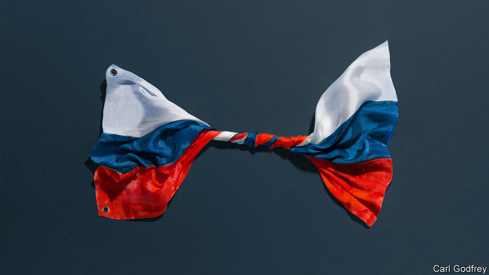

###### Weapons of misconstruction

# Sanctions are not the way to fight Vladimir Putin 

##### There is no substitute for military aid to Ukraine 

 

> Feb 21st 2024 

As RUSSIA’S war against Ukraine enters a third year, lawmakers in Washington are  over whether to continue sending military aid. America has fewer doubts about its financial campaign against Vladimir Putin. Having targeted Russian entities, it is threatening “secondary sanctions” on their foreign abettors. In December the White House said it would put the dollar system out of bounds for any bank helping Russia gain access to sensitive goods. After the prison-murder of , Russia’s main opposition leader, it was due to announce fresh sanctions on February 23rd. Two days earlier the European Union agreed on its 13th round of sanctions against Russia, which also target Chinese firms found to be helping Mr Putin’s war effort. The trouble is, sanctions are not working well. 

Since February 2022 America, Europe and their allies have together deployed sanctions against more than 16,500 Russian targets, according to a tracker maintained by Castellum.ai, a compliance firm. They have sought variously to curb Russian oil revenues, ban the export of sensitive goods to the country, freeze the central bank’s reserves and cut some Russian banks off from the global financial system. The idea was to use the West’s clout over the global trading and finance to stop Mr Putin obtaining the technology and hard currency he needs to wage war. The array of sanctions aimed at one of the world’s largest economies was hailed as unprecedented; suggested that the ensuing shock could lead to a cash crunch or even a coup. 

The reality has proved drastically different. Russia’s economy has been , and the sanctions effort much leakier, than was hoped. Soon after the war began, the IMF expected Russian gdp to shrink by more than a tenth between 2021 and 2023. By October last year it reckoned that output may in fact have risen slightly over the same period. Moreover, the war has shown just how quickly global trade and financial flows find a path around barriers that are put in their way.

Take the trade in crude oil. In 2022 around 60% of crude from western Russia was transported in European tankers. Then a price cap imposed by the g7 countries banned their carriers from shipping Russian oil unless it traded for less than $60 a barrel. In response, a shadow infrastructure grew up that exists outside the control of the West, and which carries much of Russia’s oil at a higher price. These days more oil is being traded in Dubai and Hong Kong than in Geneva. The West’s grasp on the global energy order has slipped accordingly.

Other trade flows have also adapted. The West is tirelessly adding Russian companies and individuals to its blacklists. But much of the world’s population lives in countries that decline to , and there is little to stop new companies popping up and doing business there. Even as exports from the EU to Russia have collapsed, places like Armenia, Kazakhstan and Kyrgyzstan have begun importing more from Europe—and have mysteriously become important suppliers of critical goods to Russia. 

All this explains why America and Europe are turning to secondary sanctions. But these suffer from another problem: although they are potent, they have forbidding side-effects. The mere threat of secondary sanctions can bring down a bank. When in 2018 America said it would consider labelling ABLV, a Latvian lender, a money-laundering concern in part for helping North Korea dodge sanctions, depositors and foreign creditors fled and the bank collapsed within days. Already, Chinese banks are more cautious in their dealings with Russian firms, for fear of Uncle Sam’s reach. 

Alas, in the long term such exercises of power will erode the sway America has over the global financial system, which brings it real benefits. Even America’s staunchest friends in Europe loathe its secondary sanctions, which have in the past led to huge fines for some of its banks. To enforce its penalties America would need to be ready to cause disruption in places such as India, Indonesia and the United Arab Emirates, none of which have any desire to be part of its sanctions effort. If America asserts its power aggressively, it could alienate precisely those emerging powers that it hopes to woo as the world fragments. And this could weaken its hold on the global financial system, by encouraging them to escape its reach by avoiding dollars. For the first time last year, more of China’s cross-border payments were conducted in yuan than in the dollar. Other countries would be tempted to follow suit. 

For policymakers in Washington and Brussels, sanctions hold a seductive appeal. At a time when political support for funding the war is fraying, they seem like a cheap way to weaken Russia and defend Ukraine. Yet the past two years reveal just how wishful such thinking is. Sanctions are not doing enough, and beefing them up will be counterproductive in the long term. There is no magic weapon; financial warfare is not a substitute for sending Ukraine the money and arms it needs. ■

