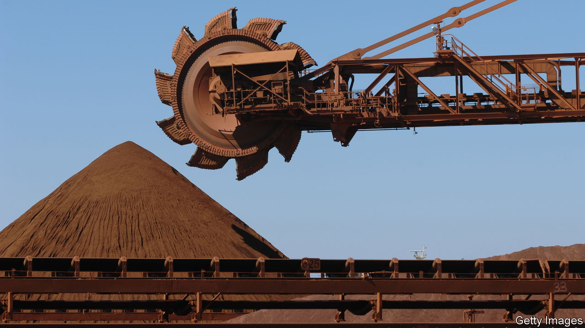

###### Let them dig

# The world needs more critical minerals. Governments are not helping 

##### Just obtaining a permit takes a remarkably long time 

 

> Feb 22nd 2024 

Mining companies have always mattered. Without the iron ore and copper they unearth, there would be no steel to build with and no wiring to carry electric power. Today miners have an extra responsibility. , it will need 6.5bn tonnes of metals between now and 2050, according to the Energy Transitions Committee, a think-tank—and not just lithium, cobalt and nickel, the much-talked-about , but steel, copper and aluminium, too. Because that output is several times greater than today’s capacity, producing it will require miners to invest more and dig faster. 

Unfortunately,  than they once did, as their latest set of earnings, released this week, confirm. The world’s biggest miner, BHP, last year spent less than half of what it did a decade ago. In part that is for sensible reasons: miners are rightly conscious that theirs is a boom-and-bust industry. The last time they splashed out, during the China-led bonanza of 20 years ago, a spectacular crash followed. Markets are volatile. Whereas copper prices remain relatively high, those for cobalt, nickel and lithium have fallen dramatically, as more supply has come on stream. But lately investment decisions have also been tied up in red tape. Governments insist they want to encourage the green transition. Their actions too often say otherwise.

Official rhetoric goes to great lengths to underline how much politicians value critical metals. America wants to stockpile them in case foreign supplies are imperilled, much as it has amassed a huge emergency reserve of crude oil. Its Mineral Security Partnership seeks to work with allies to secure resources and channel investment into the extraction of metals. Other countries have devised their own critical-minerals strategies. 

But all this work is being undermined by resource nationalism and misguided environmentalism. One obvious problem is that many countries want control over their resources, even at the expense of driving private investment away. Last year Chile announced plans for a state-owned company to produce lithium. Others, including Kyrgyzstan, Madagascar, Mexico and Namibia, are charging sky-high royalties, implementing export bans and indulging in other forms of state intervention. Politicians say they want to ensure more of a country’s wealth from raw materials ends up staying at home. But too often such policies run the risk of being counterproductive, as companies that are forced to compete with the state, or to hand over their profits, decide to pull out. In 2022 sqm, the world’s largest lithium producer, paid $5bn to the Chilean treasury. That amounted to 1.3 times its net profit. Such measures will only make more projects uneconomic in the long run. 

Hitting pay dirt

Another problem is that the process of getting permits is outrageously slow. Average lead times on mines, from discovering a deposit to commercial production, are spread out over almost 16 years; just acquiring a permit can take nearly a decade. America is sitting on a backlog of almost 300 mining projects, and many big schemes have been stuck in licensing limbo for years, with no resolution in sight. In places like Chile, meanwhile, obtaining permits is getting slower. Governments could streamline the process by reducing the number of departments and agencies that need to be consulted. Making the schedule of approvals predictable would also help ensure that projects are not delayed and capital is not needlessly tied up.

A last complication is the multiplication of rules in different jurisdictions. The hotch-potch of standards raises the cost of building new mines. These sometimes require peripheral infrastructure like desalination plants, which can cost $1bn a time. Anglo American, a global miner, has to meet at least nine different standards for ethical practices around the world, for instance, some of which may be inconsistent with each other. Ideally countries would be able to call on a unified set of sustainability standards, and report them as part of their mandatory financial disclosures. Britain has taken such an approach, and other countries should follow. If miners will not invest then the energy transition will take longer. ■

