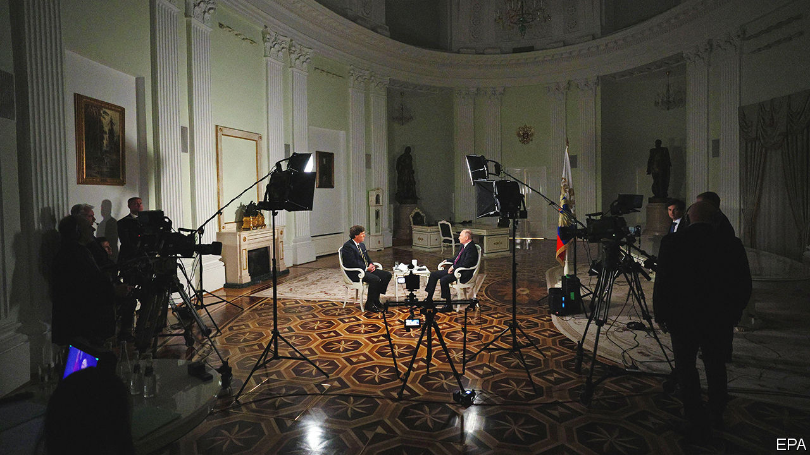

###### On HS2, data centres, Vladimir Putin, the FHLB, academic research, the Holocaust, prosthetic limbs, animals on a plane

# Letters to the editor 

##### A selection of correspondence 

 

> Feb 22nd 2024 


The government was off track

Your analysis of the reasons for the problems surrounding HS2, a high-speed rail project between the south and north of England, sadly rings all too true, as do the lessons the country needs to learn (, February 17th). The lessons include a more focused and less cumbersome planning system, less political dithering and interference, and a recognition that we do not have the necessary level of engineering experience and capability in Britain to deliver this kind of mega project. 

The central problem, however, is more fundamental. Within government HS2 was primarily seen as a stand-alone transport project rather than as a means to tackle two of the country’s most significant issues: regional inequality and low productivity. HS2 could have produced an agglomeration effect by making it easier, and faster, to travel and do business between our big towns and cities. But that kind of strategic clarity about the wider outcome of HS2 was largely missing. Hence the piecemeal approach we have today. The main lesson, therefore, is the need to be clear about the core purpose that such projects are trying to achieve before they start, in order to build a national consensus that can stand the inevitable ups and downs of implementation. 

Tom Kelly

Director of corporate affairs at HS2, 2013-19


 


Hot data

Technology Quarterly (), on the physical underpinnings of the internet, tackled the need to decrease the carbon-dioxide emissions of data centres as they expand in number and power consumption. One thing to note is that extreme heat events are beginning to force some data centres to throttle their performance or halt operations altogether, in case they fry their processors. This pattern is guaranteed to worsen, probably causing disruption to the now-essential internet and communications services. Perhaps we might want to invest in resilience in earnest.

Andrew Bochman

Idaho National Laboratory


 


Tucker Carlson’s interview

Some form of dislocation is the only possible explanation for why people in the West support Vladimir Putin (, February 17th). A strong identification with and advocacy for an ideology, country, or leader that diverges from one’s own interests and values is indicative of “transferred nationalism”, a concept introduced by George Orwell in his essay, “Notes on Nationalism”, published in 1945.

Transferred nationalism causes individuals to become more dishonest and malignant in supporting their own native country, where they have genuine knowledge and experience. Despite championing liberty and democracy at home, they abandon their principles, literary preferences, and, to some extent, their moral sense when engaging in debates on international affairs, often without even realising it. Debates and TV interviews will not reduce these leanings, they will only continue to reinforce them. As Orwell suggested, countering these tendencies is possible, but it demands a sincere moral effort.

Sebastian Woller


Far from being a senseless ramble by an out of touch “crank”, Mr Putin’s screed on Russian history in his interview with Tucker Carlson was a shrewd message for a different audience: the Russians. Mr Putin managed the remarkable feat of sending two messages in the same interview to two audiences that will listen to different parts. Westerners may have listened to only short bits of the interview. 

But for Russians, who may have been the only ones to have watched the whole thing, recalling a millenarian history of endurance and overcoming foreign invaders who initially had the upper hand, such as the Mongols, Napoleon and the Nazis, is a powerful invitation to resist the hardships of the Ukrainian war, the hundreds of thousands of soldiers killed and wounded and the total isolation of their country. Just like their ancestors, who eventually prevailed.

Luca d’Agnese


 


The FHLB responds

You mischaracterised the Federal Home Loan Bank system in America and overlooked several important facts (, February 13th). Your central point seems to be that the system “resembles” a central bank and provides too much liquidity at too low a cost to members. As evidence, you pointed to events in the spring of 2023, noting that liquidity provided by the FHLB system surpassed $1trn for the first time since the financial crisis, and asserted that the inexpensive nature of the system’s liquidity stands as a barrier to the Federal Reserve’s ability to recognise when a financial institution is in trouble (note, the Fed has not made this assertion).

You did not mention that serving as a reliable liquidity provider in all market environments is precisely the role that Congress has carved out for the FHLB system. However, unlike a central bank, the FHLB is a market-based, self-capitalising, member-owned co-operative designed to expand and contract based on the liquidity needs of its members. In times of market stress, demand for FHLB liquidity naturally increases as financial institutions seek to strengthen their balance sheets to weather the storm. For more than 90 years FHLB members have built relationships with and come to rely upon their FHLB as a first responder in crisis situations. Furthermore, each member undergoes robust credit evaluation and monitoring and the FHLBs are statutorily required to offer advances collateralised only with eligible “mission-based” collateral that support housing and community economic development. 

You singled out the bank failures of last March as evidence that inexpensive FHLB liquidity merely masks potential problems and makes resulting crises worse. However, there was no mention of the sheer number of FHLB members that used the system’s liquidity and did not fail. Indeed, 3,630 FHLB members had outstanding advances at the end of March 2023. 

Finally, you contended that FHLB lending raises resolution costs if a bank fails, but ignored the cost of the cascading bank failures that would ensue if the FHLBs were not available in moments of stress when the need for liquidity increases and other market-based funding sources retreat. As a study published by the Urban Institute demonstrated last November, “an increase in a bank’s use of FHLB advances reduces its odds of failure.” 

Though the FHLB system is not the lender of last resort, its ability to provide market-based, reliable liquidity to members in emergency situations is one of its distinguishing characteristics and one that has served America’s financial system well for nearly 100 years. 

Ryan Donovan

President and CEO

Council of Federal Home Loan Banks

, 

 


Science for science’s sake

Free exchange () made many strong points linking university research, patent production and economic growth. Yet the column concluded that governments should curb their “lavish public support” for universities. In an uncertain world, basic science is all the more important. A focus on application can lead to short-term breakthroughs, certainly, but there is always a need for basic science (testing hypotheses of mechanistic theories) that may not have an immediate application but can lay the foundation for breakthroughs. Such examples include CRISPR gene-editing and the general circulation models used by the Intergovernmental Panel on Climate Change. 

Funding isn’t black or white. Grants that blend corporate and academic research or promote industry-academic collaborations are useful experiments. 

Adam Pellegrini

Associate professor

University of Cambridge 

There is little doubt that the research conducted by post-war corporate labs depended critically on the university education of their scientists (likewise for present day corporate research in big tech and pharma). University research fulfils many goals, not least of which is high-quality research-led education. The university education received by scientists at Bell Labs and DuPont would have been much impoverished if their professors had not also been active researchers.

Marcus Pearce

Queen Mary University of London

 


The banality of evil

Your excellent examination of Holocaust memorials (“”, February 10th) mentioned the “superb” exhibition at London’s Imperial War Museum. Some might question whether a showcase on the Holocaust belongs in a war museum, suggesting as it does that the killing of 6m Jews, as well as gypsies, homosexuals and other Nazi victims, was a crime committed as part of the second world war. In fact, what makes this act of genocide so particularly horrifying is that it was carefully planned and carried out in cold blood, in areas where there was little or no fighting. A crime against humanity, yes, but not a war crime.

Paul Moss


 


Arms and the man

The notion that a prosthetic limb need not mimic the missing arm or leg that it is replacing has a precedent in science fiction (“”, February 3rd). Robert Heinlein wrote about the possibility of mission-specific prosthetics in his book “The Moon is a Harsh Mistress”, published in 1966, in which the main character uses multiple prosthetics to replace the part of his arm lost in a mining accident. He is described as having a dozen arms, each one optimised for a specific task, plus one that looks and feels like a flesh-and-bones arm. This arm was presumably for social occasions, when an arm with micromanipulators might not be appropriate.

Robert Checchio


 


I do believe it’s true

It comes as no surprise that zebras may panic when travelling on an aircraft (“”, January 27th). As Paul Simon will tell you, they are known to be reactionaries.

Grant Walters


When vultures are transported by air, are they allowed carrion luggage?

Thomas David Kehoe


