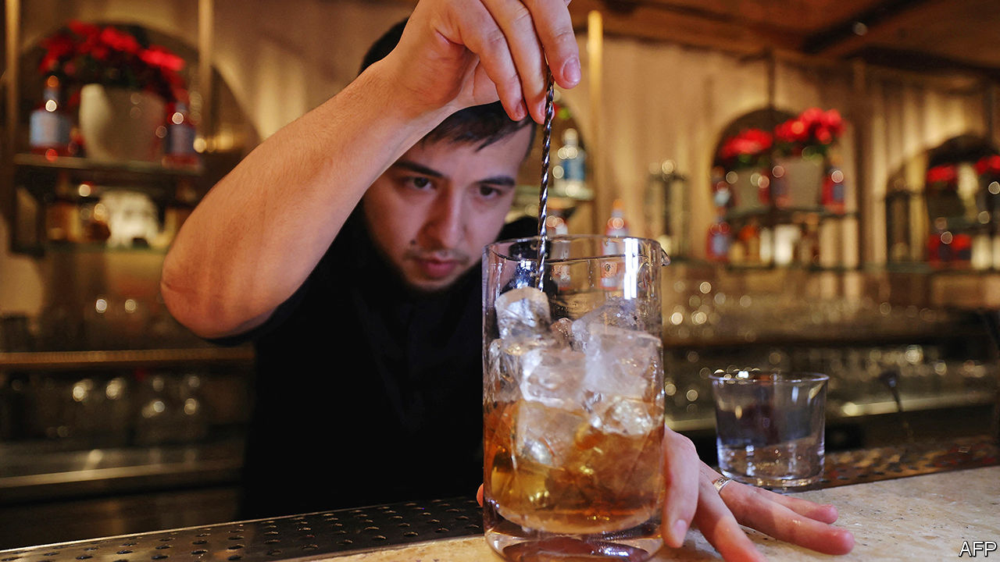

###### Saudi’s booze-free bars

# Bar culture has arrived in Saudi Arabia, albeit without the booze 

##### And the kingdom’s first liquor store has residents wondering if more will follow 

 

> Feb 22nd 2024 

IT LOOKS and tastes like a negroni, ruby red and bittersweet with a herbal finish. At 58 rials ($15), it is priced like a negroni too. But it does not kick like one, because this version of the classic Italian cocktail is served in Riyadh, the capital of teetotal Saudi Arabia.

Mocktails are having a moment around the world, as health-crazed young people shun old-fashioned old fashioneds. In Saudi Arabia, though, a recent mocktail buzz signals a different sort of social change. Alcohol, music and gender mixing were long forbidden in the kingdom. Now you can belly up to the bar with a date and order a virgin amaretto sour in a chilled glass—the bar experience, albeit without the buzz.

King Abdulaziz banned alcohol in 1952 after one of his sons got drunk at a diplomatic function and killed Britain’s vice-consul. Embassies could still import it via diplomatic pouch. Some diplomats sold it on the black market; enterprising locals and expats brewed their own. For most drinkers, though, the only way to tipple was to travel.

The ban is no longer absolute. In January the kingdom unexpectedly opened its first liquor store, open only to non-Muslim diplomats with a limit on purchases. Officials insist they did this to rein in the black market. It seems to have helped. Some smugglers have run out of stock; others now charge 2,000 rials for a bottle of mediocre whisky.

Some in the kingdom, though, believe this is a prelude to a wider easing of the ban. The next step may be to allow alcohol in select locations, like luxury resorts on the Red Sea. 

In trendy parts of big cities, some restaurants already seem prepared for a policy change. At a French eatery rumoured to be a favourite of the crown prince, the walls are lined with wine bottles. You cannot order Bordeaux with your , at least not yet: the bottles are empty. But people are getting used to a different sort of nightlife. If you were planning to relax the ban, this would be a smart way to start: first acclimate the public to the sight of punters ordering whisky sours, then add the whiskey.

Even if the kingdom allows alcohol, many Saudis will continue to abstain for religious reasons. Mixologists decamping from places like Dubai to craft fancy mocktails will continue to do brisk business. “We want to give the right experience,” says the bartender who mixed your correspondent’s negroni at an Italian restaurant in Riyadh’s financial district. “You can’t have our cuisine and drink a mango juice.”■

