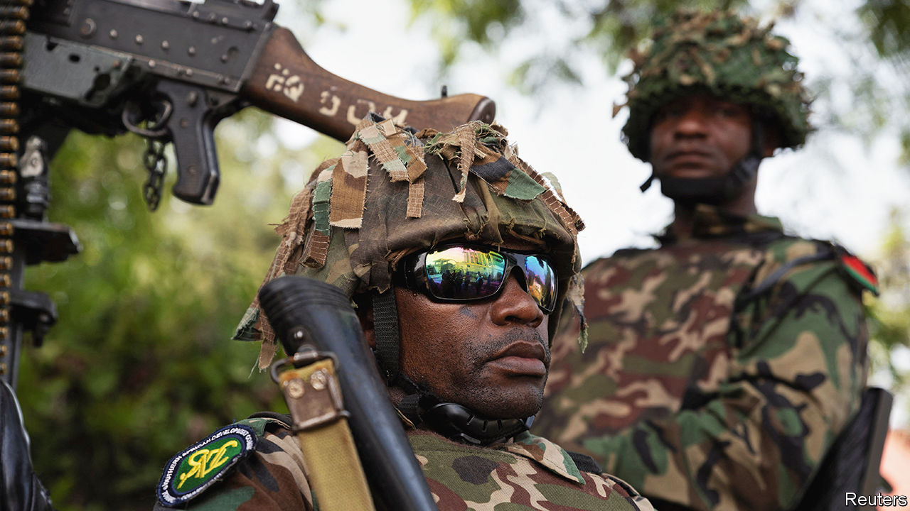
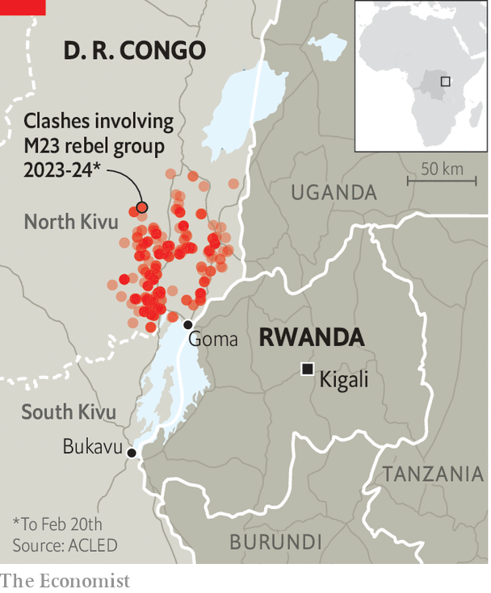

###### On the brink

# Congo’s M23 rebellion risks sparking a regional war 

##### Goma is under a terrifying siege 

 

> Feb 22nd 2024 

Dozens of families sit under a large tarpaulin on bare volcanic rock, surrounded by plastic buckets and bundles of clothes. Deafening blasts of artillery fire punctuate the sound of children wailing at one of the many displacement camps outside Goma, the main city in the east of Congo. M23 rebels are entrenched just six miles away. “My husband was killed,” says Aline Batachoka, a fresh arrival huddled together with other young women for warmth. “There was war and massacres.” 

Mrs Batachoka is one of an estimated 135,000 people who fled the Rwanda-backed M23 in the past month as it advanced through Masisi, a patch of North Kivu province west of Goma. She and the other newly displaced have joined about half a million people who had already sought refuge in the wretched camps on the city’s outskirts from earlier M23 offensives. With the front line now straddling what was the last government-controlled road to Goma, rebels surround the city by land (see map). 

 


The only road out of Goma now leads across the border to Rwanda. Yet that is not much of a lifeline, since Congo’s neighbour is largely responsible for the current crisis, which has already sucked in troops from at least six countries and risks exploding into a full-blown regional war. “It’s clearly escalating,” says Pierre Boisselet, a conflict researcher at Ebuteli, a Congolese think-tank, warning of the risk of a direct confrontation between foreign armies on Congolese soil. That is an alarming prospect, because the previous time this happened after a Rwandan invasion of Congo in 1998, the resulting war lasted until 2003 and claimed between 1m and 5m lives, mostly because of disease and starvation induced by the conflict. 

Rwanda’s main complaint is that Congo has sheltered and co-operates with the FDLR, a Hutu militia whose original leaders included army officers responsible for the genocide of Rwanda’s Tutsi minority in 1994. M23 traces its roots to earlier rebellions led by Tutsis. In 2012, with Rwandan backing, it captured Goma before Congolese and UN troops drove it out again. But the group sprang back to life in late 2021 and swiftly captured swathes of North Kivu. It accuses Congolese President Félix Tshisekedi of failing to honour an earlier peace deal, and of overseeing discrimination and attacks against Tutsis.

A bewildering mishmash of forces defends Goma. Congo’s notoriously ill-paid and poorly equipped army fights alongside an assortment of militias known collectively as  (“patriots” in Swahili, the east’s dominant language). European private military contractors staffed by, among others, former members of the French Foreign Legion, are contracted to provide training and technical support to Congo’s army. They have also sometimes helped it plan operations. Burundi, a neighbour of both Congo and Rwanda— which has dire relations with the latter—has also deployed more than 1,000 troops to fight alongside the Congolese army. 

There are also some 16,300 UN peacekeepers in Congo, whom  sometimes shoot at due to deep distrust of the role of the international community. And last is a military mission recently dispatched by SADC, the regional bloc, which will have 2,900 South African troops in addition to forces from Tanzania and Malawi. If that were not complicated enough, Uganda, which played a leading part in previous Congo wars, has an ambiguous role in the current drama. It has looked the other way as M23 fighters moved across its territory and into Congo, for example.

To prevent this tinder box igniting, America has repeatedly tried to broker a peace deal by getting Congo to stop arming the FDLR and Rwanda to pull back its forces. Yet in fact Rwanda has doubled down in its proxy war against Congo and the various peacekeeping forces and missions deployed there. On February 4th a South African peacekeeper was killed when a UN helicopter was fired on while it was flying to Goma. Almost two weeks later a mortar barrage killed two more South African soldiers, who were among the advance elements of the SADC mission. 

The Congo missile crisis

Though no blame has officially been apportioned, both attacks are thought to have been conducted by M23 rebels. That seems plausible given Rwanda’s other actions. Earlier this month a drone launched from Rwanda bombed Goma’s airport and Rwandan forces fired an anti-aircraft missile at a UN surveillance drone in Congo, according to a confidential report by the UN peacekeeping mission in Congo. That prompted an unusually stern denunciation from America, which called on Rwanda to withdraw its troops and, in particular, its anti-aircraft missile systems “which threaten the lives of civilians, UN and other regional peacekeepers, humanitarian actors, and commercial flights”. 

Rwanda has long denied its involvement in Congo. Yet these claims ring hollow. In December UN experts provided evidence that M23 fighters had received training in Rwanda, and showed aerial photographs of Rwandan army columns marching through Congolese territory. High-tech, and costly, mortar shells that can be guided by lasers or GPS have also landed near Congolese army positions, the experts said. They added that these had not previously been observed in the area and that “the use of the weapon system requires extensive training”.

Recently, Rwanda has barely bothered to maintain the pretence that it is not involved in Congo. In response to America’s call for it to withdraw its troops, Rwanda’s foreign ministry hit back saying it has taken measures to protect its air space and to “degrade offensive air capabilities” (which sounds like code for attacking Goma airport). It said these steps were a direct result of threats to its security posed by Chinese attack drones and by repeated violations of its airspace by Congolese jet fighters. 

Mr Tshisekedi also gives no indication of backing down. He refuses to negotiate with M23, saying it is a Rwandan proxy group that aims to steal Congo’s mineral wealth. This month army spokesman Sylvain Ekenge described the struggle against M23 as existential for Congo, saying the troops “are condemned to succeed and to fight to the last drop of blood”.

A previous crisis in 2012, when the M23 captured Goma, led to swift action by foreign donors who blocked some $240m in budget support to Rwanda. Yet, notes Jason Stearns, an expert on Congo, the international opprobrium Rwanda faced for backing M23 has been replaced by complacency and even increased support. 

Mr Boisselet thinks both sides can still climb down. Onesphore Sematumba, a Congo analyst for the International Crisis Group, argues that diplomats need to pull out all the stops to avert a wider war. “We’re not there yet, [but] if the regional escalation continues, we could find ourselves in a scenario like during the other Congo wars,” he says. “More bombing means more displacement, more misery.”

Misery is the word. The M23 conflict has already inflicted a heavy toll. Lately, artillery shells have been landing in the camps for displaced people, blowing apart civilians. Mrs Batachoka says that some people in her group lost track of children when making their desperate escape. Her own child, swaddled to her back, is weak and ailing. “We have nothing”, she says. “Absolutely nothing.” ■

