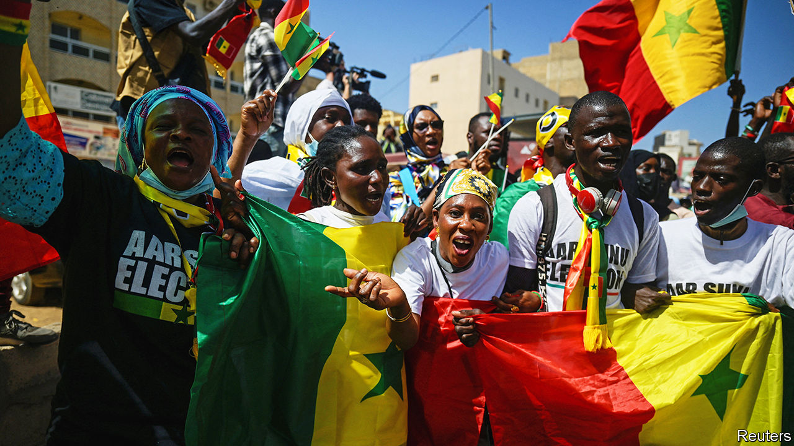

###### A boost to democracy

# Senegal’s judges stand up for the constitution 

##### But with no date for an election, its democracy is not yet secure 

 

> Feb 22nd 2024 

THE REBUKE was blunt and brief. On February 15th Senegal’s Constitutional Council, the last line of defence for its democracy, summarily cancelled a presidential decree that had indefinitely postponed the election due on February 25th. It also cuffed down a law rushed through the National Assembly that had then attempted to reschedule the poll to December 15th. Stripped of a veneer of legality for his actions and under heavy pressure, Macky Sall, the president, promised to “fully implement the decision” of the council. That is a tremendous boost to democracy and rule of law in Senegal, where both had recently seemed in retreat. 

Yet there is a wrinkle. The council conceded that there is not enough time for the government to organise the poll by its original date. Instead it told the government to hold the vote “as soon as possible”. Mr Sall has promised to do so. What that means in practice has been hotly contested. 

 A civil-society group that has led the campaign against the delay is demanding that the election be held by March 10th. That would ensure that Mr Sall leaves office by April 2nd, when his constitutional term ends. However, even holding it on March 10th would trigger an infringement of the constitution and the electoral code, since it would be too late under the constitution and would not allow the required 20-day campaign period. Some candidates have instead said that the election must be held by April 2nd at the absolute latest. But Mr Sall’s party has suggested it will be difficult to organise a poll even by then. The president was expected to speak soon after  went to press.

Mr Sall has made some conciliatory moves. More than 300 out of perhaps 1,000 political prisoners have been released. On February 17th the authorities permitted a protest march for the first time in the two weeks since the elections were cancelled. He has also been meeting political leaders, including some from the opposition, to decide on what to do next. Discussions about the date of the election are tangled up with much else. Karim Wade, the son of a former president, wants the electoral process started from scratch, which would allow him to apply again to run. His application was rejected by the Constitutional Council because he held Senegalese and French nationality at the time he submitted it, though he has since given up the latter.

Yet going back to square one would restart an 80-day electoral process. That would seem to be at odds with the council’s ruling that voting should happen as soon as possible. Moreover, the council’s decision seems to imply that if the election is not completed by April 2nd, then Mr Sall would have to step down to make way for a caretaker president. Mr Sall, who has said he will not run for a constitutionally questionable third term, has not commented on such specificities. 

The opposition, who are increasingly angry that Mr Sall still has not named a date, will have to reach some sort of agreement with the president to avert a deeper constitutional crisis. Unless it is scrupulously fair, it risks perpetuating the sort of politics that helped get Senegal into this mess: that of political bigwigs striking deals that can only be implemented by contorting the law and pressing the country’s nominally independent institutions to go along with them. 

The decision to strike down Mr Sall’s decree is a welcome display of spine from the Constitutional Council. But until the country’s constitutional order and rule of law become more deeply entrenched and consistently enforced, Senegal’s democracy will remain at risk. ■

