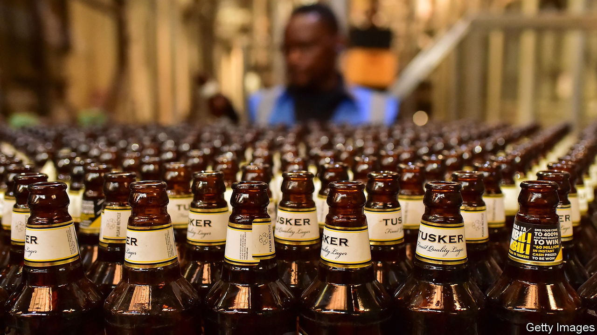

###### Pub brawl

# The booze industry reveals a lot about Kenya 

##### The politicisation of business is retarding the country’s economy 

 

> Feb 22nd 2024 

TUSKER, A CRISP, golden and eminently quaffable lager, is arguably Kenya’s most recognisable brand. Sun-tanned tourists gulp it down cold at the end of a game drive. For Kenyans, who often prefer it warm, it used to be a source of national pride. “My country, my beer,” its best-known slogan proclaimed.

What Kenyans drink often reveals how they wish to be perceived. Tusker was long seen as the patriotic choice, even though for much of the colonial period Africans were not allowed to drink it. Trendy youngsters drink WhiteCap, a beer once seen as the tipple of the fusty, or Guinness. 

 They are all drinking products made by East African Breweries (EABL), which produces about 90% of the country’s domestically brewed alcohol. Kenya’s drinking habits, therefore, also provide an insight into why the business environment too often impedes rather than encourages growth. EABL’s dominance of the brewing business is but one example of how east Africa’s biggest economy is distorted by the market power of a few big firms. It is a problem common in many other African countries, where markets are often small and fragmented, competition regulators are weak and barriers to entry are high.

Another example is Safaricom, a mobile-phone operator with a 66% share of the Kenyan market. This dominance may explain why it is so profitable. Over the past five years its average return on equity (ROE) was a mouthwatering 47%. That compares with an average ROE of about 10% on mobile-phone operators in America, according to Aswath Damodaran, a finance professor at New York University.

EABL has also done well, with an average ROE of 49% over the past two years, far above the returns earned by global peers. Many livelihoods depend on it, from the 62,000 smallholder farmers who supply it with barley and sorghum to the many more who deliver its beer in lorries or serve it up in bars. Yet its high margin is not a sign of a healthy market. Dominant companies protected by barriers tend to be less dynamic, efficient and competitive. Ripped-off consumers pay the price. 

Across sub-Saharan Africa essentials, such as food, cost about 20% more than in poor countries in other regions, according to an IMF working paper from 2020. It found African firms were 10-20% more profitable than those in comparable countries, and that their price markups (over costs) were around 11% higher. These tend to fall disproportionately on the poorest.

When it comes to alcohol, high prices can be deadly if they encourage boozers to opt for cheaper moonshine. In Kenya beer is pricey not just because the market is dominated by a big firm, but also because the government taxes it so heavily. About half of the 200 Kenyan shillings one pays for a bottle of Tusker ($1.40) goes to the taxman. Little wonder then that perhaps 59% of booze is sold on the illicit market, reckons Euromonitor International, a research firm. Not only does this limit the government’s tax take but it often leads to tragedy when bootleg distillers mess up. Earlier this month at least 20 people died after drinking illicit booze at a party. Alas, such incidents are not uncommon. 

One way to foster competition, which could lower prices for consumers, would be to make it easier for artisanal brewers to get licences. Many Kenyans drink traditional brews that, if made properly, are no more dangerous than a pint of Stella. Yet the authorities grant few permits. The few who get them are not allowed to advertise or brand their beer and they must sell it in unmarked 20-litre containers. As a result few startups survive.

Formal startups face endless run-ins with government agencies, who add intimidation, bureaucracy and corruption to the already formidable challenges of taking on such a dominant competitor as EABL. “The 12 gates of hell”, is how Eoin Flinn, the CEO of the 254 Brewing Company, a craft brewer, describes the dozen bureaucracies he must deal with. Following the rules is often a Kafkaesque affair. Last year the revenue authority shut down his firm for failing to mark its pipes “to the satisfaction of the commissioner”. It took two weeks to discover that the commissioner wanted a single pipe painted blue.

Kenya is taking steps to liberalise and deregulate its economy. The government, which has stakes in 132 companies including Safaricom, plans to sell its shareholdings in 11 companies. The country’s competition authority is among the more robust on the continent. Last year it fined nine steel companies a total of $2.2m for price-fixing. Yet these are baby steps, says Kwame Owino of the Institute of Economic Affairs, a Kenyan think-tank, who argues that the authority is too inclined to protect state-backed firms. 

The main impediment to genuine reform is the nexus between politics and business in Kenya. Since Kenyan politicians often have significant business interests, they are not above using the organs of state against competitors, says Aly-Khan Satchu, an investment adviser. “If you control the levers of politics and the levers of business to a meaningful degree, you are able to tilt the playing field substantially.” 

A politician might, for instance, have a business that supplies a monopoly, while a senior civil servant might be angling to get a relative a job at a state-owned company. “Both have a vested interest in protecting the monopoly,” says one MP. And businesses back politicians in the hope of friendly regulation. As long as people in Kenya’s political class benefit from distorting the market, they are unlikely to liberalise it. ■

