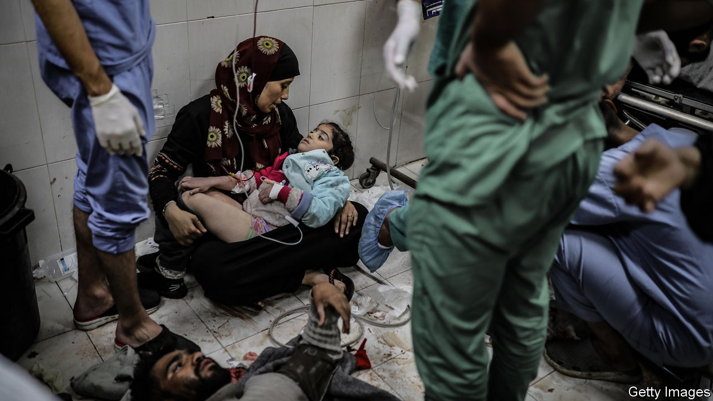
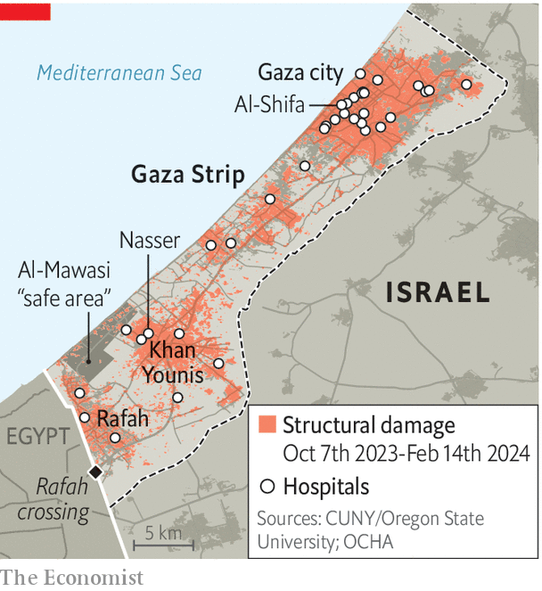

###### Gaza’s devastated health system

# The wrecking of Gaza’s health system goes beyond its hospitals 

##### The strip could see 58,000 excess deaths over the next six months if fighting continues 

 

> Feb 22nd 2024 

The injured lie over hospital floors, blood bubbling from untreated wounds. Doctors perform amputations without anaesthetic. For want of gauze, they rip up their gowns. After surgery, there is no water to wash the blood from their hands. Without sterilised equipment, hospitals spread disease rather than treat it. Many doctors who have worked in other war zones say that conditions in Gaza are the worst they have seen. “Hospitals, intended to be safe havens…have frequently turned into death traps,” says a report released in February by Physicians for Human Rights (phri), an Israeli watchdog. 

On February 18th the World Health Organisation (who) said the Nasser hospital in Khan Younis, the biggest city in southern Gaza, where fighting is still fierce, was no longer functional. A study released the next day suggests that even if a ceasefire can be agreed, the damage to Gaza’s health system is so great that many more deaths will follow, even when the fighting stops.

 


Since Israel’s ground offensive began in October last year, medical facilities have been a key battlefield. Tens of thousands of Gazans have sought shelter in hospital compounds, many of which have been attacked by Israeli forces who say that Hamas operatives are sheltering there. According to the who, 85% of the nearly 800 health workers and hospital patients killed in conflicts around the world in the past year died in the occupied Palestinian territories, most of them in the ten-mile-wide Gaza strip. Some 60% of the 1,500 attacks on health-care facilities in all conflict zones occurred there, too.

After more than four months of war, only a quarter of Gaza’s 36 hospitals and less than a third of its 72 health clinics are operating—and those only partially. On February 18th a week-long siege by Israeli forces of Nasser hospital, which was the largest hospital still functioning in Gaza, ended with troops entering the facility and arresting several doctors, including its director. About 130 patients and at least 15 medics remain in the building, which has no electricity or running water.

Gaza’s health system is being destroyed at its roots. Health-workers are exhausted and traumatised, ambulances have been wrecked and the hospitals still standing may be structurally unstable. Even when hospitals have not suffered direct hits, shock waves from bombs have done damage to internal piping, such as gas lines, and left oxygen supplies shattered.

Some 29,000 people in Gaza have died in the war so far. But new research suggests that fatalities will continue to mount long after any fighting stops. A study published on February 19th by the Johns Hopkins Bloomberg School of Public Health in Maryland and the London School of Hygiene &amp; Tropical Medicine estimates excess deaths, the number of deaths beyond those expected in any normal year, would increase by 6,550 over the next six months even if there were an immediate ceasefire. If the fighting continues at its current level, that figure could reach over 58,000 over the same period. That is in part due to infectious diseases and in part to traumatic injuries that the few remaining hospitals are ever less able to treat. Other specialists predict the lack of proper health care could leave 280,000 people with life-changing injuries or illnesses.

Hospitals, which have special protection under the laws of war, have become a battleground in many recent urban conflicts. About 60% of Syria’s health system was destroyed in the four years after civil war erupted in 2011, according to the un. A quarter of Yemen’s health services closed in the first year of its civil war in 2014. In 2022, after Russia invaded Ukraine, 37 of Ukraine’s 1,600 hospitals were wrecked.

Still, Israel says Gaza’s hospitals are legitimate targets. It has published evidence that it says shows that Hamas fighters have hidden among patients and stored weapons in at least a few hospitals. It also says that Hamas maintained a tunnel under Gaza’s biggest hospital, al-Shifa, in Gaza city, that connected to its larger tunnel network. If a hospital is used for military purposes, it loses its special status. But Israel has not allowed independent investigators to access the hospitals and verify the allegations. After taking control of al-Shifa in November it dialled back its claim that it had uncovered evidence that there was a major command-and-control centre.

Many Palestinians say that Israel has a broader intent; to impair “Gazan society’s capacity to exist,” as phri puts it. Whether that is true is debatable. What is not debatable is that the war has already rendered much of Gaza uninhabitable. The collapse of the health system will make that even harder to reverse. ■

