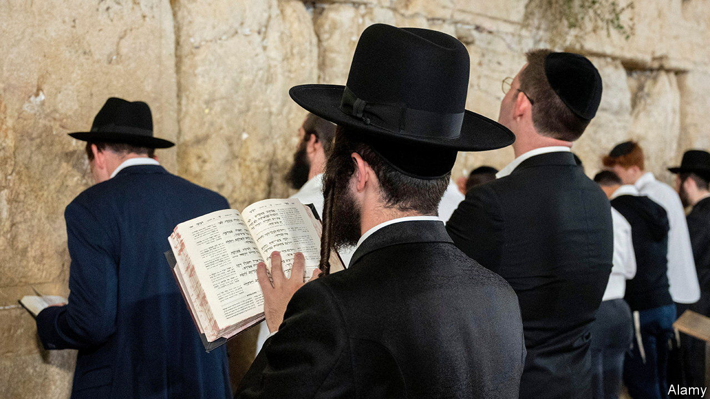

###### Israel’s ultra-Orthodox

# Ultra-Orthodox Israelis’ refusal to fight is a growing problem for Netanyahu 

##### Those keeping him in power are unwilling to share the burdens of war 

 

> Feb 22nd 2024 

Two pieces of legislation may be brought before Israeli lawmakers in the coming days. The first aims to alleviate the military personnel shortage caused by the war in Gaza. The second would exacerbate it. Both could have dire implications for Binyamin Netanyahu’s government. 

The Israel Defence Forces (idf) is made up of professional officers and ncos, conscripts (mainly 18-year-old Israeli men and women, who serve for at least 32 and 24 months respectively), and regular reservists who have military experience and although no longer in the forces can be called up until the age of 40. The first law, which has been published only in draft, would lengthen male conscripts’ service to three years and extend the call-up age for reservists to 45. Having been caught unprepared by Hamas’s attack on October 7th last year, the idf wants to take no chances and plans to maintain a much larger presence on Israel’s borders for years. 


Most Israelis accept their military obligations—and their proposed extension—as a necessary evil. Some 300,000 men and women left their civilian lives behind and rushed to their units when the war began. But they would like to see the burden shared more equally. The second law, which has yet to be presented to the Knesset, Israel’s parliament, does the opposite. 

It would codify an exemption from the draft for young men from the Jewish ultra-Orthodox community which has been in place since Israel’s foundation in 1948. This arrangement, whose Hebrew name literally means “Torah study is their job”, was ruled illegal by the Supreme Court in 1998. Since then Israeli governments have been trying—and failing—to come up with a legal way for young  to avoid serving in the army. They have managed to get around it with repeated extensions of the original regulation, the most recent of which ran out in July last year.

Doomed youth

On February 21st the attorney-general asked the Supreme Court for a fifth delay in presenting the government’s response to petitions demanding the defence minister start drafting  men. At present 66,000 are registered as students of religious seminaries and so do not serve. The original exemption was for 400 students. The number has ballooned, partly because of the huge growth in the ultra-Orthodox after the second world war, and partly because of rabbis’ desire to cloister their young men away from secular society. This has led to a change in Jewish tradition. In the past only a few exceptional scholars studied into adulthood. Today what Israeli sociologists call a “society of learners” has emerged. Scholarship has become their ethos, though many rabbis admit in private that a large number of the registered students do not, in fact, spend their days poring over their books. 

As the ranks of the  swelled, so did their political power. Since the 1970s their parties in the Knesset have often served as kingmakers in coalition governments. The preservation and growth of the , the seminaries whose students are exempt from service, has remained one of their main conditions for supporting would-be prime ministers. Increasingly, these have received state funding. 

Two previous attempts to enshrine the exemption in law have been disqualified by the Supreme Court on the grounds that it violates the principle of equality. When Mr Netanyahu returned to office at the end of 2022, the price the ultra-Orthodox parties demanded for joining his government included passing a law that would be “petition-proof”. So far he has managed to put it off, but if no law is proposed soon, the court will probably force the government’s hand. The very idea of military police press-ganging religious students could lead  parties to abandon the prime minister, bringing down his coalition. 

Political tensions have often flared over the conscription exemption. But the war in Gaza, which has seen the largest call-up of reservists in over 40 years, has stoked anger about it. A large majority of Israelis say they still support the war, but in a recent poll 53% also said they opposed the law extending conscription and reserve service, mostly because they feel the inequality is unjust. Publicly, Mr Netanyahu has suggested that the  already make up for their lack of military service by volunteering, but few are convinced. Members of the prime minister’s Likud party in the Knesset have already warned him that they will not vote for either law. The opposition, which has gone easy on the government of late because of the war, sees this as an ideal issue on which to attack the coalition, which has been plummeting in the polls. 

In private the idf’s top brass admit they have little use for the tens of thousands of ultra-Orthodox young men from highly segregated communities who study only religious texts from the age of 13. But they are concerned that their continued exemption will have an impact on the Israelis who are called upon to serve. “We need to know that in the future we can continue relying on the motivation of both our conscripts and the reservists,” says one idf general. After the attack of October 7th, many of those mobilised arrived at their units even before their official call-up was issued. “If the government passes the laws exempting one community and forcing others to serve much longer terms, we may not be able to rely on so many reservists turning up next time,” says the general. 

The idf’s preferred solution is for all 18-year-old Israelis, including the ultra-Orthodox and Arab-Israelis who are also exempt, to do some kind of national service. The military would have its pick of recruits. The rest would serve in civilian groups. But the idea has little support among politicians—at least those currently in charge. In a desperate attempt to boost his ratings, Mr Netanyahu has been trying to persuade Israelis that only he can deliver “total victory” over Hamas. But they want his political allies to join the fight. ■

