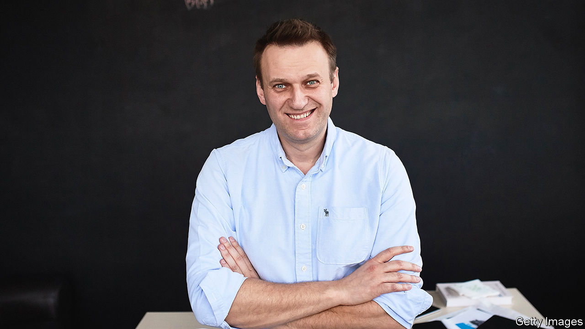

###### Better Russia, where are you?

# Alexei Navalny didn’t just defy Putin—he showed up his depravity 

##### On February 16th Russian authorities announced the death of the opposition leader 

 

> Feb 22nd 2024 

HE WAS JUST an ordinary fellow. Nothing remarkable about him. He was Everyman, every Russian; one of the hundreds of thousands whose voices were usually . His speeches weren’t full of literary quotes or references to history. Instead he liked to sit down with people and talk about what worried them: health care, schools, the price of bread. He was no philosopher, just a jobbing lawyer, turned obsessive blogger, turned  of Vladimir Putin and his regime of crooks and thieves. He resisted everything they stood for: cronyism, greed, moral rot. For that he knew he would be endlessly ,  and . Killed, possibly. But . He often talked as if he had died already, and got over it.

He almost had. In August 2020, on a campaign flight in Siberia, his clothes were smeared with Novichok, a nerve agent developed for the Russian army. The regional hospital was unsafe for him, so he was flown to Berlin. When, after five months, he recovered and flew home, he was immediately arrested and sent to jail on ludicrous charges. But he got his revenge on “Vladimir the Poisoner of Underpants”. Two days after his arrest his team released a two-hour film of Putin’s secret palace on the Black Sea, with its helipads, gold loo-brushes and pole-dancing stage. No need for a speech about it. The film said it all.

The palace had been filmed by a drone launched from an inflatable boat, like something in a thriller movie. Hollywood’s dramas regularly seemed to reflect his own. Everything he knew about politics, for example, came from watching “The Wire” and “The West Wing”. His own career was one big reality show, in which fighting the authorities was fun. And it was science fiction, his great love, with unpredictable thugs in a weird, menacing universe. In detention sometimes he fancied himself in the cabin of a spaceship voyaging to some new world. His android guards might try to obstruct him, or asteroids might blast the ship entirely, but he could still jump nimbly through.

Through to where? To a future Russia free, democratic, unthreatening, capitalist without the crap. And, yes, happy. He had supported Boris Yeltsin’s mass privatisations, but his brief dream of liberalism when the Soviet regime fell was soon hijacked by gangsters. Persuading ordinary Russians to want it again—to realise that they had never actually known it—was hard. He persevered because he was proud of Russia and what he believed it could be: normal, like other European countries, not run by kleptocrats, yet different and special for its culture, its history and its weight in the world. That balance needed fighting for.

He had not always been such a fighter. The failings and malevolence of the Soviet system had dawned on him only slowly. As a child he queued endlessly for milk and dreamed of chewing gum. Summers were spent with his grandparents near Chernobyl; after the nuclear accident, local people were ordered to dig up potatoes from the radioactive dust to prove all was well. Some of his relatives died. Later he liked a punk band called Civil Defence; their rebellious lead singer was sent by the KGB to a psychiatric clinic. Still he held back until, in 2000, Putin became president. The cynicism and contempt he saw in this man pushed him into politics.

Yabloko, the oldest liberal party, seemed a natural fit, until he found he was too nationalist for it. At one time he even made xenophobic videos he later regretted. But he also began to work at the regional grassroots, mobilising voiceless citizens, chipping at corruption and injustice in a hundred little ways. He bought shares in some of Russia’s largest state-run companies, then went to their AGMs and grilled the thieving management. Through a clutch of anti-corruption websites he encouraged people to demand road repairs (“Russian Pothole”), monitor public procurement (“Russian Kickbacks”) and report election violations.

He set up 40 offices across the country’s 11 time zones, uniting them by blogging. NavalnyLive streamed his doings on YouTube. On social media he sent out calls to people of all persuasions—Martians even—to come out and protest. From the rigged election of 2011 onwards, in ever-bigger numbers, they did. The regime mocked him as an internet hamster; so he was. He ran for mayor of Moscow in 2013, picking up 27% of the vote despite facing trumped-up embezzlement charges. In 2017 the Kremlin barred him from running for the presidency, but through his YouTube presence he controlled the political narrative. The internet hamster would bite the throats of those bastards.

After his homecoming-arrest in 2021 there was a swift rigged trial in a police station. He was found guilty, of course, but allowed to address the “court”. He relived the climax of one of Russia’s most popular films, “Brat 2” (Brother 2), when the charismatic hero shouted at a racketeer, “Tell me, where does power lie? I believe that power lies in the truth.” Those words rang out now as if he was addressing a fired-up multitude. In his mind, he was.

Fear was something he had no time for. When Ukraine was invaded in 2022 he urged Russians, from his cell, to empower themselves and call out this imperialist act, based on lies. Ukrainians were Slav brothers; he himself was the son of a Ukrainian father and a Russian mother. They should be left alone. Crimea’s annexation in 2014 had also shown Russia moving sharply backwards from any semblance of a European nation-state. But there he wanted Crimea’s people to decide, freely, which side they were on. 

Putin’s goons invented more cases against him, tacking on another 19 years to his sentence for “extremism”. They sent him to a , then a worse one, above the Arctic Circle. But even the solitary cells of such frigid prisons could not silence him. He made light of them, and urged Russians to vote against Putin in the coming elections.

His decision to return had always been right. No question. He would not give up on his ideas or his country, and his supporters should not give up either. “The Putinist state cannot last,” he wrote in January. “One day we’ll look over, and he will be gone.” ■

