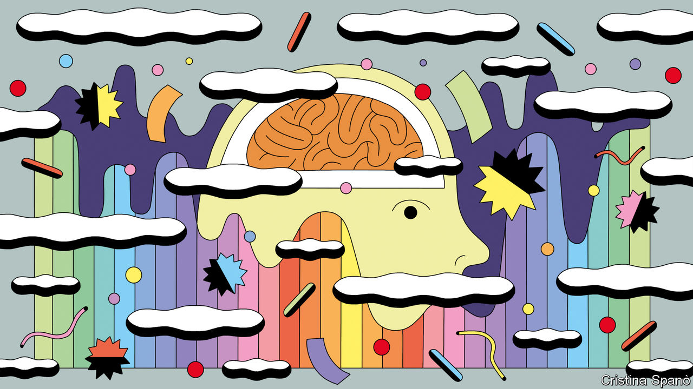

###### PINS and needles

# Long covid is not the only chronic condition triggered by infection 

##### Finding similarities between post-infectious illnesses could lead to better treatments 

 

> Feb 21st 2024 

SOME INFECTIONS—HIV/AIDS, for example—are chronic. If you catch one you are stuck with it indefinitely, unless a treatment exists to clear away the guilty pathogen. Many, though, are acute. Unless they kill you, your immune system will do the clearing and you can carry on as before. 

For an unlucky few, however, that is not the end of the story. Certain infections have a second act, brought about by some consequence of the pathogen’s visit. Sometimes, the physiological chain is clear. One well-known example concerns a variant of that causes rheumatic heart disease when the body’s immune response also attacks cardiac tissue. Often, though, the connections are more opaque—particularly with neurological symptoms. Indeed, it may not even be clear which pathogen is involved.

Many researchers suspect, for example, that what is variously labelled chronic-fatigue syndrome or myalgic encephalomyelitis (ME) is such a post-infectious neurological syndrome (PINS). However, a suggestion that Epstein-Barr virus is the trigger has never been nailed down. Much remains mysterious about the condition itself, and, with at least nine different proposed definitions, it may well be that the umbrella term encompasses different conditions with overlapping symptoms and varied causes.

Between the extremes of rheumatic heart disease and ME there are, however, a group of post-infectious illnesses where the original cause is clear, even though the physiology is obscure. The most recently recognised is long covid, which has shone a spotlight on the field. A session at this year’s meeting of the American Association for the Advancement of Science (AAAS), in Denver, therefore took a closer look at PINS. In particular, participants discussed the similarities between PINS with different causative agents; how transient infections might, via the immune responses they provoke, cause long-term neurological problems; and whether what is going on is similar to the effects of some cancer therapies. This does not, unfortunately, bring immediate prospects of treatment. But it opens avenues of investigation.

One well-established PINS is post-treatment Lyme disease (PTLD), the province of John Aucott, of Johns Hopkins University. Lyme disease is a tick-borne bacterial infection that causes raised temperature, headaches, muscle and joint pain, and tiredness. For most of those affected, these pass after treatment with antibiotics. But in 10-20% of cases the pain and tiredness, together with difficulty concentrating and difficulty sleeping, become chronic.

Dr Aucott has been studying the matter for 15 years. In 2018 he showed that PTLD can cause a mild but measurable decline in verbal learning ability—something previously contested. He was therefore struck (“shocked”, he said), when reading an early paper on long covid, by how similar a chart of its principal symptoms was to one he had published on PTLD. 

To understand how PTLD wreaks its havoc, Dr Aucott recruited functional MRI, a scanning technique. He stress-tested people’s brains by making them do cognitive tests while lying in the scanner, and compared the responses of those who had PTLD with others who did not.

He predicted that any differences would show up in the brain’s grey matter, which, with its high concentration of neuron cell bodies, is where most brain activity occurs. Instead, he got a response in the white matter: the wiring, composed of long protuberances called axons, connecting cell bodies in different parts of the brain. Something odd is thus going on, though what, exactly, is not clear.

As to the cause of the neurological symptoms of PTLD, a clue may lie elsewhere, in a study Dr Aucott cited on synovial fluid, a lubricant and shock absorber found in many skeletal joints. A non-neurological symptom of PTLD is a type of arthritis caused (as with -related heart disease) by the immune system’s attack on healthy tissue. Sampling this fluid in people with PTLD revealed molecules called peptidoglycans that form part of the cell wall of the Lyme-disease-causing bacterium. These are known to be antigens—substances that provoke the immune system. The interesting point is that these antigens long outlived the bacteria.

Picking up on the theme of immune response, Christopher Bartley of America’s National Institute of Mental Health went on to describe a paradox. He showed that, although covid has some suggestive immune-related consequences, these are seen equally in those with and without neurological symptoms of long covid.

One thing which does seem clear is that SARS-CoV-2, the covid-causing virus, does not get into the central nervous system. When post-mortem samples have been examined for viral genetic material, scarcely any is found in brains—and what little there is comes from blood vessels, not brain cells themselves. Any persistent covid-related brain damage, in other words, is not a consequence of direct infection.

One PINS that needles

It might, though, be “autoimmune”, like rheumatic heart disease. Certain other viruses, including herpes simplex, Japanese encephalitis and varicella zoster virus, are known to provoke autoimmune brain illness. And one early study showed that up to 73% of antibodies produced against SARS-CoV-2 are autoreactive, meaning that they stick to, and potentially harm, at least some human tissue.

Using more sophisticated techniques, Dr Bartley and his colleagues were able to identify a number of antibodies produced in response to covid by immune-system cells inside the brain, and which reacted strongly with brain tissue. But herein lies the paradox. Those who have long covid and those who seem to have recovered completely have similar profiles of these antibodies. Nor is there any difference, six months after infection, in levels of molecules that are signs of the sorts of brain damage that might be expected. 

The possibility remains that any autoimmune brain damage is inflicted quickly, while the disease is still acute, meaning that a search for relevant molecules months after the event is a wild-goose chase. But, as Dr Bartley wryly observed, “we are still trying to figure this out.”

Be that as it may, Michelle Monje, a neuro-oncologist at Stanford School of Medicine, homed in on precisely how covid-induced neurological damage might occur—particularly focusing on glial cells, as brain cells other than neurons are known.

Such cells come in three varieties: , a group of immune-system cells which are also responsible for neurological “gardening”—pruning the connections between neurons to improve neural circuits; astrocytes, which regulate the flow of information across junctions between neurons; and oligodendrocytes, which wrap axons with a fatty substance called myelin that acts like an insulator and stops interference with the passage of signals. (It is myelin which gives white matter its colour.) All three of these have their activity disrupted by anticancer chemotherapy, resulting in a condition known colloquially as “chemo brain fog”. Dr Monje’s instant reaction when she read about long covid was that the way patients describe its symptoms is often reminiscent of this.

That got her interested. And, together with Akiko Iwasaki of Yale School of Medicine, she assembled a research collaboration to investigate, using a mouse strain engineered by Dr Iwasaki specifically for covid work. This showed that microglia in the white matter were reacting to immune-cell-activating molecules called cytokines released in response to covid infection. Moreover, subsequent post-mortem examinations suggested the same thing was happening in people.

One of these cytokines, CCL11, caught their attention in particular. CCL11 has previously been associated with reduced generation of new nerve cells—and new nerve cells are important to memory formation. Its levels, they found, were elevated in the bloodstreams and brains of their mice, and a subsequent study on people with long covid showed it was elevated in their bloodstreams, too. On top of this, when they injected CCL11 into uninfected mice, it did, indeed, inhibit nerve-cell formation.

Correlation is not causation. But that is an interesting coincidence. As all three presenters made clear, research on both PINS in general and long covid in particular is very much a work in progress. But, to the extent that these disparate conditions do share mechanisms, they might share any eventual treatment, too. ■


