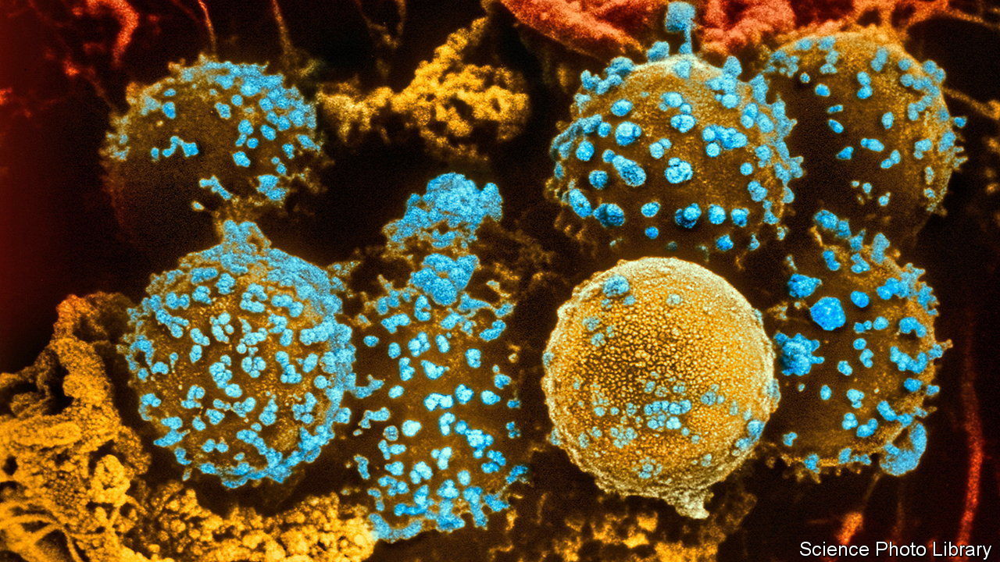

###### Sweet science

# New treatments are emerging for type-1 diabetes 

##### The trick is to outsmart the immune system 

 

> Feb 20th 2024 

“WHERE ARE the islets of Langerhans?” is a trick question that pops up from time to time in quizzes. The answer is to be found not in atlases of geography, but rather in those of anatomy, for the so-called islets are in fact clusters of cells scattered through the pancreas. There they synthesise and release a range of hormones, including insulin, which regulates glucose levels and thus metabolism. 

The islets’ insulin producers are called beta cells. (Cell types alpha, gamma, delta and epsilon perform other tasks.) They are the only bodily sources of that hormone. So, if their number declines, trouble looms. And decline it does, in the condition known as type-1 diabetes. This happens when, in a phenomenon called autoimmunity, the body’s own immune system attacks its complement of beta cells, wiping out as many as 80%. 

Without an alternative supply of insulin, someone with type-1 diabetes will die. (In type-2 diabetes, insulin continues to be produced but the body’s cells acquire resistance.) Supplementary insulin can be administered by injection or via a device called an insulin pump. But a better way might be to replace the missing beta cells and somehow protect them from immune attack. 

A few lucky patients do indeed have their beta cells replaced—by transplantation from human donors. And Vertex Pharmaceuticals, a firm in Boston, is testing beta cells grown from stem cells for the same purpose. But neither approach includes immune protection. This means both require the administration of immunosuppressive drugs to prevent the rejection that follows any transplant, let alone one where autoimmunity is at play. One of the sessions at this year’s meeting of the American Association for the Advancement of Science in Denver therefore looked into how transplanted beta cells might be made hypoimmunogenic—in other words, invisible to a patient’s immune system.

Sonja Schrepfer, who works for the University of California, San Francisco (UCSF), and also at Seattle-based Sana Biotechnology, proposes a twofold approach, to deal with the fact that the immune system has two arms. One, the adaptive arm, is the basis of tissue rejection. This adaptive arm can recognise the signature of “selfness” provided by an individual’s HLA proteins. These molecules contain so-called hypervariable regions, which differ from individual to individual. If the immune system comes across non-self HLA proteins, it recognises the cells displaying them as interlopers and attacks, using shock troops called killer T-cells and antibodies. 

The first part of Dr Schrepfer’s approach is therefore to prevent the production of HLA proteins in laboratory-grown beta cells destined for transplant. This can be done by editing two genes involved in their production, theoretically rendering the cells in question invisible to the adaptive arm.

Lack of HLA proteins does, however, bring a cell to the attention of immunity’s other arm, the innate system. Its troops are called NK (natural killer) cells and macrophages, and one of the red flags it reacts to is an absence of any sort of HLA. It can, however, be warded off by over-expression of a protein called CD47, something that Dr Schrepfer’s team also achieved by genetic manipulation of their beta cells. 

It seems to work. In an experiment whose results were announced just before the meeting, the team first induced diabetes in a laboratory monkey and then injected their modified beta cells into one of its muscles. The diabetes went away, and stayed away for more than six months. Now they have moved on to people. In a trial about to start at Uppsala University Hospital, in Sweden, human versions of the modified cells will be transplanted into the forearm of a single patient. 

Disrupting beta cells’ HLA expression is not the only possible approach to deflecting the adaptive immune system. Hasna Maachi of the Technical University of Munich, in Germany, described to the meeting how she and her mentor, Matthias Hebrok, are trying to develop an alternative. This introduces a third party, called a suppressor cell, to do the warding off.

Suppressor cells “talk” to the killer T-cells, and calm them down. Dr Hebrok’s group is therefore working with Wendell Lim of UCSF, who is engineering suppressor cells specifically activated by a protein on the surface of beta cells, to devise some beta-cell protection. In this case there is no need to build in a level of protection against the innate immune system, since it will not notice anything wrong.

The Hebrok group is also, Dr Maachi explained, working on a way to turbocharge beta cells. This involves a protein called MAFA, which regulates expression of the insulin gene. Suppressed levels of MAFA are a symptom of type-1 diabetes, so boosting its presence seemed a promising approach. So far, the researchers have shown that raising MAFA levels in beta cells derived from stem cells seems to increase the amount of insulin produced.

Figures presented by Lori Sussel of the University of Colorado suggest that type-1 diabetes affects one in 500 Americans. The global average may be closer to one in 1,000. That is both a great deal of human suffering and a tempting market for whoever can come up with something which resembles a cure, rather than a treatment. Though there is a way to go yet, hypoimmunogenic beta cells might, just possibly, bring that closer. ■


