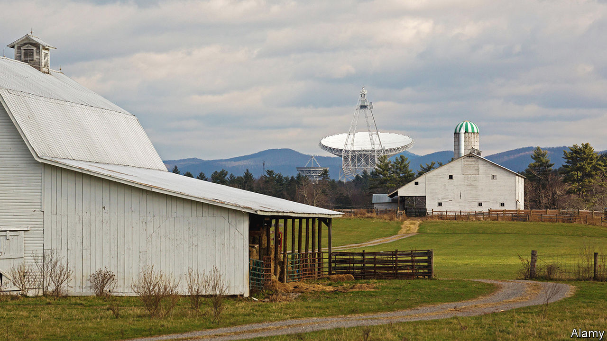

###### Echoes of the past

# Radio telescopes could spot asteroids with unprecedented detail 

##### They would need radar to do it 

 

> Feb 21st 2024 

Astronomy is a passive science. Its practitioners usually earn their livings studying what they are given: light and other forms of radiation emitted by stars and nebulae, sometimes after it has bounced off other objects, such as planets. But there is an exception. A small but dedicated band of astronomers is not content with the views which nature offers. They choose, instead, to illuminate their targets artificially, by beaming microwaves at them and looking at the reflections. They are, in other words, observing by radar.

Since 1946, when American military engineers bounced a radar signal off the Moon, this approach has been used to examine planets, moons, and various asteroids and comets. Unfortunately, the field lost one of its two principal instruments in 2020, when , Puerto Rico, collapsed, leaving the Goldstone Solar System Radar in California to carry the burden.

Now, as the meeting of the American Association for the Advancement of Science in Denver heard, radar astronomers are lobbying for a powerful new tool they call the Next Generation Radar programme (ngRADAR). This would take the world’s largest steerable radio-telescope dish, at Green Bank, West Virginia, (pictured) and turn it into a transmitter, shining a microwave spotlight into space. Unlike Goldstone and Arecibo, however, the Green Bank telescope would not gather the reflections of the beam it sent out. This would be done with sets of smaller radio telescopes elsewhere. To start with, the plan is to recruit the Very Long Baseline Array. This has ten dishes, each on different sites on American territory, scattered from Hawaii in the west to the Virgin Islands in the east. Eventually, if all goes well, the Very Large Array in New Mexico, which has 27 dishes (and one spare), and its successor, the Next Generation Very Large Array, could be included, too.

Increasing the receiver-collecting area by employing arrays of detectors in this way would allow weaker signals to be analysed. And ngRADAR would also operate at a shorter wavelength than previous systems, making finer details visible. The upshot, as Patrick Taylor, of America’s National Radio Astronomy Observatory, explained, would be a system that could see an object five metres across when it was as far away as the Moon. This would allow astronomers to study the shapes, surface features and composition of passing asteroids in perhaps better detail than can be managed by sending spacecraft to visit them. That is a twofold win, for space missions are both scarce and expensive.

A taste of what the radar study of asteroids has already achieved was provided by Marina Brozovic of the Jet Propulsion Laboratory in Pasadena, California. Dr Brozovic uses the Goldstone dish for her research. In 2012 Goldstone scanned an asteroid called Toutatis when it was 7m kilometres from Earth. Pictures reconstructed from these data had a resolution of 3.75 metres, which approaches the 2.25-metre resolution of the best optical images taken by , a Chinese spacecraft that flew past Toutatis the same year. 

Goldstone was also involved in DART, the Double Asteroid Redirection Test carried out in 2022. This involved thumping a small asteroid called Dimorphos, which was in orbit around a larger one, Didymos, with a 600kg probe and watching, by means including radar, how its orbit changed. This test suggested that, with enough notice, a space rock on a collision course with Earth might be nudged into an orbit where it would miss.

Edgard Rivera-Valentín of Johns Hopkins Applied Physics Laboratory, in Maryland, meanwhile, broadened the discussion to describe some of radar astronomy’s successes in examining objects other than asteroids. Dr Rivera-Valentín worked with the Arecibo telescope until its collapse. Before that, he explained, it mapped the surface of Venus, studied subsurface features such as lava flows on the Moon and Mars, and detected ice in polar craters on Mercury, where craters’ walls keep it in perpetual shadow (remarkably, this predated similar discoveries on the Moon).

But it is asteroids that are of most practical concern to today’s radar astronomers, and the primary task of ngRADAR, if it is approved, will be tracking and understanding those nearest Earth, especially any that might one day hit humanity’s home planet. The searchlight narrowness of the beam means it will be of little use for discovery. But, as with enemy aircraft during the second world war, once a target is located a searchlight’s narrow beam can track it remorselessly. This will permit orbits to be established with precision.

If doing that suggested a risk in a few years’ or decades’ time, a diversionary mission based on DART’s findings might be put together. If the worst came to the worst, though, and a rock were found that was likely to hit Earth in short order, such tracking would at least be able to predict where it would enter the atmosphere, and thus allow civil-defence measures to be invoked in time. ■


