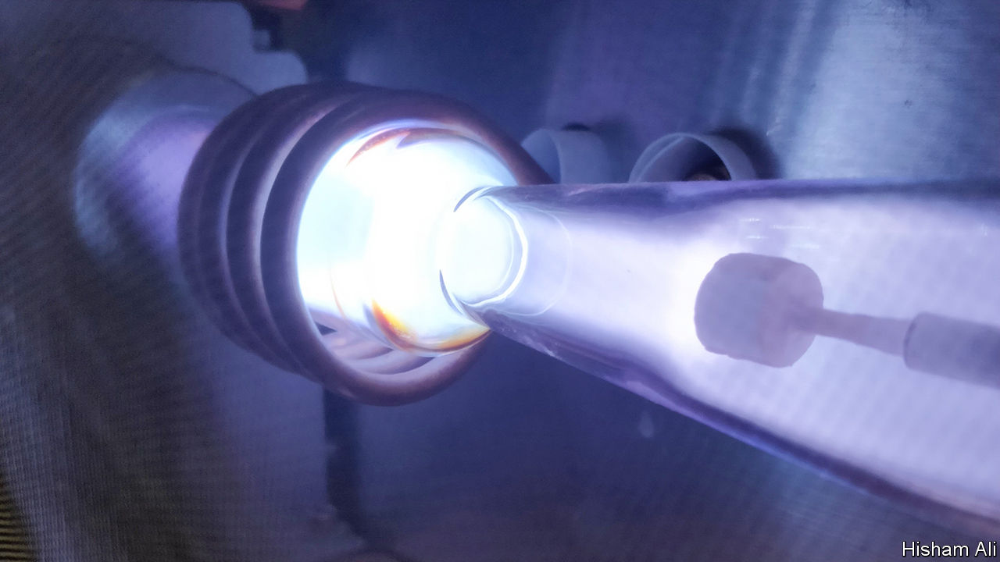

###### Spoiler alert

# The challenges of steering a hypersonic plane 

##### At five times the speed of sound, a craft flies through plasma, not air 

 

> Feb 21st 2024 

Mach 5 is the new Mach 1. Just as aviators of old sought to break the sound barrier and travel supersonically, the search is now on for reliable and controllable ways to travel “hypersonically”, generally defined as more than five times the speed of sound. While re-entering spacecraft and intercontinental ballistic missiles have rushed through the atmosphere at this speed for decades, they are not very steerable. The dream is of vehicles that can be manoeuvred in a manner more like conventional aircraft. At first, these machines would be military missiles. But some dreamers suggest hypersonic passenger flight might eventually be possible.

Steering hypersonically using conventional control surfaces, like wings and ailerons, is out of the question. The forces and heat involved would destroy them. Smaller versions called trim tabs can help a bit. But what is really needed is a different approach. And, as he told delegates at last week’s meeting of the American Association for the Advancement of Science in Denver, Hisham Ali of the University of Colorado, Boulder, is one of those proposing just that. He thinks the answer is to be found in a field called magnetohydrodynamics. 

Aerodynamics manipulates gases. Magnetohydrodynamics manipulates plasmas. These are gas-like fluids whose atoms have been ionised by losing some or all of their electrons—as happens to the air, by frictional heating, when an object travels hypersonically through the atmosphere. Since a plasma’s particles are electrically charged (the electrons negatively and the ions positively), their flow pattern over a hypersonic vehicle could be altered using a set of electromagnets within. Changing the plasma flow would also change the craft’s trajectory, at a rate controllable via the electromagnets. Additionally, the plasma’s passage could be harnessed to produce electricity inside the craft, perhaps powering the magnets.

To test these and other ideas, Dr Ali and his team are building the plasma equivalent of a wind tunnel. This machine will supplement a tabletop version he completed in 2023 (pictured), after ten years working in the field. His original motivation was the problem of how to get spacecraft sent to other worlds to slow down fast enough to land or enter planetary orbit. 

Such exploration is still among his interests, but military applications are important, too. Here, a crucial difference is between what are known as blunt bodies (re-entering spacecraft with big, forward-facing heat shields) and slender bodies (missiles with pointed fronts). Pointed fronts add to manoeuvrability, but are more easily damaged. He therefore has a plan to use magnetohydrodynamics to guide that plasma away from vulnerable areas. Whether any of this will ever lead to a world in which day trips from London to Sydney are possible remains to be seen. But even a hypersonic journey begins with a single step.■


