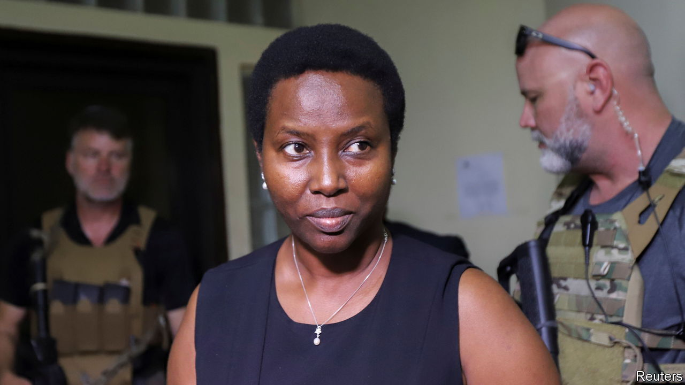

###### Ongoing injustice

# Jovenel Moïse’s widow is accused of being party to his murder 

##### She denies the allegations, and many in Haiti think that the charges are political 

 

> Feb 22nd 2024 

Since July 2021, when Jovenel Moïse, Haiti’s president at the time, was assassinated, the small country has become ever more ungovernable. Gangs run rampant. The number of Haitians arriving at the United States’ southern border has risen. As a result, many Haitians are watching with interest the two sets of cases against those potentially involved in his killing, taking place in both Haiti and the United States.

This month the case in Haiti took an unexpected turn when a judge charged Mr Moïse’s widow, Martine Moïse, with involvement in the killing, along with the former prime minister and police chief. The indictment charges Mrs Moïse, who was injured in the attack, with conspiracy in the murder. It does not suggest she planned it, but points to inconsistencies in her evidence and suggests that she wanted to be president.

Mrs Moïse’s lawyer has denied she had any involvement in her husband’s murder. She has not been charged in the case in the United States. The legal order contains some intriguing details: Mrs Moïse claims to have hidden under her bed during the attack, but the investigators suggest that would have been impossible. Even so, it was a “pretty big leap” to get to the charges, says Jake Johnston of the Centre for Economic and Policy Research in Washington. Much of the evidence relies on the testimony of Joseph Felix Badio, an official who was himself arrested last year, and who has been accused of ordering the killing. 

Many Haitians sense political foul play. Mr Moïse’s assassination was widely seen as a coup. Since his death Ariel Henry has held the top job. He has used the deteriorating security situation to put off organising elections. Today Haiti has not one elected official. Meanwhile, life for many continues to get worse. The UN reckons that in 2023 Haiti’s homicide rate was 41 people per 100,000, more than double that in 2022. In the United States it is 8 per 100,000 people.■

