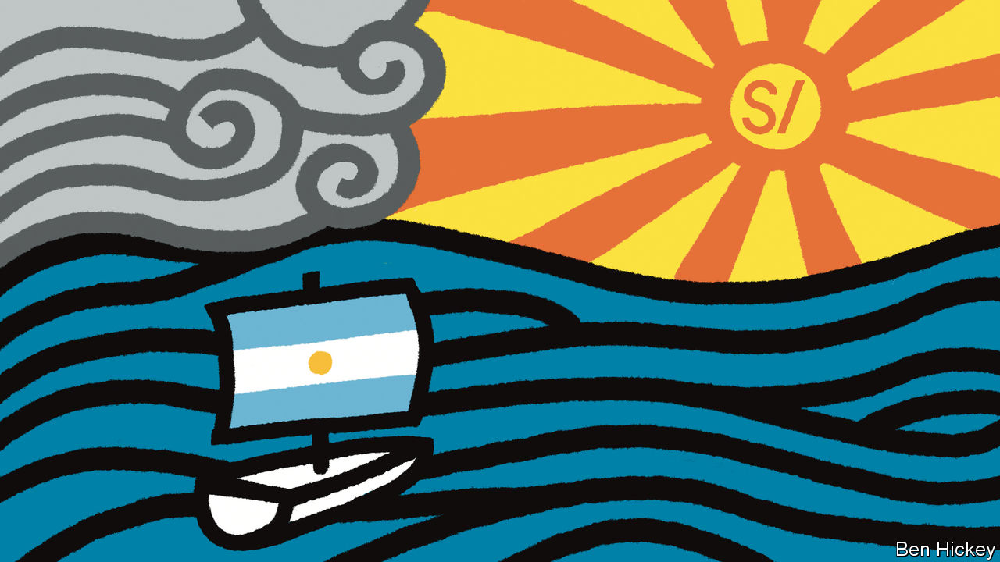
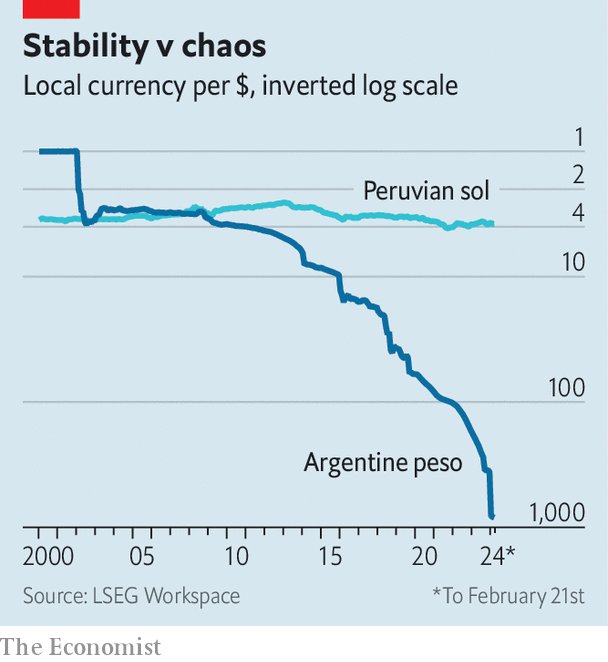

###### Lessons from Lima

# What Javier Milei could learn from Peru’s economic successes 

##### Argentina’s libertarian president wants to rip up the rule book. He shouldn’t 

 

> Feb 22nd 2024 

Since taking office in December Javier Milei, Argentina’s new libertarian president, has wasted little time in trying to implement sweeping reforms. He has had one setback: earlier this month an “omnibus” bill of 664 articles was withdrawn after Mr Milei’s party failed to get enough support from Congress. However, Mr Milei has taken the “chainsaw” he promised to Argentina’s bloated state: the peso was devalued by 50% and annual subsidies worth 0.7% of GDP have started to be phased out. The number of government ministries has been reduced from 18 to nine. This week Mr Milei will describe his grand plans to the Conservative Political Action Conference in the United States, full of Donald Trump supporters. He will do so after meeting Antony Blinken, the US secretary of state, in Buenos Aires. 

But rather than try to emulate Trumpian bombast, Mr Milei should look closer to home for economic advice, specifically at Peru. At first glance this seems strange. Since 2016 Peru has become a byword for instability. Presidents have come and gone: the sixth in eight years is now in office. There have been three legislatures in that period. The country’s political gyrations included the election of Pedro Castillo, a hard-left president overthrown after attempting a coup against Congress and the judiciary. The killing by security forces of 50 protesters after he was ousted has helped to make Dina Boluarte, his replacement, deeply unpopular. 

 


And yet through all this Peru’s currency, the sol, has been a beacon of stability (see chart). It has long been the most solid currency in South America. Against the dollar, it fluctuates from time to time, but it is worth the same as in 1999.

There are lessons in this for Mr Milei, who campaigned on ending chronic inflation by shutting down his country’s central bank and adopting the dollar in place of the peso. Peru suggests that is unnecessary. In the 1980s Peru suffered hyperinflation. In 1985 the shrivelled sol was withdrawn and replaced with the inti (“sun” in Quechua). To no avail: by 1990 the central bank was printing bills marked 5m intis but soon worth almost nothing. Streets in the centre of Lima, the capital, were filled with money-changers: the dollar came to account for over 80% of the money supply. A populist government operated several exchange rates, with cheap dollars for favoured importers—just as in Argentina under Mr Milei’s predecessor.

In 1990 a new president in Peru, Alberto Fujimori, implemented a radical programme of economic stabilisation and reform. The exchange rate was unified at a low rate and then allowed to float. Subsidies on fuel and utility bills were withdrawn overnight; the government stopped printing money and dismantled capital controls and trade barriers. Inflation had reached 2,800% in 1989. As relative prices adjusted, it peaked at 7,650% in 1990 before falling to 139% in 1991 and 6% by 1998. A new sol was introduced in 1991.

Economic exemplar

Having contracted by a quarter between 1988 and 1990, Peru’s economy began to grow, expanding by 5.2% in 1993. With only one or two blips, sustained growth ensued until last year. Mr Fujimori went on to shut down Congress and rule as an autocrat until 2000, but only after the passage of many of his reforms. 

In this century, Peru has enjoyed the lowest inflation among Latin American countries with their own currency, points out Julio Velarde, the governor of the central bank. Peruvians have gradually come to trust the sol. Only 34% of bank deposits, 23% of bank loans and 8% of mortgages are now in dollars.

What explains the sol’s credibility? Start with the central bank. Mr Fujimori granted it constitutional independence. Although the governor and a further three of the seven members of the bank’s board are chosen by the country’s president, they have generally been professionals. Mr Velarde, who has been governor since 2006, enjoys the “total confidence” of financial markets, says Luis Miguel Castilla, a former finance minister. Even Mr Castillo, the left-winger, felt obliged to appoint him for a further term. “There’s a certain public consensus in favour of a prudent macroeconomy,” says Mr Velarde. The bank was among the first in the world to raise its interest rate, in August 2021, to scotch the global spike in inflation. It began cutting again in September. Inflation is now at 3%. With the Federal Reserve slow to cut its own rates, that is prompting some depreciation of the sol.

Structural economic factors may be even more important in the sol’s success. Richard Webb, a former central-bank governor, points out that Peru has enjoyed almost 30 years of “a productive boom of dollars”. Mr Fujimori’s economic opening unleashed export growth. And “a revolution in transport” has facilitated a steady increase in food production in the Andes, adds Mr Webb, lessening pressure for food imports. Add to that a steady flow of foreign investment, and all this has allowed the central bank to accumulate international reserves of $74bn, equal to around 28% of GDP, the highest figure in the region. That gives it the heft to defend the currency against volatility. “It’s enough that the market knows we could intervene,” says Mr Velarde.

In much of this Argentina could profitably copy Peru. Two things are at the root of Argentines’ longstanding mistrust of the peso. One is persistent fiscal deficits that governments have financed by forcing the central bank to print money. Mr Milei is stopping that. The second is protectionism. Even with a bumper agricultural harvest in 2022, Argentina’s exports that year were only 14% of GDP, compared with 26% in Peru. And Argentina’s nationalist economic policies deterred foreign investment. The result is that its central bank has exhausted its international reserves.

Mr Milei’s proposal to impose dollarisation and shut the central bank attacks the symptom rather than the cause. An earlier Argentine president, Carlos Menem, imposed a kind of soft dollarisation in the 1990s, fixing the peso by law at par to the greenback. But Mr Menem was fiscally lax and Argentina’s economy differs too much from that of the United States to form what economists call an optimal currency area. Over time the peso became overvalued; a successor government had to impose wrenching deflation, which could not prevent a financial collapse in 2001-02.

Since taking office Mr Milei has said little about dollarisation. He has shown willingness to rule by decree, but has so far lacked the political skill to pass reforms in Congress. He was in Israel when the omnibus bill was withdrawn. Since returning to Argentina he has made headlines for picking spats with a pop star and calling Congress a “den of rats”. Such belligerence will make it harder for him to succeed. 

As for Peru, the sol faces a medium-term test. Partly because of political instability, the economy shrank by 0.6% last year. It is forecast to grow again this year, but by only 2-3%. 

Mr Castilla, the former finance minister, worries that the next election in Peru, due in 2026, could throw up a populist president who would compromise the central bank’s independence. But for now most Peruvians continue to keep their money in their national currency, a luxury Argentines have yet to enjoy. ■

