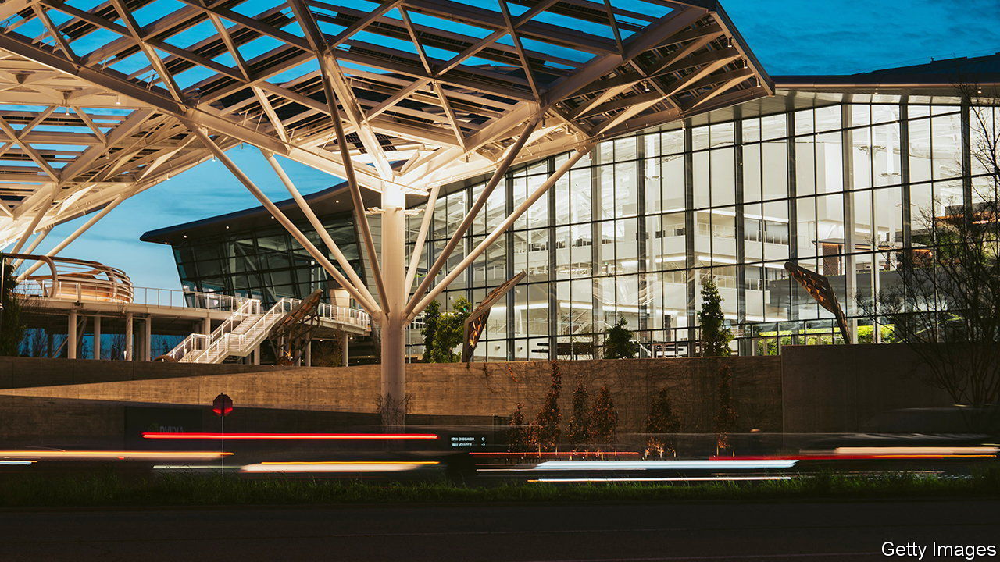
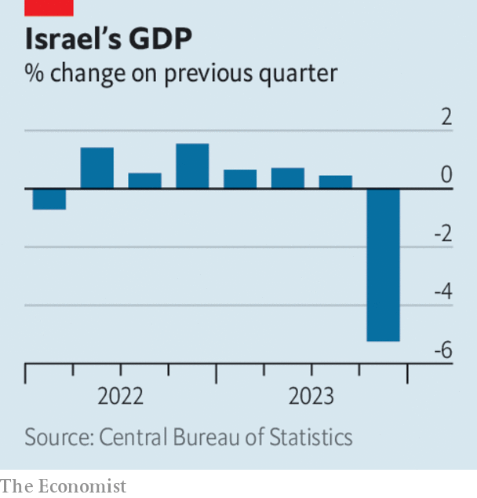
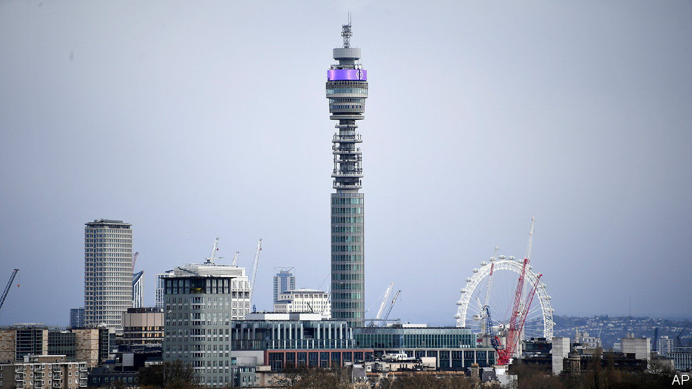

###### The world this week

# Business 

#####  

 

> Feb 22nd 2024 

 fourth-quarter earnings exceeded expectations. Revenue at the maker of chips for artificial intelligence hit $22.1bn, up by 265% from a year earlier, and it made a net profit of $12.3bn, a rise of 769%. It predicted even stronger sales this quarter, even though it is struggling to keep up with demand. Nvidia’s market valuation has soared past $1.7trn, spurring much of the recent rally in the S&amp;P 500. 

Japan’s  stockmarket index hit a new high, surpassing the previous record set 34 years ago. The Nikkei is up by 18% since the start of this year, as foreign investors flock to Japanese stocks made cheaper by the weak yen. 

 reported a record pre-tax annual profit of $30.3bn, another bank to benefit from charging higher interest rates. Markets, however, focused on a $3bn write-down that HSBC booked in the fourth quarter related to its stake in a Chinese bank, the largest charge taken yet by a foreign lender because of its exposure to China’s struggling property market. HSBC’s share price swooned. 

In  the central bank lowered its five-year loan prime rate from 4.2% to 3.95%. The bigger-than-expected cut to the rate, which is used to determine mortgages, is the latest in a number of official attempts to try to revive a moribund housing market. 

Meanwhile,  to China last year plunged to its lowest level in decades, according to a measure from the State Administration of Foreign Exchange. The country’s direct-investment liabilities in its balance of payments, which reflects the foreign capital going into China, came to $33bn in 2023, a big drop from the $180bn recorded in 2022 and the lowest amount since 1993. 

 have moved back above 7% in America, according to the Mortgage Bankers Association, as expectations fade that the Federal Reserve will cut interest rates soon. 

revenues surged to $648.1bn for the 12 months ending January 31st (as it raked in $1.2m a minute). However, the average amount that shoppers spent per trip dipped slightly in its fourth quarter. Last November Walmart said it would be “managing a period of deflation”, but it noted this week that although prices for general merchandise goods were lower than a year ago, they were a bit higher for food and consumables.

Network effects

Two of America’s biggest credit-card issuers are merging. , which issues credit cards on MasterCard and Visa networks, agreed to buy , which has its own network, for $35bn. 

 reported a sharp reduction in net profit for the six months ending December 31st. The Australian miner booked another $3.2bn charge in relation to the Samarco dam failure in Brazil in 2015 (taking its total provisions for the disaster to $6.5bn so far) and a $2.5bn impairment on its nickel business in Western Australia. Nickel prices have collapsed amid a global glut of the metal, caused by Indonesia pumping up production at its cheaper mines. Traders are also paring their bets on the price amid slowing growth in the demand for electric vehicles, which contain nickel in their batteries. 

 


The  had a big impact on  in the fourth quarter of 2023, as GDP contracted by 5.2% compared with the third quarter. The deployment of 300,000 reservists has taken a big chunk out of the labour force, and the building industry has been hurt by restrictions on Palestinian workers. Imports and exports plummeted. The economy grew by 2% over the whole year. 

Sales at   grew by 9% in 2023 to £25.3bn ($31.9bn) and it expects growth of 10-12% this year. The defence company’s order backlog of £70bn is its biggest ever and includes new nuclear-powered submarines for the Australian and British navies. BAE is also restarting production of parts for the M777 howitzer, used to great effect by Ukraine against Russia. 

 forecast that its output of electric trucks would be flat this year and that it would cut 10% of its staff. Rivian’s IPO in 2021 pushed its market value above that of General Motors, but its share price has fallen by almost 90% since then. 

Let’s go for a spin

 


London’s   is to become a luxury hotel. BT (formerly British Telecom) is selling the building to MCR Hotels, which includes the High Line and Lexington in New York among its assets, for £275m ($347m). The 177-metre-high communications tower opened in 1965 as the Post Office Tower and has featured in several films and TV programmes, including “Doctor Who”. The question on everyone’s lips is whether MCR will reopen the tower’s famous revolving restaurant. It was closed in 1971 following a bombing in the toilets.

