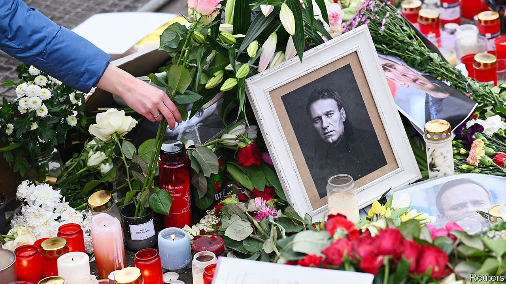
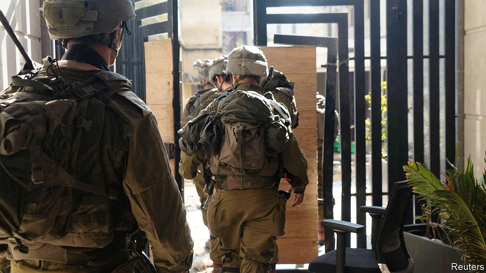

###### The world this week

# Politics 

#####  

 

> Feb 22nd 2024 

Some 400 people were arrested across Russia for marking the death of , the country’s leading opposition figure. Mr Navalny was found dead at the Arctic penal colony to which he had been recently bundled, the result of “sudden death syndrome”, according to the authorities, who refused to release his body to his family. Politicians in the West held Vladimir Putin responsible. Despite his incarceration, Mr Navalny continued to infuriate the Russian president, relaying “Arctic hugs and polar greetings to all” in his new year message. His wife, Yulia Navalnaya, has vowed to continue his work. America prepared new sanctions against Russia. 

The  has a long reach hitting its enemies. A Russian helicopter pilot who defected to Ukraine was found dead in Spain. The head of Russia’s foreign intelligence service described the man as a “traitor and criminal”. 

Russia executed several Ukrainian prisoners of war after capturing , according to reports. Ukraine’s new commander-in-chief, Colonel General Oleksandr Syrsky, withdrew his troops from the eastern town to stop them being encircled. The fall of Avdiivka is a blow to Ukraine’s war effort. Russia had briefly occupied it in 2014 before Ukraine retook the town and reinforced its position there. Russian flags now flutter again over its municipal buildings. 

 blockaded Poland’s border with Ukraine, stepping up their protest against Ukrainian grain imports, which they blame for undermining their market. The protests present a quandary for the new Polish government, which says it backs the farmers, but is also highly supportive of Ukraine. 

 made its strongest accusation yet that Russia is gathering groups of illegal migrants and sending them over the border. The interior minister said that thousands of migrants were waiting to cross, after 1,300 had entered between August and December (before that just one person a day was crossing over). New laws are being prepared to boost border security. 

Sunak is sunk

 Conservative Party  to the opposition Labour Party, the latest in a run of defeats for the Tories. By-election losses for governing parties are not uncommon, but the swing to Labour far exceeded the party’s national poll lead of 20% over the Conservatives. In Wellingborough, hitherto one of the Tories’ safest seats, the fall in the party’s share of the vote was the biggest since the second world war.

Sir Lindsay Hoyle came under pressure to step down as  of Britain’s House of Commons following his botched handling of a vote on a ceasefire in Gaza. Sir Lindsay is accused by the Conservatives and Scottish National Party of favouring a Labour amendment that would have allowed Labour MPs to vote for a “humanitarian ceasefire”. Sir Lindsay said he did this because he was worried about MPs’ “security”. Some MPs say they have faced threats from radical supporters of Palestine for not backing a stop to the war. 

 


Benny Gantz, a member of the  war cabinet, said that unless the remaining hostages who were seized by Hamas on October 7th are freed by March 10th, Israel would launch a ground offensive in Rafah, the city in southern  to which many Palestinians have fled. March 10th is also the probable start of Ramadan. Efforts to broker a ceasefire continued in Cairo, although Qatari mediators said progress was slow. The death toll in Gaza passed 29,000. Meanwhile, America vetoed a   demanding an immediate ceasefire in Gaza. The United States is proposing its own resolution calling for a temporary ceasefire which also warns Israel not to invade Rafah.

The World Food Programme, a UN agency, announced that it was pausing food deliveries to northern Gaza, because  faced chaos and violence there “due to the collapse of civil order”.

 blamed Israel for an air strike on a building in Damascus that killed at least two people. Israel has carried out a dozen attacks in Syria this year on targets connected to Iran. 

 Constitutional Council slapped down an attempt by the government to postpone the presidential election, which had been scheduled for February 25th. The council said it must now take place as soon as possible. 

Israel and  became ensnarled in a diplomatic tangle, which started when Luiz Inácio Lula da Silva compared Israel’s military action in Gaza to “when Hitler decided to kill the Jews”. Israel’s foreign minister said Brazil’s left-wing president would be “persona non grata” in the country until he retracted the statement. In response, Brazil withdrew its ambassador from Israel.

A judge in  investigating the assassination in 2021 of the then-president, Jovenel Moïse, charged his wife with involvement in the killing. The indictment says that Martine Moïse, who was injured in the attack, had given contradictory evidence and was herself interested in power. Some, including Ms Moïse, say the charges are political. Her lawyer has denied that she played any role in the murder.

The Pakistan Muslim League-Nawaz and Pakistan People’s Party cemented a coalition agreement, following an election in which Tehreek-e-Insaf, the party of Imran Khan,  imprisoned opposition leader, came first. The PML-N and PPP will form a government with the support of smaller parties. Shehbaz Sharif of the PML-N will again become prime minister, a job he held until last August. The PPP’s Asif Ali Zardari, widower of Benazir Bhutto, a slain former prime minister, will return as president.

At least 26 people were killed in tribal clashes in . Local police said it was the worst outbreak of violence they had seen in the remote Highlands area, where tribal conflicts have worsened because of an influx of illegal weapons. A state of emergency was declared in Port Moresby, the country’s capital, last month, after riots killed 16 people. The government is struggling to impose order.

Chinese coast guards boarded a Taiwanese tourist boat that was visiting the Kinmen islands, which lie just 10km (six miles) off the coast of  but belong to . A few days earlier two Chinese fishermen drowned after they were chased away from the Kinmens by Taiwanese coast guards. Responding to Taiwan’s protests, China said there was no such thing as “restricted” waters. 

Rich man, poor man

 raised $42m for his re-election bid in January and had $130m in the kitty at the start of February, more than any other presidential candidate has amassed at this point, according to his campaign.  campaign coffers are being drained by legal fees, and his war chest could reportedly run dry by the summer. A judge’s recent order for Mr Trump to pay $355m, plus interest, for cooking the books at the Trump Organisation won’t help. He has taken to selling gold-coloured Trump-branded sneakers for $399 a pair to raise money. 

